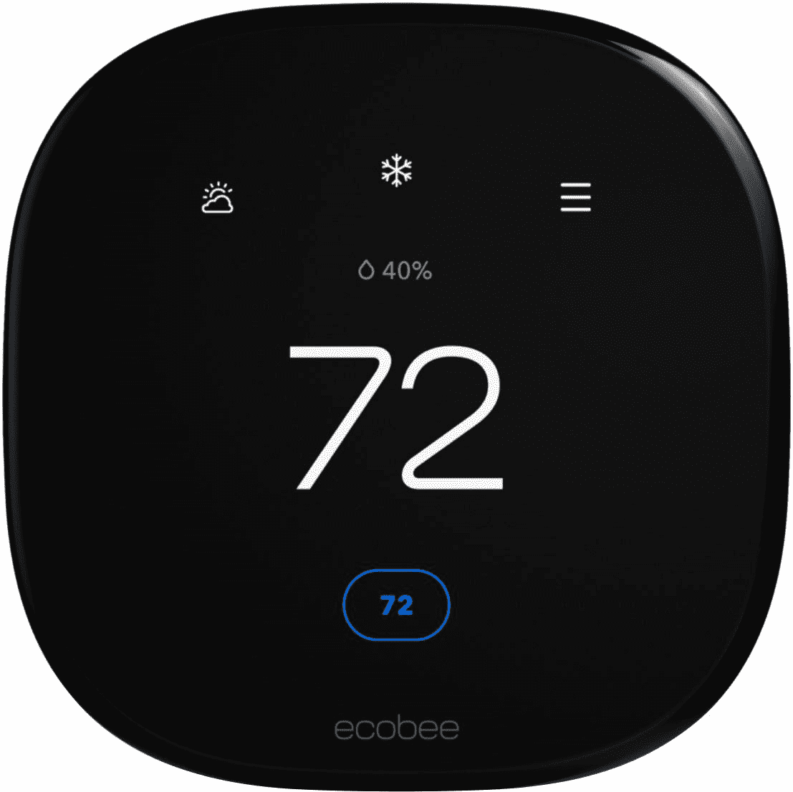
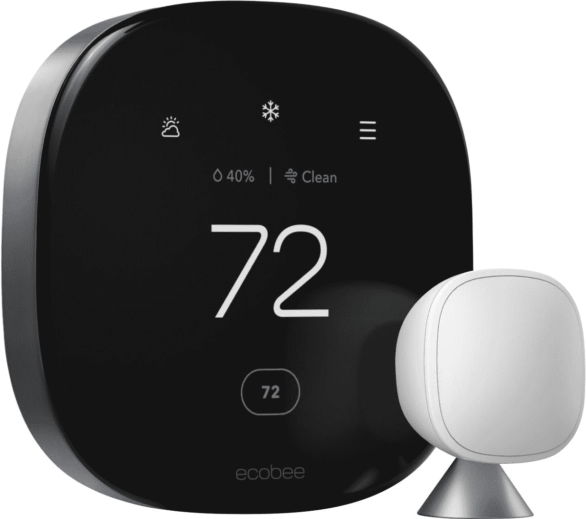

# Ecobee 使其新的智能恒温器高级和增强官方

> 原文：<https://www.xda-developers.com/ecobee-makes-new-smart-thermostat-premium-and-enhanced-official/>

就在过去的几天里，Ecobee 的新款[高级和增强型恒温器几乎全部泄露](https://www.xda-developers.com/new-ecobee-premium-enhanced-thermostat-leaks/)。现在，它们是正式的，我们对新的智能家居设备有了更多的了解。Ecobee 大约三年没有推出新的恒温器，所以粉丝们完全有理由感到兴奋。

之前泄露的双重方法被证明是真的，新硬件取代了 Ecobee 之前的两个顶级型号。Ecobee 智能恒温器增强版的零售价为 200 美元，而 Ecobee 智能恒温器高级版的售价为 250 美元。此外，现有的 Ecobee3 Lite 已降价至 150 美元，但仍是预算选择。

那 250 美元能给你带来什么呢？首先，对设计给予了一些认真的关注。以前你会发现大量的塑料，现在你会发现锌和玻璃的和谐。如果你买的是高级型号，它需要在家里看起来不错，Ecobee 肯定在这方面提供了帮助。

智能扬声器功能回归，支持亚马逊 Alexa 和苹果的 Siri。抱歉，还是没有谷歌助手。这种溢价确实增加了一个空气质量监测器，这对于我们这些过敏的人来说肯定是一个赢家，因为我们正在进入一年中的那个时候。还有一个用于运动检测的新雷达传感器，该溢价可以兼作 Ecobee 家庭安全系统的枢纽。

这两款机型的用户界面也做了相当大的改动，触摸屏也变大了。智能恒温器增强版以更具吸引力的价格交换了许多其他功能。整体风格和用户界面非常接近高端，但没有智能扬声器，没有空气质量传感器，它由塑料制成，不包括 Ecobee 智能传感器。尽管如此，它的价格还是很不错的。

这两款机型现在都可以订购，不过像往常一样，仅限于美国和加拿大等特定市场。

 <picture></picture> 

Ecobee Smart Thermostat Enhanced

##### Ecobee 智能恒温器得到增强

时髦的新用户界面和设计以及更大的触摸屏使 Ecobee 的新中端智能恒温器在您的智能家居中有很多功能。

 <picture></picture> 

Ecobee Smart Thermostat Premium

##### Ecobee 智能恒温器高级版

不再有塑料，集成的智能扬声器，更好的用户界面和新的空气质量监测器使这款 Ecobee 成为迄今为止最好的恒温器。