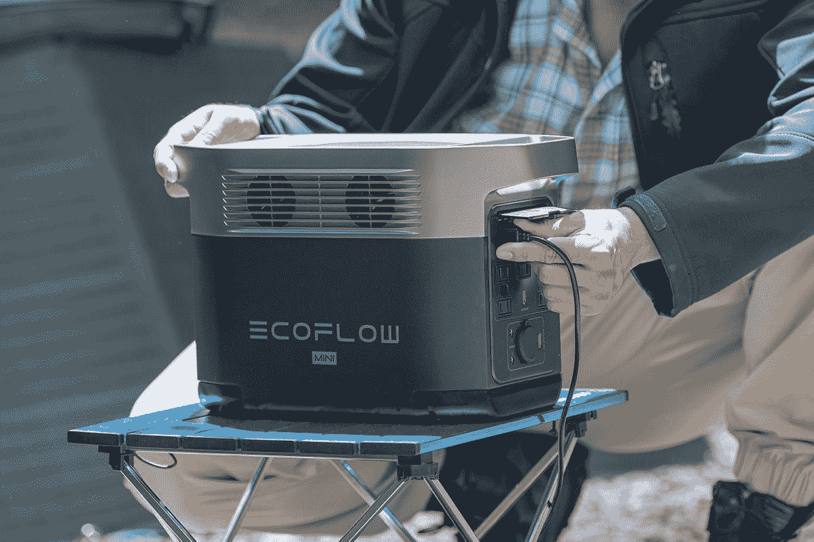
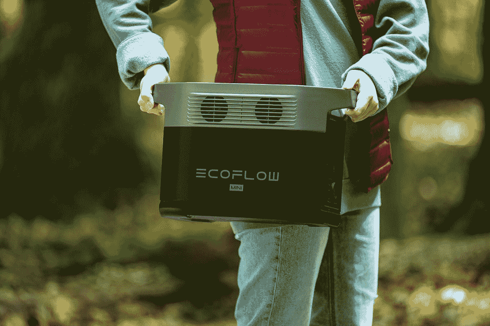

# EcoFlow 推出 DELTA 迷你超级便携式发电站

> 原文：<https://www.xda-developers.com/ecoflow-launches-the-delta-mini/>

EcoFlow 制造了目前市场上最好的便携式发电站，其解决方案从为短途野营旅行设计的产品到可以连续几天为家中任何电器供电的设备。人们对可靠电力的获取方式正在发生变化，最近对这类便携式发电站的需求不断增加。为了创造一个为每个人设计的更方便的便携式发电站，EcoFlow 推出了 [DELTA mini](https://ecoflow.com/products/ecoflow-delta-mini-power-station?utm_source=PRXDA&utm_medium=referral&utm_campaign=delta_mini_launch) 。

DELTA mini 超级小巧轻便。它可以毫不费力地放在任何大小的汽车后部，放在您的桌子上，桌子下面，或者方便地运输。即使是较小的尺寸，EcoFlow 也没有放弃任何你在大型便携式电站中能找到的功能。您仍然可以使用 300 瓦太阳能输入充电、882 瓦小时容量和 1400 瓦功率输出等设备，这些设备可以为 90%的家用电器供电。

* * *

Eco Flow DELTA 将于 [HSN](https://ecoflow.com/products/ecoflow-delta-mini-power-station?utm_source=PRXDA&utm_medium=referral&utm_campaign=delta_mini_launch) 发布，折扣价为 799 美元。这次拍卖将于 9 月 5 日开始。销售价格是限时优惠，仅在产品发布时提供。利用这次促销，因为通过 [EcoFlow 网站](https://ecoflow.com/)的标准价格将是 999 美元。

* * *

## 在任何有可靠电源的地方工作

世界上许多人突然发现自己能够远程工作。人们能够利用这一点，在野营旅行、离网环境、公路旅行、海滩或任何你想去的地方工作。DELTA mini 能够提供可靠的电源，让您的计算机连续运行数天。

无论您是在一台笔记本电脑上工作，还是需要一台配备多台显示器和移动设备的台式机，DELTA mini 都能胜任。使用 **X-Boost 技术**的功率设备需要高达 **1800W 的功率**。

 <picture></picture> 

EcoFlow Delta mini Computer Backup Power

## 在户外探险中保持活力

这个简单的产品可以为你打开无数新的户外机会之门。能够随身携带这款 885 瓦时大容量的设备是一大优势。为手机、笔记本电脑、小冰箱充电，或者使用吹风机或电锅等物品，在长途露营旅行中保持几天的电力供应。

到了充电的时候，可以使用 **75V 太阳能输入**。将您的 DELTA mini 与 EcoFlow 的三块 110 瓦太阳能电池板结合起来，以获得高达**300 瓦的太阳能充电**。这将在 **4-8 小时**内为你的便携式电站充满电。

 <picture></picture> 

EcoFlow DELTA mini Off-grid Power

## 用于家中停电和紧急情况

停电是一个日益严重的问题，洪水、野火、暴风雪和自然灾害都会导致人们断电。不要放松警惕。Delta mini 能够为您的大部分家用电器供电，使在这种情况下生存变得更加容易。

许多人发现自己只能在短时间内有电，有时一天只有几个小时。DELTA mini 从 **0-80%充电仅需一小时**，**充满需要 1.6 小时**。这使您能够获得所需的备用电源，即使是在很短的时间内。

 <picture></picture> 

EcoFlow DELTA mini's Portable and Lightweight Design

不要错过这个只需 799 美元就能买到新款 DELTA mini 的机会。查看 9 月 5 日的 [HSN](https://ecoflow.com/products/ecoflow-delta-mini-power-station?utm_source=PRXDA&utm_medium=referral&utm_campaign=delta_mini_launch) ,了解 EcoFlow 新产品的特价。

###### 我们感谢 EcoFlow 赞助了这篇文章。我们的赞助商帮助我们支付与运行 XDA 相关的许多费用，包括服务器成本、全职开发人员、新闻撰稿人等等。虽然您可能会在门户内容旁边看到赞助内容(这些内容将始终被标记为赞助内容),但门户团队对这些帖子不承担任何责任。赞助内容、广告和 XDA 仓库完全由一个独立的团队管理。XDA 绝不会通过接受金钱来赞扬一家公司，或以任何方式改变我们的观点或看法，从而损害其新闻诚信。我们的意见不能被收买。