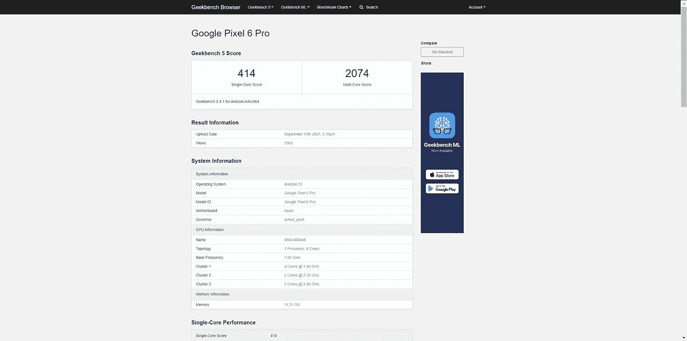
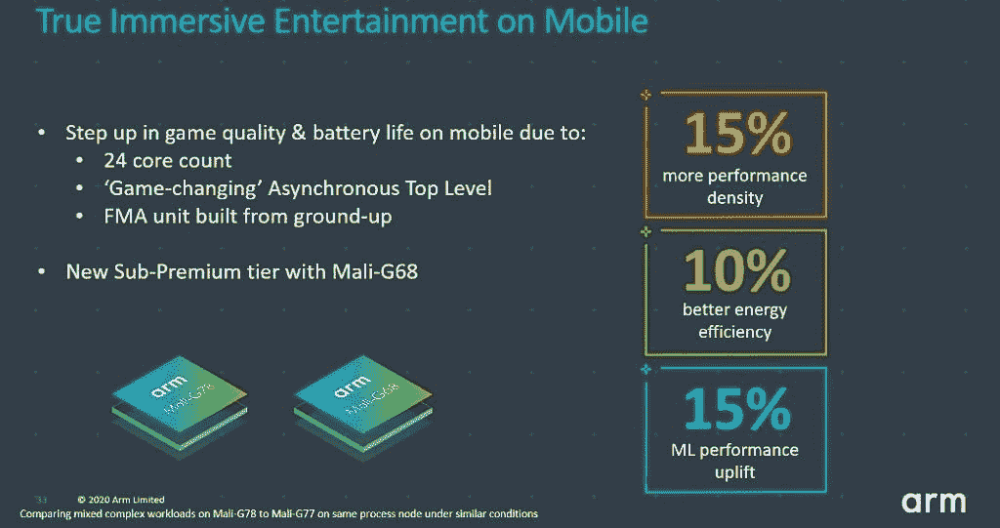

# 独家报道:这是 Pixel 6 中谷歌张量芯片的可能规格

> 原文：<https://www.xda-developers.com/exclusive-google-tensor-specs-in-pixel-6/>

自从有传言称谷歌正在为 Pixel 手机开发自己的芯片以来，我们一再被问到的一个紧迫问题是:它的规格是什么？一次又一次的泄露证实了关于谷歌张量芯片的各种小道消息，但没有一个证实了最重要的部分:CPU 的细节。最近一份据称来自[谷歌 Pixel 6 Pro](https://www.xda-developers.com/google-pixel-6/) 的 Geekbench 清单在网上引发了关于 Tensor CPU 的疯狂猜测，多亏了我们的消息来源，我们终于可以解决其中一些理论[。](https://www.xda-developers.com/exclusive-pixel-6-pro-leak/)

## 迄今为止所有的谷歌张量谣言

首先，一点上下文。2020 年初，韩国各种消息来源和美国新闻网站 *Axios* [报道](https://www.xda-developers.com/google-is-working-on-its-own-chip-for-pixel-phones-and-chromebooks/)谷歌的“白教堂”芯片将与三星合作设计，并在 SLSI 的 5nm 工艺上制造。当时的传言称，谷歌的芯片将采用八核 ARM 处理器，由两个 Cortex-A78 +两个 Cortex-A76 +四个 cortex-A55 核心组成，ARM 的现成 Mali GPU，为机器学习优化的硬件，以及为该公司的谷歌助理服务优化。鉴于开发定制 SoC 的挑战，谷歌在其第一款移动芯片组中使用现有的 CPU 内核是有意义的，因此这些传言的规格对许多人来说似乎是合理的。

几个月过去了，谷歌的定制硅没有任何消息，直到 4 月份[报道称](https://www.xda-developers.com/google-pixel-6-custom-system-on-chip/)该芯片将首次出现在 Pixel 6 系列上。最后，谷歌上个月证实了其计划，将 Pixel 6 系列与名为谷歌张量的内部芯片[一起发货。他们还证实了该芯片组的一些高层细节，例如其 TPU 如何用于在视频的每一帧上运行 HDRNet，该芯片如何为新的设备上人工智能功能提供动力，以及该芯片如何通过其第二代泰坦 M2 模块保护用户数据。](https://www.xda-developers.com/google-pixel-6-teaser/#:~:text=Google%20Silicon%20101%20(GS101)%20is%20officially%20%E2%80%9CGoogle%20Tensor%E2%80%9D)

谷歌在 8 月初的意外宣布证实了去年泄露的大部分信息，而对一些剩余谣言的证实来自其他泄露。一位谷歌人在谷歌问题跟踪上留下的评论证实了关于现成的 Mali GPU 的珍闻，我们现在知道它是 Mali-G78。一次[对 Android 12 beta](https://www.xda-developers.com/android-12-beta-4-pixel-6-camera-modem-leak/) 版本的拆解显示，Pixel 6 将配备三星 Exynos 调制解调器，这一点后来被[路透社](https://www.xda-developers.com/google-pixel-6-5g-modem-samsung/)*证实。最后剩下的尚未确认的规格是 CPU，这就是为什么这么多的注意力放在[这个 Geekbench 列表](https://browser.geekbench.com/v5/cpu/9766974)上。*

 *<picture></picture> 

The Geekbench result that many assumed was from the Pixel 6 Pro. While we can never be 100% certain, we are strongly leaning towards this benchmark being legitimate. The build fingerprint, kernel version string, CPU frequencies, CPU clusters, GPU info, and more match the values from our source's Pixel 6 Pro. It would be very unlikely for someone to have faked this listing, [which would be possible](https://www.xda-developers.com/xiaomi-poco-f1-lite-fake-benchmark/) but requires the person to know the exact values to fool our source who has real hardware.

基于这份清单中不完整的 CPU 信息，[数字聊天站](https://twitter.com/chat_station/status/1436634275265138693)等泄密者推测出了谷歌张量芯片的 CPU 配置。对于许多人来说，这一猜测中最令人震惊的部分是谷歌张量 CPU 将有两个 Cortex-X1 内核的建议， [Arm 迄今为止最强大的 Cortex CPU](https://www.xda-developers.com/arm-announces-cortex-x-custom-cpu-program/) 。相比之下，高通骁龙 888 和三星 Exynos 2100 都没有一个以上的 Cortex-X1 内核。如果这款芯片除了双 Cortex-X1 内核之外，还拥有两个 Cortex-A78 内核，那么谷歌张量可能是迄今为止 Android 设备上最快的芯片组。

正如许多人所指出的那样，Geekbench 的得分远低于 Exynos 2100 Galaxy S21 和高通骁龙 888 设备的平均水平，考虑到所涉及的硬件，这很奇怪。在与 [*AnandTech*](https://www.anandtech.com/author/168) 的高级移动编辑 Andrei Frumusanu 交谈后，我们得出的结论是，你*不能仅仅从这一个基准测试结果中得出关于 Pixel 6 Pro 真实性能的结论。正如他在我们的讨论中指出的，很难判断基准测试的单核部分是哪个内核，而且内核似乎锁定在 2.15GHz，远远低于 X1 内核的最大频率。有几个因素可能导致了这一令人失望的基准测试结果，例如未经优化的 DVFS 或调度程序参数，所有这些因素都可能阻止 Geekbench 以峰值频率运行内核。如果我们想知道 Pixel 6 Pro 有多快，我们必须等待更多有手机的人来运行基准测试。*

## 来自真实 Pixel 6 Pro 的谷歌张量规格

虽然基准测试没有确认 Google Tensor CPU 内核的微体系结构，但由于我们的来源，我们最终能够确定每个 CPU 内核的可能设计。昨天，一位拥有真正 Pixel 6 Pro [的消息人士联系了我们](https://www.xda-developers.com/exclusive-pixel-6-pro-leak/)，我们从他的设备中了解到，Geekbench 清单中透露的三集群核心设计和 CPU 频率是准确的。继我们昨天的报告之后，我们在谷歌张量芯片中找到了确切的 CPU 部件，这些部件通过 [/proc/cpuinfo](http://www.linfo.org/proc_cpuinfo.html) 暴露给系统，这是一个由 CPU 本身填充并由内核读取的[文件。因此，它被欺骗的可能性非常低，尽管谷歌自己在输出中掩盖 CPU IDs 的可能性很低。我们说这是一个低可能性，因为谷歌没有欺骗或混淆设备上的任何其他数据，但是谁知道呢——很可能谷歌张量的 CPU 部分是他们唯一关心隐藏的东西。](https://developer.arm.com/documentation/100442/0100/register-descriptions/aarch32-system-registers/midr--main-id-register)

假设输出没有被篡改，我们已经确定 Google Tensor 将具有以下 CPU 配置:

*   **2x ARM Cortex-X1，主频为 2.802GHz**
*   **2x ARM Cortex-A76，主频 2.253GHz**
*   **4x ARM Cortex-A55，主频 1.80GHz**

AnandTech 的 Andrei 认为使用双 X1 内核是明智的，但他和我们采访过的其他人都对明显使用双 A76 内核感到困惑。Cortex-A76 是[早在 2018 年年中](https://www.xda-developers.com/arm-cortex-a76-cpu-mali-g76-gpu-mali-v76-vpu-announcement/)宣布的，并由 A77 和最近的 [A78](https://www.xda-developers.com/arm-announces-cortex-a78-cpu-mali-g78-gpu-ethos-n78-npu/) 接替，后者在功率、性能和面积方面明显更好(PPA)。我们很难解释为什么谷歌可能会选择两个 A76 核心而不是两个 A78 核心，因为这样做没有什么明显的好处。我们甚至检查了各种高通和 Exynos 设备的 cpuinfo 输出，以确保结果符合预期，并且我们没有误解 Pixel 6 Pro 的输出。我们希望证明这种说法是错误的，但毫无疑问，这种 CPU 配置就是真实 Pixel 6 Pro 设备的 cpuinfo 输出所表明的。

我们不知道的一个重要细节是 CPU 内核可用的缓存量。大容量缓存对于内核达到 Arm 宣称的性能非常重要。

此外，我们仍然不知道 GPU 核心的数量，这很难找到，因为该信息不容易暴露给系统。我们之前了解到，Pixel 6 将[与 exy nos Galaxy S21—](https://www.xda-developers.com/google-pixel-6-same-gpu-exynos-galaxy-s21/)**[ARM Mali-G78](https://www.xda-developers.com/arm-announces-cortex-a78-cpu-mali-g78-gpu-ethos-n78-npu/)**具有相同的 GPU 设计——这一事实我们可以通过真实的硬件来证实。GPU 的时钟频率可能高达 848MHz，尽管不知道核心的数量，我们不知道与其他使用 GPU 的设备相比，手机的性能会有多好。

 <picture></picture> 

ARM Mali-G78

在我们之前的报告中，[我们确认了](https://www.xda-developers.com/exclusive-pixel-6-pro-leak/)谷歌张量包括“g5123b”调制解调器，这很可能是指[三星的 Exynos 5123](https://www.xda-developers.com/samsung-exynos-990-5g-modem-5123-7nm/) 调制解调器。我们还报道了该手机支持 Wi-Fi 6E(即。6GHz Wi-Fi)，拥有一个代号为“abrolhos”的张量处理单元(TPU)，主频高达 1.230GHz，将与 12GB LPDDR5 RAM 模块配对，还将至少有一个存储版本，具有 128 GB UFS 存储。这款手机还将拥有超宽带无线电，用于短程位置跟踪和数字汽车钥匙支持等功能。

## AV1 解码，其他新花絮

Pixel 6 Pro 搭载了**谷歌的 AV1 解码器** (c2.google.av1.decoder)，由谷歌张量芯片进行**硬件加速。该器件能够以高达 4K 的分辨率和 60fps 的速率解码 AV1 内容。它还可以解码高达 4K 分辨率和 120fps 的 HEVC 内容，或 8K 分辨率和 30fps 的内容。相比之下，[三星 Exynos 2100](https://www.xda-developers.com/samsung-exynos-2100-specs-features/) 可以解码高达 8K 分辨率和 30fps 的 AV1 内容，或者 8K 分辨率和 60fps 的 HEVC 内容。尽管如此，谷歌张量芯片支持硬件加速的 AV1 解码这一事实非常重要，因为迄今为止，所有高通骁龙芯片——以及谷歌过去的 Pixel 手机——都不支持这一功能。**

谷歌选择在自己的谷歌张量芯片中包含硬件 AV1 解码不应令人惊讶，因为该公司一直是免版税视频编解码器的最大支持者之一。当 Roku 从其平台上移除 YouTube 电视应用程序时，该公司要求 AV1 支持的努力是其主要不满之一。

说到编解码器，我们的消息来源向我们证实，Pixel 6 Pro 同时支持 aptX 和 aptX HD 编解码器，这是市场上许多无线耳机使用的两种蓝牙音频编解码器。这些编解码器必须从高通获得许可，所以我们的一些读者担心 Pixel 6 系列不会支持它们，因为它们没有骁龙芯片。不过，支持 aptX 并不需要骁龙芯片，所以这些担忧大多是没有根据的。不过还是确认一下 Pixel 6 系列会支持高质量蓝牙音频的好。**索尼的 LDAC 也支持**。

最后，我们的消息来源证实了我们已经怀疑的一些事情:**Pixel 6 Pro**上没有视频输出。谷歌再次选择不实施 DisplayPort 替代模式，该模式允许通过 USB-C 端口发送 DP 视频信号。Android 已经有了几个版本的[准系统桌面模式](https://www.xda-developers.com/make-android-10-desktop-mode-useful/)，但是谷歌似乎不想与之有任何关系。这很不幸，因为手机对于普通用户来说已经足够强大，足以处理日常任务，并且凭借 12GB 的内存，Pixel 6 Pro 可以轻松处理你所有的多任务处理需求。*