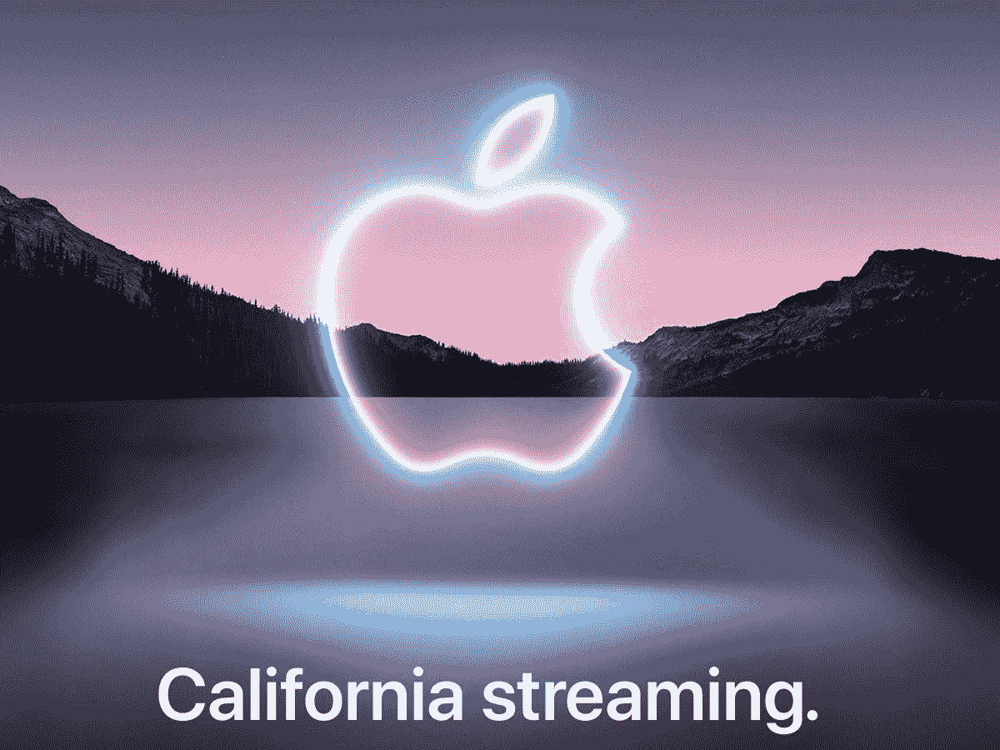

# 以下是苹果九月发布会的预期

> 原文：<https://www.xda-developers.com/expect-from-apple-sept-event/>

# 以下是苹果九月发布会的预期

昨天，苹果发出了参加其特别活动的邀请，该活动将于 9 月 14 日举行。下面是从中可以期待的。

 <picture></picture> 

{"subsource":"done_button","uid":"B60375F7-A86A-54B9-B765-E1894A1BCA30_1631030960057","source":"editor","origin":"gallery","is_remix":false,"used_sources":"{"sources":[],"version":1}","source_sid":"B60375F7-A86A-54B9-B765-E1894A1BCA30_1631030960073","premium_sources":[],"fte_sources":[]}

昨天，苹果终于发出了参加其特别活动的[邀请函](https://www.xda-developers.com/apple-invitations-special-event/)，该活动将于 9 月 14 日举行。虽然我们已经对苹果将在发布会上宣布什么有了一个公平的想法，但一些新的信息现在已经在网上浮出水面。它证实了我们对 [iPhone 13](https://www.xda-developers.com/iphone-13/) 阵容、[苹果 AirPods 3](https://www.xda-developers.com/apple-airpods-3/) 和 [Apple Watch Series 7](https://www.xda-developers.com/apple-watch-7/) 的猜测，并强调了一些额外的细节。

根据 [@PineLeaks](https://twitter.com/pineleaks/status/1435302664808632323) 的 *Twitter* 帖子，以下是对苹果九月发布会的期待:

## iPhone 13 系列

### 一般

*   整个阵容都不会涨价。
*   显示屏下的指纹扫描仪将不会出现。
*   专业型号可能会有一个永远在线的显示屏。
*   设备厚度和重量将增加，尤其是在 Pro Max 变体上。

### 表演

*   iPhone 13 mini 将提供大约一小时的额外电池续航时间。
*   Pro Max 型号的电池将比 iPhone 12 Pro Max 大 18-20%。
*   两款 6.1 英寸机型将使用相同的电池组件，预计容量将增加 10%。
*   由于 120Hz 显示屏的存在，Pro 型号的电池可能不如常规的 6.1 英寸 iPhone 性能好。
*   在低功耗模式下，Pro 型号的显示器将从 120Hz 切换到 60Hz，这是无法避免的。

### 摄像机

*   所有相机传感器将接收至少 15%以上的光，超宽的一个看到高达 40%的改善。
*   电影视频会尽量让主体靠近画面中心，同时确保不会显得不自然。
*   OIS(光学图像稳定)系统将切换到一个更少侵略性和更平滑的操作模式。
*   夜间模式将能够识别场景中的星星，并相应地进行调整。
*   一种新的算法将分析结构，并在夜间拍摄中重新锐化/调整阴影。
*   苹果公司已经显著改善了夜间模式拍摄的色彩科学。

## AirPods 3

*(图片:[52 音频](https://www.52audio.com/archives/74422.html) )*

### 电池

*   充电外壳电池将比第二代 AirPods 大 20%左右。
*   无线充电是一项标准功能。
*   实际 AirPods 内部的电池应该与当前 AirPods Pro 中的电池大小相同。

### 声音

## 苹果手表系列 7

*(图片:[乔恩·普罗瑟](https://www.youtube.com/watch?v=oBJm1_Ctxg0) )*

### 电池

*   这些手表可能会获得自最初的 Apple Watch 以来最重要的电池寿命升级，以及[更大的显示屏](https://www.xda-developers.com/apple-watch-series-7-flat-edge-design/)。

虽然这个帖子揭示了相当多的技术细节，但还有更多值得期待的。苹果公司几乎总是设法在主要事件之前保密一两件事。我们迫不及待地想知道！请务必在特别活动期间和之后查看我们的完整报道、总结和评论。