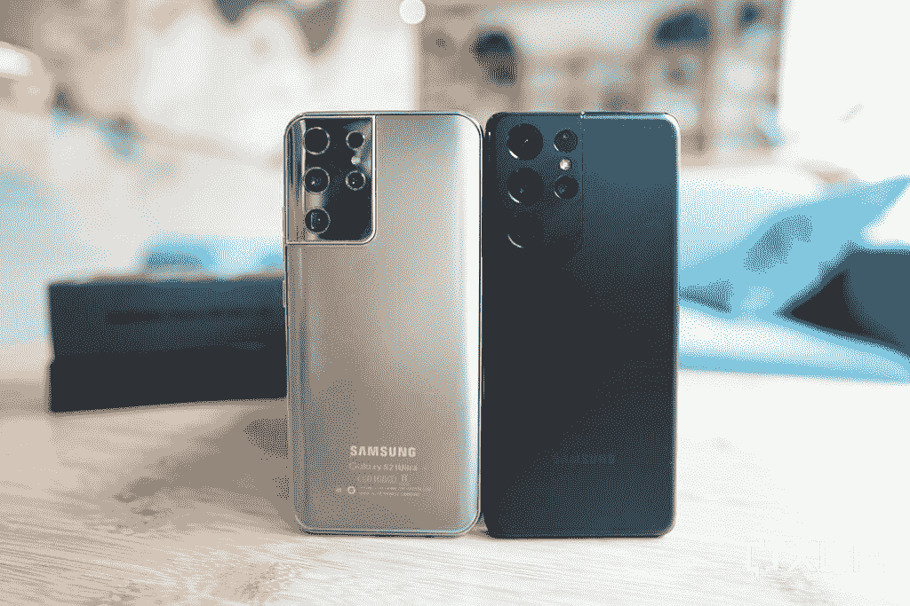
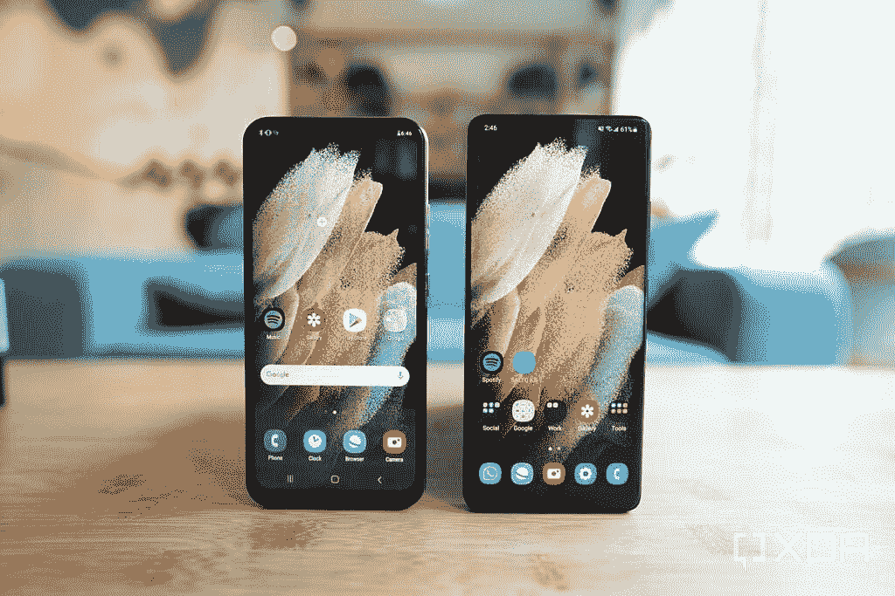
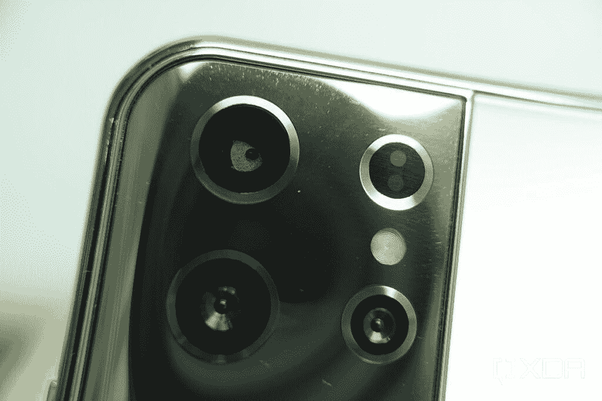

# 我们花 100 美元买了一个假的 S21 Ultra，并与真品进行了比较

> 原文：<https://www.xda-developers.com/fake-galaxy-s21-ultra-vs-real-galaxy-s21-ultra/>

三星的 Galaxy S21 Ultra 可以说是目前世界上最好的智能手机——事实上，它在我们的[最佳安卓](https://www.xda-developers.com/best-android-phones/)和[最佳智能手机相机](https://www.xda-developers.com/best-smartphone-cameras/)列表中名列榜首。但由于其相对较高的四位数价格标签，这款手机对许多消费者来说遥不可及。这为不诚实的制造商制造假货打开了大门。

鉴于这是一个手机发布缓慢的月份，XDA 电视台决定挑选其中一个克隆产品，看看它们与真实产品相比有多接近(或不接近)。

本周早些时候，我们在浏览 Facebook Marketplace 时发现了这款 S21 Ultra 山寨机，并看到一款“Galaxy S21 Ultra”标价 800 港元，相当于约 102 美元。

 <picture></picture> 

The Fake S21 Ultra (left) and the real S21 Ultra.

即使考虑到价格低廉，这款手机也绝对是个骗局。虽然手机背面看起来很好——塑料涂层散发出令人信服的拉丝金属感——并且足够接近真实的东西，可能会欺骗普通消费者。翻转手机可以明显看出这是一款廉价手机，而不是三星的高端旗舰手机。

 <picture></picture> 

The fake S21 Ultra (left) has a flat LCD panel while the real S21 Ultra has a curved OLED panel.

首先，有一个水滴凹槽和一个相当大的下巴挡板，屏幕显然不是 OLED 面板。启动手机会带来更多的欺骗——不管是谁做的，都经历了模仿三星启动动画的麻烦，一旦启动，手机就会使用三星的默认壁纸之一，并有类似于一个 UI 的应用程序图标。甚至屏幕上的导航按钮都与三星的相似，甚至连 home 键右侧的 back 按钮的位置都很奇怪(错误)。

克隆人甚至继续前进，创造了一个假的 Bixby 主屏幕，位于主屏幕的左侧。但是这个页面显然是假的，点击它没有任何作用。

虽然假的 S21 Ultra 可以打电话，有功能性的 WiFi 和蓝牙，以及一个工作的底部发射扬声器，但其他一切都是假的。例如，这款手机的设置页面声称有 6GB 的内存和 256GB 的内部存储，但这是一个明显的谎言，因为这款手机慢得离谱。启动 YouTube 花了 40 秒，当你输入的时候会有键盘输入延迟。

我们下载了第三方应用程序来检查使用的真实组件，它显示克隆手机只有 1GB 的 LPDDR2 RAM 和 2GB 的内部存储。后者意味着开箱后只能安装一到两个应用程序，再多的话，手机就会存储不足。

至少克隆手机没有在包装或设置的任何地方声称由骁龙 888 供电，因为这里的 SoC 是一个联发科 MT6782，2013 年生产的 28 纳米 SoC。它甚至不支持 4G 网络。

连那好看的背影都妥协了一堆谎言。相机模块看起来比较接近真正的 S21 Ultra 的相机模块，但它只包含一个 300 万像素的相机，其余的“镜头”是假的。事实上，仔细观察据称超宽的相机，你可以看到镜头只是一块纸板，它已经转移到里面，看起来是弯曲的。

 <picture></picture> 

The upper left camera module has a "lens" that's made of cardboard and is about to fall out of place.

300 万像素的摄像头当然很烂。下面是假的 S21 Ultra 和真的 S21 Ultra 捕捉到的一些样本。

只有 1GB 的内存和 2GB 的存储空间，只有 3G 连接，这款手机对大多数人来说是不可用的。在我们看来，这款山寨版 Galaxy S21 Ultra 有两个目标受众:购买这款产品的人知道它是假的(也许他们只是像我们一样好奇，或者想笑一笑)；或者不幸的是，有些人看不出这是假货，还以为自己偷到了一笔交易。我们真的希望大多数人属于前一阵营，因为任何认为这是真正的三星设备的人都是被骗了。