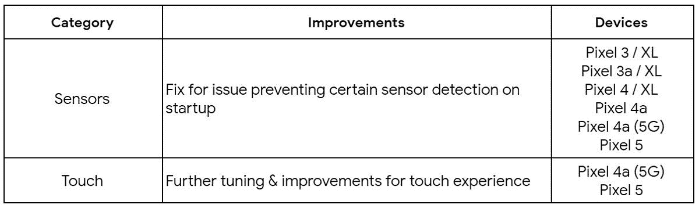
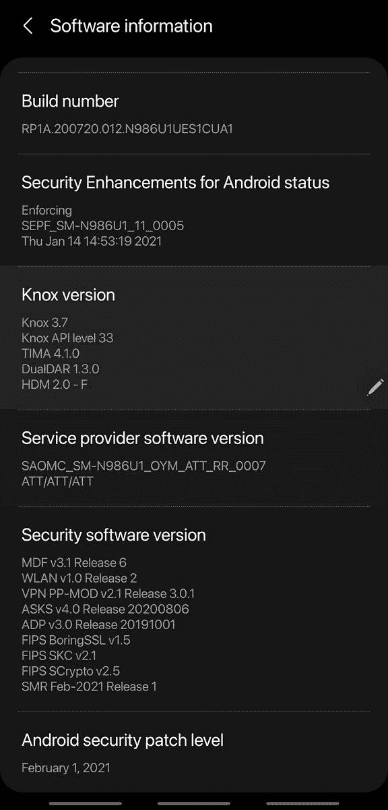

# 2021 年 2 月推出 Pixel、Galaxy S20 和 Note 20 的安全更新

> 原文：<https://www.xda-developers.com/february-2021-android-security-update/>

这是这个月的第一个星期一，这意味着是时候进行另一次安全更新了。谷歌今天发布了 2021 年 2 月的 Android 安全公告，并随之发布了 2021 年 2 月的 Pixel 手机安全更新。然而，谷歌的 Pixel 手机并不是今天唯一获得更新的设备，因为三星紧随谷歌的声明，向其骁龙 Galaxy S20 和 Galaxy Note 20 系列设备推送了更新。

## 2021 年 2 月 Android 安全公告

在[最新的 Android 安全公告](https://source.android.com/security/bulletin/2021-02-01)中，谷歌披露了多个影响 Android 运行时、框架、系统和媒体框架的安全漏洞。这些漏洞已经用 2021-02-01 安全补丁级别进行了修补。与此同时，谷歌还披露了闭源供应商组件和 Linux 内核中的多个漏洞。这些漏洞通过 2021-02-05 安全补丁级别解决。这些漏洞的补丁已经准备了几个星期或几个月，现在才被公开。如果你有兴趣了解更多关于每月 Android 安全更新过程的信息，那么请点击这里的查看[我们的解说。](https://www.xda-developers.com/how-android-security-patch-updates-work/)

## 像素更新公告/功能更新

另外，谷歌披露了 2021 年 2 月针对其 Pixel 设备的安全更新。在 2021 年 2 月的 [Pixel 更新公告](https://source.android.com/security/bulletin/pixel/2021-02-01)中，谷歌披露了一个影响闭源高通组件的中度严重漏洞。

对于用户来说，2021 年 2 月的安全更新也带来了一些功能上的变化。该公司表示，它已经修复了 Pixel 4a 5G 和 Pixel 5 的触摸体验。据《The Verge》上个月的报道，触摸屏问题在 Pixel 4a 5G 上最为突出。另一个调整解决了启动时传感器检测影响所有像素设备的问题。目前还不清楚 Pixel 2 是否也会受到这个问题的影响，因为它也运行 Android 11，但谷歌[早在 12 月就停止为其提供安全更新](https://www.xda-developers.com/google-pixel-2s-final-software-update-now-available/)。

 <picture></picture> 

Source: [Google](https://support.google.com/pixelphone/thread/96155274?hl=en)

此更新现已针对具有以下内部版本号的 Pixel 设备推出:

*   全球:

    *   像素 3 (XL): RQ1A.210205.004

    *   像素 3a (XL): RQ1A.210205.004

    *   像素 4 (XL): RQ1A.210205.004

    *   像素 4a: RQ1A.210205.004

    *   像素 4a (5G): RQ1A.210205.004

    *   像素 5: RQ1A.210205.004

*   威瑞森:

*   T-Mobile:

如果你不想等待更新(或不能更新，因为你的手机是根)，你可以从下面的链接下载工厂图像或完整的 OTA 图像。

**[像素工厂图像](https://developers.google.com/android/images)**| |**|[像素 OTA 图像](https://developers.google.com/android/ota)**

## 三星 Galaxy S20，Galaxy Note 2021 年 2 月 20 日安全更新

上周晚些时候，我们[报道了](https://www.xda-developers.com/samsung-galaxy-s20-february-2021-security-patch/)三星已经开始为欧洲的 Galaxy S20 系列设备推出新的更新，安全补丁级别将于 2021 年 2 月发布。同样的更新也将在骁龙 S20 设备上推出，但三星也将更新推广到骁龙 Galaxy Note 20 系列。我们论坛[上的一名用户报告说](https://forum.xda-developers.com/t/feb-security-update-released-for-986u1-devices-this-morning-cau1.4227113/)收到了他们美国未锁定的 Galaxy Note 20 Ultra (SM-N986U1)的 2021 年 2 月安全更新。三星向其旗舰设备提供更新的速度令人印象深刻，这就是为什么许多人现在认为该公司是[软件更新最好的公司之一](https://www.xda-developers.com/discussion-samsung-good-software-updates-one-ui/)。

 <picture></picture> 

Credits: XDA Senior Member [rjohnstone](https://forum.xda-developers.com/m/rjohnstone.3591369/)