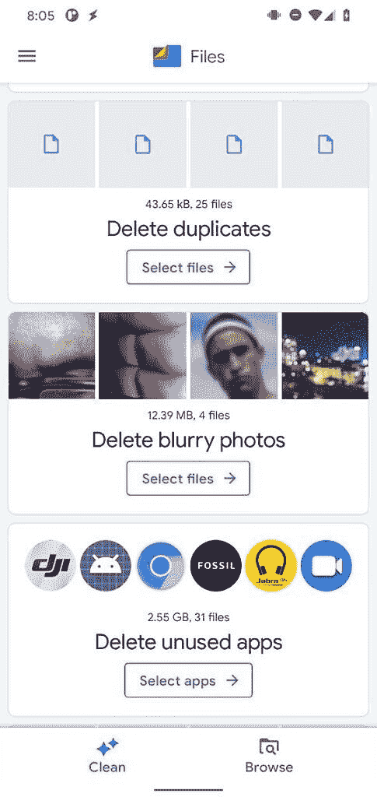

# 谷歌更新的最新文件引入了一个新的收藏夹

> 原文：<https://www.xda-developers.com/files-by-google-favorites-folder/>

谷歌正在推出谷歌应用程序的文件更新，为应用程序带来了一个新的收藏夹。这个新文件夹是在去年八月该应用的一次拆卸中第一次被发现的，现在它终于随着最新的更新向用户推出了。虽然这次更新不包括我们去年年底在 APK 拆除时发现的新[垃圾文件夹，但它确实突出了其他几个即将推出的功能。](https://www.xda-developers.com/files-by-google-1-0-345-prepares-trash-folder-restoring-deleted-files/)

谷歌已经开始通过 Play Store 推出 Google v1.0.362806406 的文件。最新的更新包括一个新的收藏夹，可以让你快速访问应用程序上所有你喜欢的文件。要向文件夹添加新文件，请选择一个文件并点击三点菜单按钮。在下拉菜单中选择新的添加到收藏夹选项，该文件将被添加到收藏夹文件夹中。

*新的收藏夹文件夹*

要访问收藏夹中的文件，请转到“浏览”选项卡，并在“收藏”转盘中选择“新收藏夹”选项。这将打开一个列表，列出所有你喜欢的文件。正如你在所附的截图中看到的，所有添加到收藏夹的文件都将标有星号。

APK 拆卸通常可以预测应用程序未来更新中可能出现的功能，但我们在这里提到的任何功能都可能不会出现在未来的版本中。这是因为这些特性目前还没有在实时构建中实现，并且可能会被开发人员在未来的构建中随时引入。

虽然谷歌更新的最新文件不包括任何其他面向用户的变化，但它确实有几个新的字符串，突出了一些即将推出的功能。新的字符串表明，谷歌正在为该应用程序准备一个新的内部存储用户界面，这将为你提供一个占用你手机内部存储空间的明细。

虽然新的用户界面看起来与 Android 的内置存储菜单没有什么不同，但它仍然是一个有用的补充，因为它让你可以访问应用程序中的信息。

 <picture></picture> 

Delete blurry photos

新的字符串表明，谷歌的文件将很快能够自动检测你存储中的模糊照片，并主动删除它们，以帮助你节省一些空间。此外，以下字符串表明，谷歌将很快用 Nearby Share 取代该应用程序的内置传输功能。

```
 <string name="nearby_receiver_failure_message">"If you can't receive files, your friend might need to update %1$s app and look for Nearby Share."</string>
<string name="nearby_settings_title">Nearby Share</string>
<string name="nearby_sharing_message">Powered by <a href="https://support.google.com/files/?p=FBG_Share">Nearby Share</a></string>
<string name="nearby_sharing_title">Fast file sharing with people nearby</string>
<string name="nearby_unavailable_message">"Nearby sharing isn't available on this device."</string> 
```

虽然这些功能在当前版本中没有上线，但我们设法手动启用了它们，上面的截图显示了它们在发布时的样子。虽然您可能需要等待一段时间才能使用这些即将推出的功能，但您可以通过从下面的 Play Store 链接下载 Google update 的最新文件，立即开始使用新的收藏夹文件夹。

*感谢 PNF 软件为我们提供了使用* *[JEB 反编译](https://www.pnfsoftware.com/?aid=xdadev)* *的许可，这是一款针对 Android 应用的专业级逆向工程工具。*