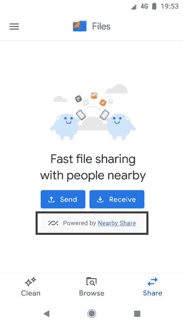

# 谷歌文件为一些用户推出了一个垃圾文件夹

> 原文：<https://www.xda-developers.com/files-by-google-trash-folder-nearby-share/>

正如我们在 12 月份发现的那样，Google Files 正在准备添加一个垃圾文件夹功能，让你暂时从你的设备中删除文件夹，直到应用程序在 30 天后永久删除它们。该功能现已面向 Android 版谷歌应用程序文件 1.0.378055542 的部分用户推出。

我们的线人@[doraeigah](https://twitter.com/Doraeigaah)在 Twitter 上发现了他们 Android 12 设备上的这一功能，并与我们分享了下面的截图，但该功能尚未在我的设备上推出。不过，该功能可能会在运行 Android 11+的设备上推出，因为它利用了 Android 11 中添加的 Android[内置回收站功能](https://www.xda-developers.com/android-11-hidden-recycle-bin-trashed-photos-videos/)。

除了垃圾文件夹，谷歌更新的最新文件还对运行 [Android 12](https://www.xda-developers.com/android-12/) 的设备的设计进行了一些小的调整。

据 POSP 团队的开发者[大卫·比安科](https://twitter.com/HrX2003)称，虽然该应用程序尚未适应 [Material You](https://www.xda-developers.com/material-you/) 的新动态重新着色系统，但它显然已经适应了底部导航栏的新材料。该应用程序还[现在似乎使用](https://twitter.com/outbraegeous/status/1402439723612782594)谷歌无字体，这是为你重新设计的完整材料做准备的又一个微妙的调整。

最后，谷歌对文件的更新正在用谷歌的附近共享取代应用程序的内置共享功能，至少对一些用户来说是这样。这一变化在谷歌支持页面上有详细说明[，之前在](https://support.google.com/files/answer/10514188?p=FBG_Share&visit_id=637587954855319339-3369021014&rd=1)[我们之前的应用拆除](https://www.xda-developers.com/files-by-google-favorites-folder/#:~:text=Furthermore%2C%20the%20following%20strings%20suggest)中也有暗示。既然附近共享已经在使用谷歌移动服务的 Android 设备中变得无处不在，那么谷歌应用程序的文件就没有理由拥有自己的文件共享功能。这也是为什么一加[在自己的文件管理器应用中放弃了文件破折号功能](https://www.xda-developers.com/oneplus-replaces-file-dash-with-google-nearby-share/)。

正如谷歌在其支持页面上解释的那样，由 Nearby Share 支持的文件传输要求两台设备都运行谷歌应用程序的最新版本的文件。两个用户还必须位于附近共享支持的区域。您最多可以共享 500 个文件。共享文件保存在收件人设备的“下载”文件夹下。