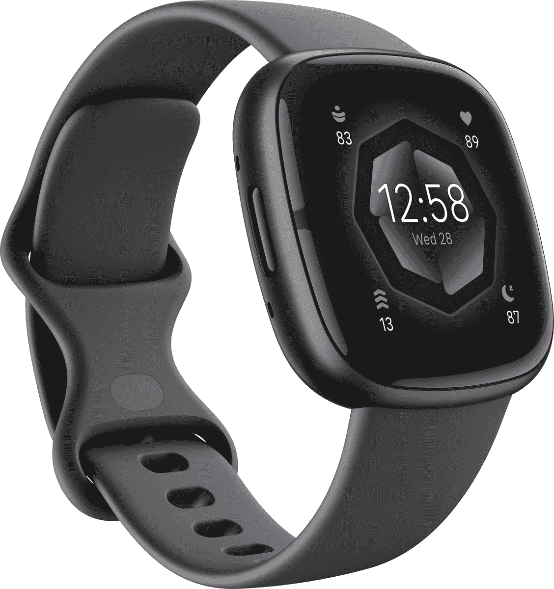
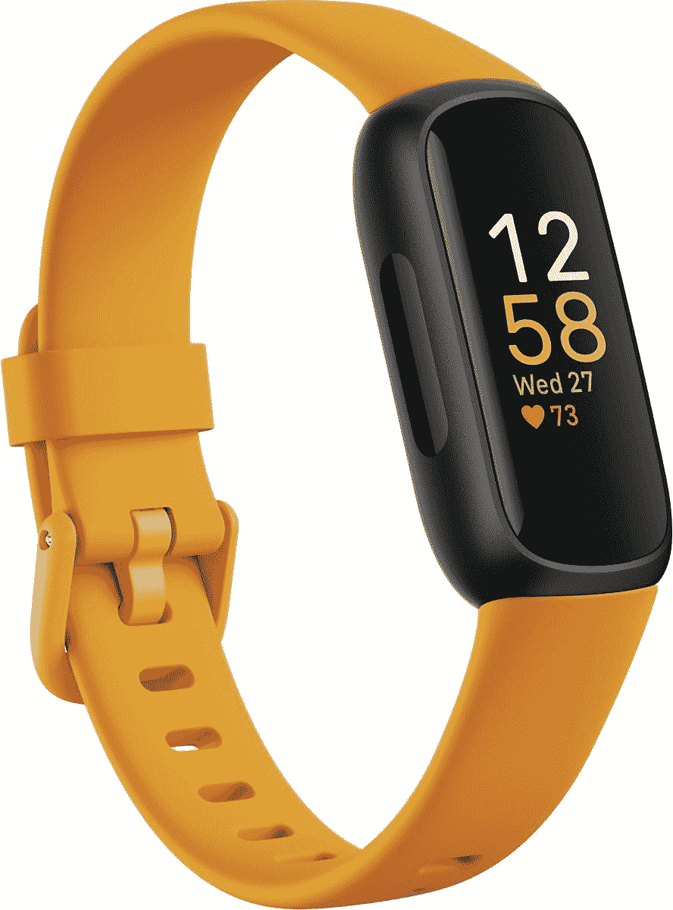
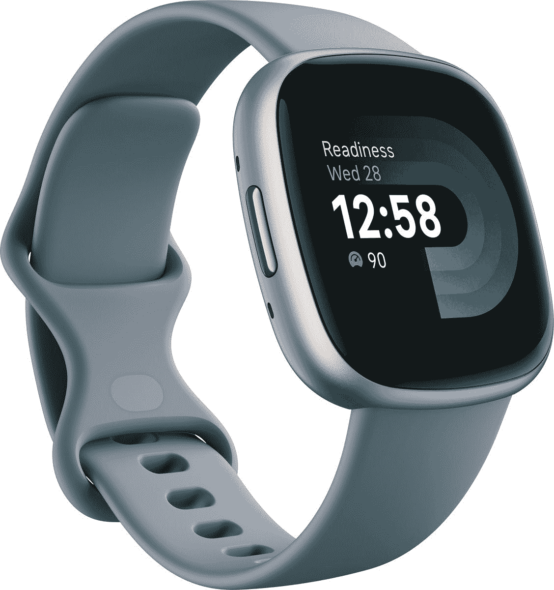

# Fitbit 宣布 Sense 2，Inspire 3，Versa 4

> 原文：<https://www.xda-developers.com/fitbit-announces-the-sense-2-inspire-3-and-versa-4/>

可穿戴设备提供了一种简单方便的方式来跟踪健康和健身目标。你只需要把它绑上，在你的智能手机上加载一个应用程序，它就能完成所有的工作。坦率地说，这是保持动力的好方法。如果你一直在市场上寻找新的健身可穿戴设备，你很幸运，因为 Fitbit 刚刚宣布了三款新设备:Sense 2、Inspire 3 和 Versa 4。

如果你一直关注新闻，你会知道这三种设备以前见过。本月早些时候，它们在一次重大泄露中被披露，让我们第一次看到了 Fitbit 的最新消息。虽然我们确实看到了很多 Sense 2、Inspire 3 和 Versa 4，但我们没有任何关于新设备可以做什么的硬数据。谢天谢地，现在他们是官方的，我们可以看看每一个都提供了什么。

## 感知 2 和感知 4

Sense 2 和 Versa 4 是相同的设备，具有轻薄的时尚设计。与标准健身追踪器相比，这些设备提供了更传统的外观，使其成为追踪健康指标的更时尚和时尚的方式。这些设备提供 24 小时心率监测、活动跟踪以及睡眠和压力跟踪。

健身可穿戴设备的特别之处在于它可以持续使用几天。Sense 2 和 Versa 4 都可以在一次充电后提供长达 6 天的电池寿命，并且可以在 12 分钟内快速充电以提供一天的电池。令人印象深刻。虽然跟踪健身对一个人的健康很重要，但晚上睡个好觉也很重要。如前所述，Sense 2 和 Versa 4 可以跟踪睡眠指标，以显示你是哪种类型的睡眠者。该设备甚至可以提供如何改善睡眠的建议。

现在你可能会问自己，是什么把意义 2 和意义 4 区分开来？差别很小，但 Sense 2 提供了与心电图应用程序、皮肤温度传感器、更好地帮助识别压力的 cEDA 传感器以及 皮肤电活动 (EDA)扫描的兼容性。记住这些差异，Fitbit Sense 2 的售价为 299.95 美元，而 Versa 4 的售价为 229.95 美元。这两款设备都兼容 Android 和 iOS。无论你拥有哪种智能手机，这都是一个简单的选择。

## 灵感 3

Inspire 3 看起来更像传统的健身追踪器，而不是智能手表，但这并不意味着它缺乏功能。尽管该设备轻薄，但它可以跟踪各种不同的活动，如心率、睡眠和压力。它一次充电可以工作长达十天，让你自由地享受户外活动，而不会感到必须充电的焦虑。对于那些刚刚涉足健身追踪领域的人来说，Inspire 3 是一款完美的设备。与 Sense 2 和 Versa 4 一样，Inspire 3 也兼容 Android 和 iOS。这款设备的售价为 99.95 美元。如果这些设备听起来很有趣，你现在可以点击下面的链接预订。

 <picture></picture> 

Fitbit Sense 2

 <picture></picture> 

Fitbit Inspire 3

 <picture></picture> 

Fitbit Versa 4

* * *

**来源** : [谷歌](https://blog.google/products/fitbit/fall-2022/)