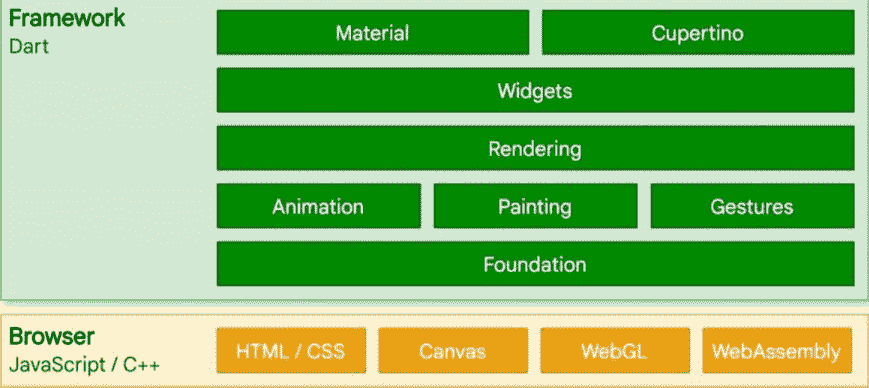

# Flutter 2.0 引入了对构建 web 应用程序的生产质量支持

> 原文：<https://www.xda-developers.com/flutter-2-0-web-stable/>

Flutter 2.0 已经发布到稳定，有了它，就有了稳定的 web 支持。这意味着 Flutter 现在可以安全地用于生产质量的 web 项目。

说了这么多，让我们看看 Web 的 Flutter 需要什么。

## 渲染器

Flutter for Web 有两种方式可以在浏览器中显示您的应用程序。它可以使用 HTML、CSS 和 Canvas 来呈现它，也可以使用 CanvasKit。各有各的优势。HTML 渲染器使用更多的基本元素，因此下载和加载速度更快。CanvasKit 渲染器有点重，但当屏幕上有很多内容时，它可以提供更好的性能。

默认情况下，Flutter web 应用程序会根据客户端设备自动选择使用哪个渲染器。移动设备将被发送 HTML 渲染器，而桌面设备将获得 CanvasKit。如果您想使用特定的渲染器，Google 提供了总是使用其中一个的选项。

 <picture></picture> 

An architectural overview of Flutter. Source: Google

## 特定于 Web 的功能

尽管 Flutter 是跨平台的，但仍然有一些东西是特定于每个支持的平台的。这是因为有些东西只存在于一个平台上，或者以某种需要特殊 API 的方式工作。网络也不例外。

Flutter 2.0 增加了对定制 URL 策略、web 应用深度链接和适当 PWA 支持等的支持。当您为 web 项目创建 Flutter 时，将会为您生成一个 Web 清单和服务工作者模板。

## 手势和键盘

要真正实现跨平台，框架需要考虑它的目标。如果它运行在桌面平台上，它应该响应键盘快捷键。在手机上，它应该响应点击和滑动手势。

嗯，Web 的 Flutter 做了这两件事。通过网络，它的目标是桌面和移动设备。随着 Flutter for Web 的稳定发布，将支持本地手势，具体取决于客户端平台和输入源。

## 插件

像任何好的语言一样，Flutter 支持库，或者插件。作为一种安全措施，插件需要指定它们的平台兼容性。由于 Flutter for Web 是一个相对较新的框架，很多插件，包括谷歌自己的，都不支持它。

随着 Flutter 2.0 的发布，一大堆谷歌的 Flutter 插件，包括 Firebase 套件(T1)，都被标记为网络兼容。

* * *

虽然这看起来不是很多，但这些是相当大的功能。Flutter 2.0 获得了一个完整的平台，为了将 Flutter for Web 集成到框架的其余部分，做了大量的工作。

你对 Web 的 Flutter 有什么看法？对于 web 开发来说是一个好的选择吗？让我们知道！