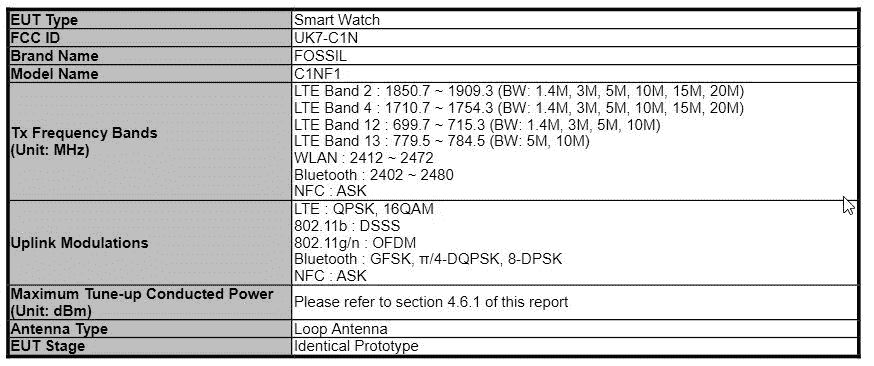
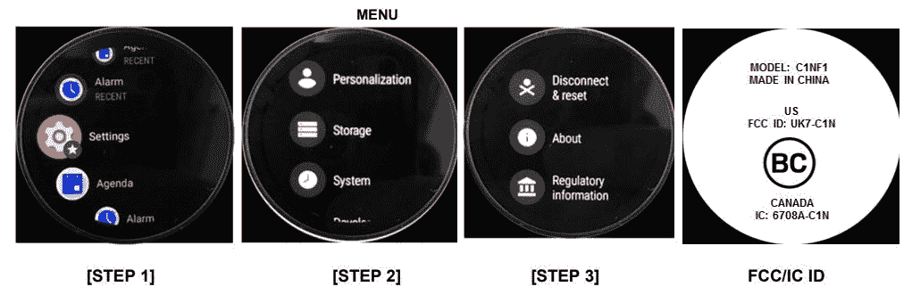

# 据报道，Fossil 正在开发新的 LTE 智能手表

> 原文：<https://www.xda-developers.com/fossil-rumored-gen-5-smartwatch-with-lte/>

Fossil 推出第五代智能手表已经一年多了。你可能会认为该公司将准备推出可穿戴设备的后续产品，但我们可能会看到第五代产品的小幅更新。FCC 文件表明 Fossil 可能很快会推出一款新的具有蜂窝连接功能的智能手表。如果属实，这将是该公司第一款具有 LTE 功能的智能手表。

 <picture></picture> 

RF exposure docs submitted to the FCC confirm LTE band support for Fossil's new smartwatch.

FCC (通过 *[安卓权威](https://www.androidauthority.com/fossils-gen-5-smartwatch-lte-at-fcc-1187663/)* )没有透露关于所谓智能手表的其他主要细节，但我们猜测消费者将能够在美国的主要运营商那里使用该设备

 <picture></picture> 

From the FCC docs, it's clear this smartwatch will have a circular screen, just like other Fossil smartwatches.

Fossil 的第五代智能手表最初于去年 8 月推出，配备了骁龙 3100、1GB 内存、扬声器和 Wear OS。虽然自那以后它们的内部结构已经老化，但可穿戴设备看起来仍然高端，考虑到 Fossil 以制作精美的钟表而闻名，你会想到这一点。然而，自从 Fossil 的第五代智能手表上市以来，高通已经推出了[骁龙 Wear 4100](https://www.xda-developers.com/qualcomm-snapdragon-4100-announcement-wear-os-smartwatches/) ，它承诺更好的性能和电池寿命。Fossil 即将推出的设备很可能会包含该处理器，这肯定会有助于延长电池寿命，但我们目前还不确定。

我们所知道的是，无论新的可穿戴化石有什么锦囊妙计，据称它都将采用 LTE 技术。

提醒你一下，LTE 的加入可不是小事。给你的智能手表添加 LTE 将会减少它对智能手机的依赖。这意味着你只需要智能手表就可以更加移动，你仍然可以接电话、回复短信和听音乐。有时候，当你的设备性能提升时，你可能并不太在意里面的规格。

虽然 Fossil 的神秘设备正在获得 FCC 的认证，但我们不确定这种新型号何时发布。CES 2021 是一种可能性，尽管时机似乎很突然。也许我们会在接近春天的时候看到一些东西，那时你就可以走到外面，充分利用你的化石智能手表和 LTE。