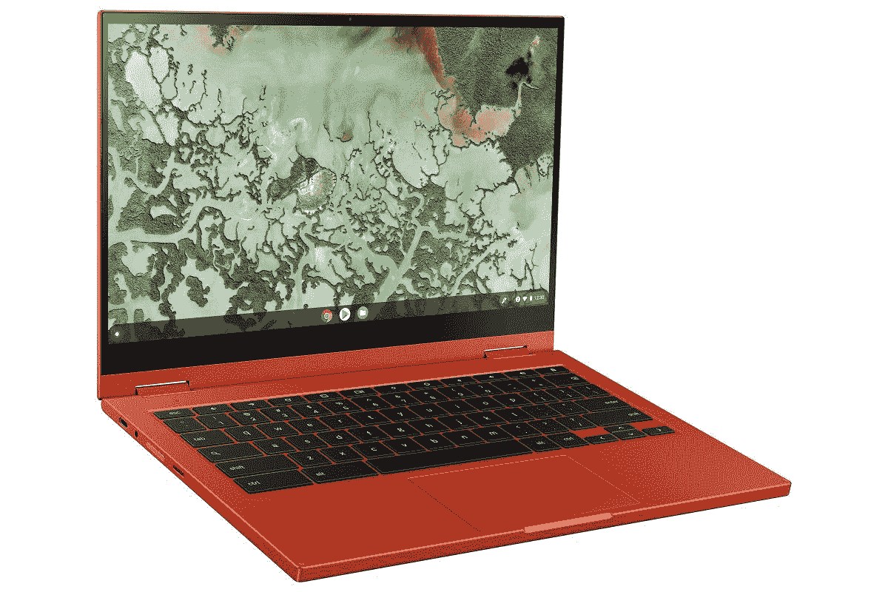

# 在我们的学生 Chromebook 精选产品 Galaxy Chromebook 上节省 200 美元

> 原文：<https://www.xda-developers.com/galaxy-chromebook-samsung-store-deal/>

我不打算撒谎，我喜欢 Chromebooks。老实说，比起笔记本电脑，我更喜欢它们。一台超级强大的笔记本电脑很有趣，是的，但是我有一台台式机可以玩我所有的游戏，做一些疯狂的事情。我不需要什么都做的笔记本电脑！在这方面，Chromebooks 真的很擅长做基本的生产力任务，做得很好，并且有很长的电池寿命。在现有的 Chromebook 中，三星 Galaxy Chromebook 是最好的。

三星 Chromebook 是我们的[高端学生 Chromebook 精选](https://www.xda-developers.com/best-chromebooks-for-students/),这是有原因的——它就是这么好！这是一款高端 Chromebook，8GB 内存，英特尔 i5 处理器，Super AMOLED 显示屏。该设备还配有一支 S Pen，因此你可以毫无问题地记笔记、画画或做任何你想做的事情。从本质上来说，Galaxy Chromebook 将满足您在工作效率方面的所有需求，当您准备放松并做些其他事情时，三星的高端 Chromebook 也可以做到这一点。

Galaxy Chromebook 唯一真正的败笔是价格。它的建议零售价通常为 1000 美元，这对 Chromebook 来说是一个很大的要求。一般来说，Chromebooks 是一个更便宜的选择，你可以找到更便宜的高端笔记本电脑。但是，在三星商店，你可以立即节省 200 美元的嘉年华红或汞灰色的颜色！更好的是，如果你有一个符合条件的折价物，你可以节省更多。不幸的是，这项以旧换新优惠不包括其他 Chromebook(也就是你最有可能以旧换新的 chrome book)，但如果你有一部旧智能手机或平板电脑要处理，你仍然可以省钱。

 <picture></picture> 

Samsung Galaxy Chromebook 2 ($150 off)

##### 三星 Galaxy Chromebook

Galaxy Chromebook 是我们的优质学生 Chromebook 选择，理由很充分-这是一款非常棒、功能强大的生产力设备！现在购买任何一种颜色的型号都可以节省 200 美元，以旧换新可能会节省更多。

寻找更多平板电脑和 Chromebook 交易？查看[三星商店的登陆页面](https://shop-links.co/1729221560182114057?u1=dbd1c1fa-4362-4169-9c81-86a128c6c698)，看看是否有其他商品更适合你的需求！