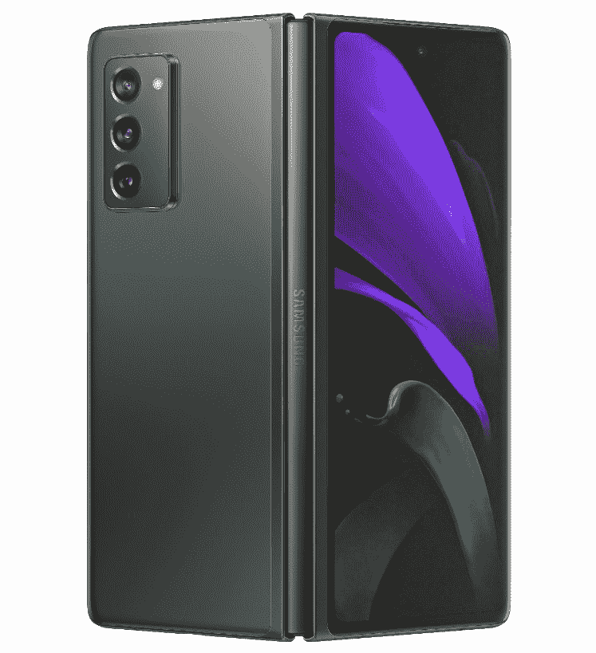

# 银河折叠现在收到其 2021 年 7 月的安全更新

> 原文：<https://www.xda-developers.com/galaxy-fold-becomes-one-of-the-first-phones-to-receive-july-2021-security-patch/>

# Galaxy Fold 成为首批获得 2021 年 7 月安全补丁的手机之一

三星开始推出 2021 年 7 月的安全补丁，首批推出的是最初的 Galaxy Fold。

在安全更新方面，三星是较好的 Android 手机制造商之一。该公司最近推出的大多数设备在获得月度安卓安全补丁后都会立即更新，毫无疑问，三星已经开始在其部分手机上推出 7 月补丁。有趣的是，三星首批获得新更新的设备之一是原始的 Galaxy Fold(有时也称为 Galaxy Z Fold)。

三星正在推出 Galaxy Fold 的新更新( [via *SamMobile*](https://www.sammobile.com/news/galaxy-fold-july-2021-security-update) )，固件版本为 F900FXXS5EUF3。升级包含 7 月的安全补丁，似乎没有其他内容。三星也开始向其他型号推出安全更新，如 [Galaxy S10 系列](https://www.sammobile.com/news/samsung-debuts-july-2021-security-update-starts-with-galaxy-s10/)。Galaxy Fold 的发行首先在捷克共和国被发现，但它正在慢慢向其他地区发展。

新的更新正值三星准备发布 [Galazy Z Fold 3](https://www.xda-developers.com/samsung-galaxy-z-fold-3/) 之际，预计这款手机将采用相同的折叠式设计，外部是一个小屏幕，内部是一个更大的方形屏幕。我们还不知道具体的规格，但它很有可能会像三星今年的其他旗舰产品一样，采用骁龙 888 芯片组。

 <picture></picture> 

Samsung Galaxy Z Fold2 5G

##### 三星 Galaxy Z Fold 2

Galaxy Z Fold 3 即将推出，但三星的 current-gen 折叠手机仍然可用。