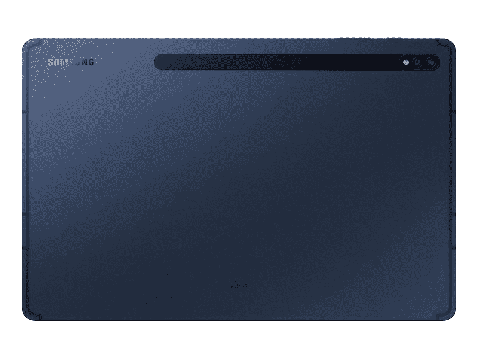
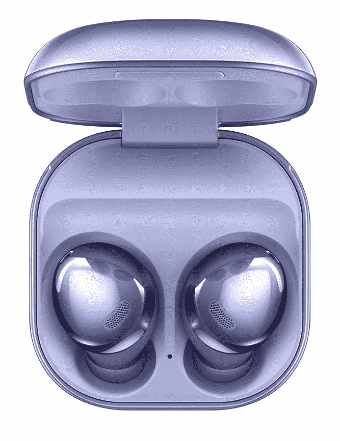

# 最好的安卓平板电脑，Galaxy Tab S7，现在已经在神秘海军上市

> 原文：<https://www.xda-developers.com/galaxy-tab-s7-navy-blue/>

你看到我上周发的关于伟大平板电脑的帖子了吗？太好了，那么你应该知道三星 Galaxy Tab S7 可能是目前最好的安卓平板电脑。这是 XDA 员工的最爱，也是有充分理由的，它是市场上真正与苹果 iPad 产品竞争的少数公司之一。如果你不相信，我们有一个 [Galaxy Tab S7 评测](https://www.xda-developers.com/samsung-galaxy-tab-s7-review/)，它一定会向你展示它有多棒。

目前，神秘海军配色仅在[三星的网站](https://shop-links.co/1731921862557557538?u1=0564f5c7-9837-4d7a-ad66-060404ad6eac)上有售，但当它在 2 月 18 日发布时，可能会在其他零售商处有售。但是为什么要等呢？如果你从三星商店预购平板电脑，你就不必担心 Tab S7 何时何地会有货——它会直接送货上门！

更好的是，你不需要为你新的超级棒的 Galaxy Tab S7 支付全价。目前，标准版和增强版降价 80 美元，包括神秘海军配色。如果你碰巧有一部符合条件的手机或平板电脑，你也可以以旧换新来节省更多。如果你能达到最大折扣，标准 S7 只需 120 美元，S7 Plus 只需 320 美元！如果你不喜欢神秘海军，除了神秘黑色，其他颜色都有折扣。

标准 Tab S7 和 Tab S7 Plus 均提供神秘海军蓝颜色:

 <picture></picture> 

Samsung Galaxy Tab S7 (128 GB)

 <picture></picture> 

Samsung Galaxy Tab S7 (128 GB)

 <picture></picture> 

Samsung Galaxy Tab S7 (128 GB)

##### 三星 Galaxy Tab S7 Plus

 <picture></picture> 

Samsung Galaxy Tab S7 (128 GB)

##### 三星 Galaxy Tab S7 Plus

如果你正在寻找更多的 Galaxy Tab S7 交易，并且不介意颜色，我们已经收集了所有销售 Galaxy Tab S7 的主要零售商，让你轻松搞定！

顺便说一下，现在你有了一个很酷的平板电脑，是时候买一些优秀的耳塞来搭配它们了。今天在伍特！，你只需花 170 美元就能买到一副新的 Galaxy Buds Pro。你可以选择幻影银、幻影黑和幻影紫。我个人会选择紫色，因为它们看起来很棒。

 <picture></picture> 

Samsung Galaxy Buds Pro

##### 三星 Galaxy Buds Pro

为您的新平板电脑配备一些出色的耳塞！今天只在伍特！，以 170 美元的价格获得 Galaxy Buds Pro。