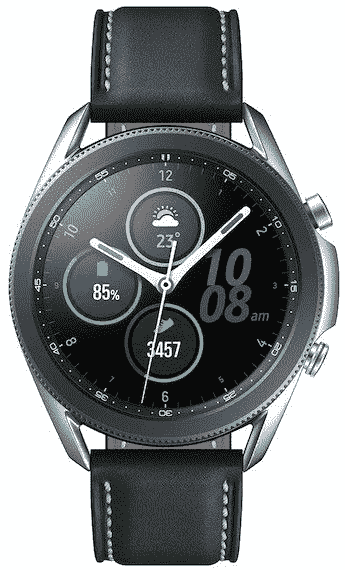

# 今天三星发现周的交易是 37%的 Galaxy Watch 3！

> 原文：<https://www.xda-developers.com/galaxy-watch-3-samsung-discover/>

三星探索周继续进行！昨天的交易是关于 Note 20 Ultra 的，但今天，零售商的一些流行配件正在大减价。今天三星发现周活动的特价商品是 Galaxy Watch 3 LTE！您只能在今天节省 37%的设备费用。

37%看起来很奇怪，但这会给你选择的手表带来一些不错的(甚至有些)折扣。对于标准的 41 毫米手表，大约便宜 129 美元！这使得 350 美元的手表降到了 221 美元。对于一款高端智能手表来说，这是一笔非常划算的交易。

毫无疑问，Galaxy Watch 3 是一款高质量的智能手表。您可以轻松跟踪自己的心率、血氧水平，甚至对自己进行 EKG。智能手表技术真的很有前途！这款手表还可以自动跟踪你的锻炼，并为你的健身目标提供先进的见解。

最后，你可以使用这款 Galaxy 手表跟踪你的压力和睡眠。虽然我不确定穿着它睡觉会有多舒服，但压力洞察力和手腕上的呼吸和冥想练习本身就很棒。也许一个好的乐队会让夜晚更加舒适？

今天的交易是为了 Galaxy Watch 3 的 LTE 版本。LTE 智能手表允许您使用移动数据来跟踪一切，并获得通知，以便您可以将智能手机留在身后。这非常适合那些外出徒步旅行或经常锻炼的人，或者如果你在健身房，想在手机放在储物柜里的时候听音乐，或者甚至只是不想太多地被手机束缚住！

请记住，你只有一天的时间来利用这笔交易。

 <picture></picture> 

Samsung Galaxy Watch 3

##### 三星 Galaxy 手表 3

使用 Galaxy Watch 3 跟踪您的健康状况、健身情况等！仅在今天，购买高级智能手表即可享受 37%的优惠，获得最佳智能手表体验之一。

如果你想看到所有的三星发现周交易，请查看下面的交易页面。明天再来查看当天的下一笔交易！

 <picture></picture> 

Samsung Discover Week

##### 三星 Galaxy 手表 3

前往三星商店，看看这家零售商本周出售的所有商品。