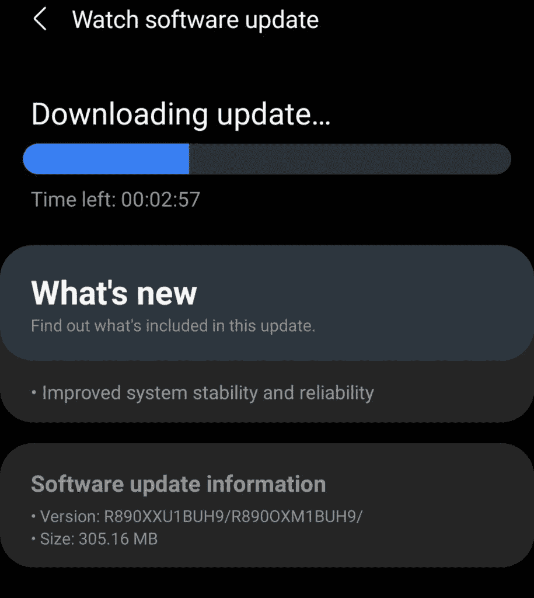

# Galaxy Watch 4 更新为设置和更多内容带来了三星健康

> 原文：<https://www.xda-developers.com/galaxy-watch-4-update-samsung-health-settings/>

三星已经开始为 [Galaxy Watch 4](https://www.xda-developers.com/samsung-galaxy-watch-4/) 和 Galaxy Watch 4 Classic 推出首次发布后软件更新。此次更新将 Samsung Health 功能添加到设置中，引入了新的取消按钮以自动检测健身程序，等等。

根据 [*Tizen 帮助*](https://www.tizenhelp.com/samsung-releases-new-firmwares-for-galaxy-watch-4-4-classic/) 的消息，更新已经开始在美国、欧洲和英国推出 Galaxy Watch 4 系列。它的固件版本是 R8**XXU1BUH9，大小为 305.16MB。虽然更新的 changelog 只提到它带来了稳定性和可靠性的提高，但它确实包括了一些值得注意的变化。

 <picture></picture> 

Screenshot: Tizen HelpSamsung

第一个也是最重要的变化是，更新将三星健康添加到手表设置中。正如我们在 [One UI 手表评论](https://www.xda-developers.com/wear-os-3-galaxy-watch-4-oneui-watch-review/)中提到的，三星最新的智能手表确实预装了三星健康。但该功能无法在设置中使用，就像老款搭载 Tizen 的 Galaxy 智能手表一样。通过此更新，您现在可以在“设置”中访问所有三星健康功能。

三星 Galaxy Watch 4 系列带有一项新功能，可以自动检测您何时开始健身并跟踪您的锻炼情况。虽然这是一个非常方便的附加功能，但对于想要手动跟踪锻炼的用户来说，它可能会有点烦人。为了解决这个问题，Samsung 添加了一个最新更新的新按钮，让您只需轻按一下即可轻松取消自动健身程序检测。

此次更新还在快速设置面板中添加了音量控制，让您可以轻松控制媒体音量，改进了自行车运动的卡路里测量，以及一些稳定性改进。如前所述，更新已经开始在美国、欧洲和英国推出 Galaxy Watch 4 和 Galaxy Watch 4 Classic。它应该在未来几天内到达所有用户。