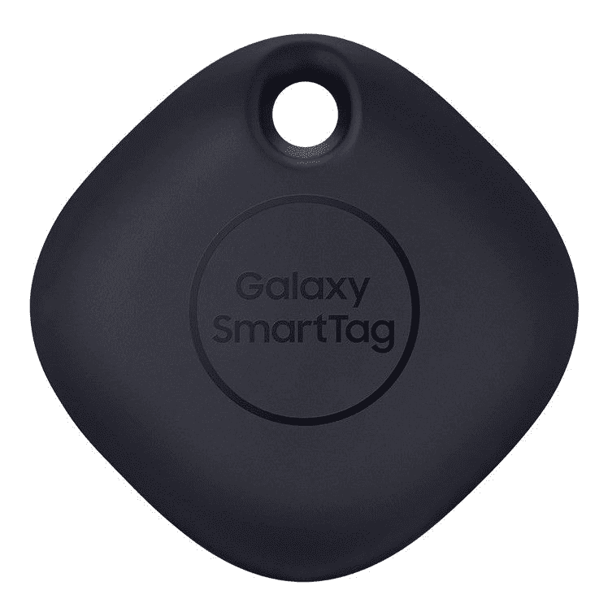

# Galaxy Watch Active 2 更新添加了三星 SmartThings Find 支持

> 原文：<https://www.xda-developers.com/galaxy-watch-active-2-samsung-smartthings-find/>

三星已经开始在 Galaxy Watch Active 2 上推出对其安卓版本“查找我的手机”功能的支持。蓝牙低能量(BLE)和超宽带(UWB)供电的网络，其工作原理类似于 Tile，可以检测注册的三星设备，如新的 Galaxy S21 系列，以及与其一起推出的 29 美元的 Galaxy SmartTag。

周五晚些时候， [XDA 论坛成员 adfree](https://forum.xda-developers.com/t/firmware-r820-r830.4161883/page-3#post-84292647) 在[三星的社区页面](https://r1.community.samsung.com/t5/%EC%9B%A8%EC%96%B4%EB%9F%AC%EB%B8%94/%EA%B0%A4%EB%9F%AD%EC%8B%9C-%EC%9B%8C%EC%B9%98-%EC%95%A1%ED%8B%B0%EB%B8%8C-2-bt%EB%AA%A8%EB%8D%B8-%EC%86%8C%ED%94%84%ED%8A%B8%EC%9B%A8%EC%96%B4-%EC%97%85%EB%8D%B0%EC%9D%B4%ED%8A%B8/td-p/8553557)上发布(韩语)后首次发现了这一更新，它将允许你在地图上定位你的手表，就像它是一个智能标签一样。然而，没有建议说你可以使用你的手表来寻找其他登记的对象。健身爱好者也有新的功能，以集体步行挑战的形式，改进的睡眠分数分析，当你开始工作时更快的自动识别，以及当你开始洗手时自动检测启动计时器。你再也不需要唱生日快乐了。(显然，除了生日那天)。

 <picture></picture> 

Samsung Galaxy SmartTag

除了通常的“提高系统稳定性和可靠性”之外，这是 Active 2 的一个相当重要的更新，也是整个三星生态系统中 Smartthings Find 的意图声明。Smartthings Find 在 Google Play 上不可用，但会在下次固件下降时自动添加到所有兼容 Galaxy 设备上的主 Smartthings 应用程序中。同时，一方面，很明显，三星正在转向类似于苹果的“整个家庭”系统的战略，让 Smartthings 成为三星独有的是一个巨大的风险，特别是当有类似的追踪器如 Tile 和 Chipolo 时，这两者都可以在所有 Android 和 iOS 设备上跨平台工作，更重要的是，成本更低。

下面是完整的 changelog 细节。目前，固件正在韩国和加拿大推出 OTA，其他地区也将很快跟进。

## 变更日志(已翻译):

**三星 Galaxy Active 2:r 820 Xu 1 du a3/r 820 GFC 1 du a3**

改进的三星健康功能:

*   你现在可以和你的朋友一起享受集体徒步挑战了
*   提供额外的睡眠评分洞察
*   缩短自动健身识别时间(跑步、划船机、椭圆)
*   享受各种健身计划带来的家庭锻炼

Smartthings 发现:

*   你可以在地图上找到手表的位置

手洗:

*   下载洗手应用后，你的手表可以自动检测并记录你开始洗手的时间
*   提高系统稳定性和可靠性