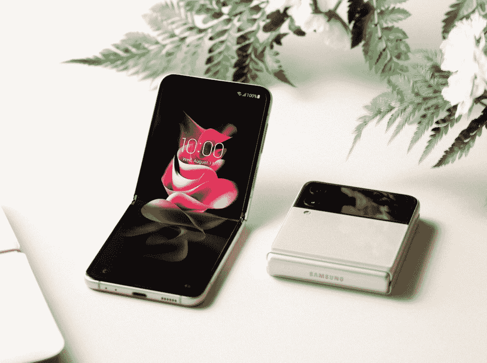

# Galaxy Z Flip 3 和 Z Fold 3 预购量远超三星之前的可折叠产品

> 原文：<https://www.xda-developers.com/galaxy-z-flip-3-z-fold-3-pre-orders/>

# Galaxy Z Flip 3 和 Z Fold 3 预购量远超三星之前的可折叠产品

三星 Galaxy Z Flip 3 和三星 Galaxy Z Fold 3 的预购量已经远远超过了三星之前的可折叠量。

三星 Galaxy Z Fold 3(T1)和三星 Galaxy Z Flip 3(T3)是三星的一对可折叠手机，它们很可能总结了目前可折叠手机的最佳状态。自从第一次折叠以来，随着技术的成熟，我们已经看到这些设备从难以置信的小众到更加实惠和实用。似乎普通大众也同意这种说法，因为在预购开始后的短短 10 天内，Galaxy Z Flip 3 和 Z Fold 3 已经超过了三星 2021 年全年的销量。

“我们非常感谢客户对我们新推出的 Galaxy Z Fold3 和 Galaxy Z Flip3 的巨大反响。人们对可折叠智能手机的兴趣达到了历史最高水平，Z Fold3 和 Z Flip3 的预购量已经超过了 2021 年迄今为止 Galaxy Z 设备的总销量。我们致力于为我们的消费者提供最具创新性的体验，”三星在一份声明中表示。

**[阅读更多:三星 Galaxy Z Fold 3 回顾(上)——技术的未来，在我们的眼皮底下展开](https://www.xda-developers.com/samsung-galaxy-z-fold-3-review/)**

如果你想挑选一款新的可折叠产品，[我们已经对它们进行了比较，这样你就能知道哪一款最适合你](https://www.xda-developers.com/samsung-galaxy-z-fold-3-vs-galaxy-z-flip-3/)。美国消费者在美国东部时间 8 月 26 日星期四午夜之前仍然可以享受预购优惠。在三星网站上或通过合作运营商预购时，Z Fold 3 可以获得 200 美元的三星信用，Z Flip 3 可以获得 150 美元的三星信用。预订的客户也有资格成为首批通过 Galaxy Z Premier 兑换 12 个月免费 CLEAR 会员资格[的客户之一。与该公司以前的可折叠智能手机相比，这些智能手机显然是成功的，我们期待看到可折叠显示技术的未来。](https://shop-links.co/1749936797141864694?u1=ac6f4ceb-171c-4917-b6d0-bf6cefb4d6c4)

 <picture></picture> 

Samsung Galaxy Z Flip 3

Galaxy Z Flip 3 是三星最新的可折叠翻盖手机，提供更大的外部显示屏、高刷新率的内部显示屏和顶级的硬件。

 <picture></picture> 

Samsung Galaxy Z Fold 3

##### 三星 Galaxy Z Fold 3

Galaxy Z Fold 3 是三星最新、最棒的可折叠手机。与之前的型号相比，它带来了几项改进，包括高刷新率显示器、屏幕下摄像头和顶级硬件。

*特色图片:三星 Galaxy Z Fold 3*