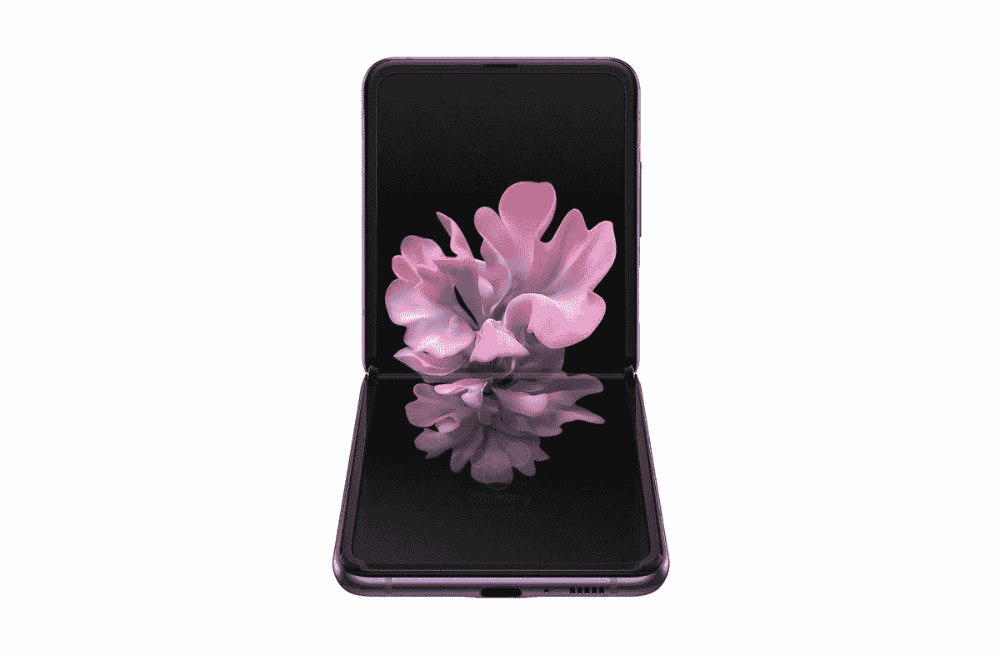
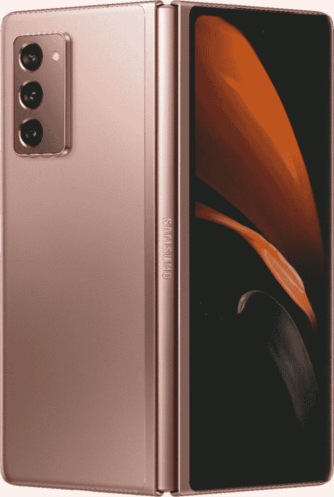

# 三星的 Galaxy Z Flip 5G 刚刚大幅降价！

> 原文：<https://www.xda-developers.com/galaxy-z-flip-price-drop/>

我喜欢可折叠手机的概念。我喜欢以前的翻盖手机(我知道，我是老古董)，市场上的一些可折叠手机用新技术复制了这种老派的感觉。问题是可折叠价格仍然相对较新，高价格符合这一事实。因此，当 Galaxy Z Flip 5G 大幅降价 250 美元时，你会注意到这一点！

据报道，Galaxy Z Flip 的下一次迭代[推迟了](https://www.xda-developers.com/samsung-galaxy-z-flip-2-reportedly-delayed/)，现在仍然是获得原始 Z Flip 的好时机！三星似乎也同意这一点，因为他们已经将可折叠 5G 机型的价格降低了 250 美元。原来 1449 美元，现在你只需 1199 美元就可以买到这款小巧的智能手机！这使得 Z Fold 更符合三星的其他高端旗舰产品，如 Galaxy Note 20 Ultra。具有讽刺意味的是，Galaxy Z Flip 的 4G 型号售价为 1299 美元。即使你的运营商还不支持 5G 模式，你也可以选择 5G 模式。

更好的是，如果你有一部手机以旧换新，你可以节省更多。诚然，最大折价价值将保留给最新和最棒的智能手机型号，但折扣就是折扣，所以确保看看它对你来说是否值得。

 <picture></picture> 

Samsung Galaxy Z Flip

##### 三星 Galaxy Z Flip

三星已经把 Galaxy Z Flip 5G 的价格降了！你现在可以花 1199 美元买到这款可折叠手机。符合条件的以旧换新可以节省更多！

不过，你可能想知道，Galaxy Z Fold 2 怎么样，它被 XDA 评为 2020 年最佳智能手机？不幸的是，较大的可折叠仍然是 1999 美元的全价，但你可以在以旧换新中节省 1000 美元。谁知道呢，也许你有一部完美的手机，它会让你的价格便宜很多！

 <picture></picture> 

Samsung Galaxy Z Fold 2

##### 三星 Galaxy Z Fold 2

Galaxy Z Fold 2 仍然是全价，但它可能会更适合你。通过符合条件的以旧换新，你可以大幅度降低价格！

不过说实话，我认为我喜欢 Galaxy Z Flip 的较小外形——我自己并不需要本质上是迷你笔记本电脑的东西！但是你更喜欢哪个？请在评论中告诉我们！