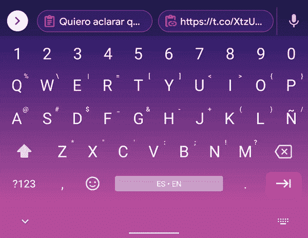

# Gboard 准备让从剪贴板粘贴更加方便

> 原文：<https://www.xda-developers.com/gboard-prepares-scrolling-paste-bar-clipboard/>

# Gboard 准备让从剪贴板粘贴更加方便

Gboard 推出了一个新功能，它可以让你不需要剪贴板管理器就可以更容易地访问所有复制的选择。

谷歌的旗舰键盘，预装在每一部现代智能手机(除了在中国销售的手机)上的键盘，正在获得一个新的技巧。如果你是 Gboard 剪贴板功能的狂热用户，这个新的变化肯定会让你的生活变得更加轻松。在最新版本的 Gboard 中，谷歌推出了一个新的滚动条，让你可以快速访问所有复制的内容。

目前，Gboard 的[剪贴板建议功能](https://www.xda-developers.com/gboard-tests-clipboard-suggestions/)已经广泛推出，只在中间显示单个剪贴板建议。谷歌正在测试的新变化(通过 [*Android Police*](https://www.androidpolice.com/2021/04/22/gboard-is-testing-side-scrolling-clipboard-suggestions/) )扩展了行的可用性，并在一个可滚动的列表中显示你的所有选择。因此，如果你复制了多个链接，文本，密码等。到剪贴板，Gboard 的剪贴板建议栏现在会在一个地方显示你所有的选择，并可以滚动浏览，以便更快地访问。可滚动的剪贴板会接管通常显示在那里的快捷方式，并将它们隐藏在一个可扩展的箭头下。这里有一个 GIF 展示了新功能的运行。

 <picture></picture> 

Courtesy: *Android Police*

正如已经提到的，Gboard 目前只显示你最近的一个建议，你必须深入到剪贴板管理器菜单才能访问你的其他复制内容。让你所有的建议都显示在键盘的正上方将会极大地增强你的复制粘贴游戏。

Android Police 报告称，无论您是否启用了剪贴板历史记录，新的建议栏都可以工作。但我们认为谷歌很可能会给用户一个选择退出或禁用该栏的选项。

目前，这一改变只对极少数 Gboard 用户开放。显然，这是一个服务器端的开关，所以你现在不能通过简单地将你的应用程序更新到最新版本的 Gboard 来获得它。我检查了我的手机，都运行 Gboard v10.4.04，在我这边无法使用。我们会密切关注这项功能，并在它开始大范围推广时通知您。