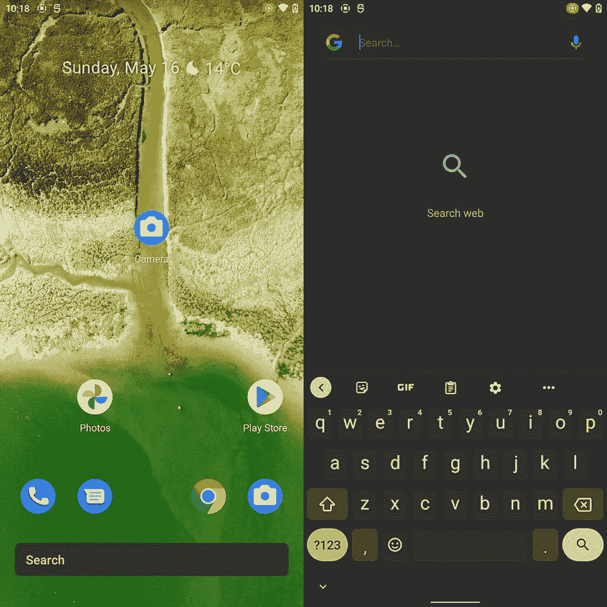

# Gboard 的最新测试将主题与你在 Android 12 上的壁纸同步

> 原文：<https://www.xda-developers.com/gboard-syncs-wallpaper-android-12/>

谷歌最近一直在改进他们的键盘体验。最近，该公司采取了大胆的步骤[在他们的 Wear OS 生态系统](https://www.xda-developers.com/gboard-wear-os-available/)上推出了 Gboard，为我们可以戴在手腕上的设备带来了语音识别、滑动书写等更多功能，而不仅仅是智能手机。这极大地改善了我们智能手表的整体打字体验。虽然 Google 一直在为移动版的 Gboard 带来新功能，但是已经有一段时间没有与 UI 相关的功能了，对吗？嗯，我们在这方面有所改进。

Gboard 的最新测试为我们带来了在 Android 12 上同步键盘主题和壁纸颜色的支持。它会从你的壁纸的调色板中抓取颜色，并将其应用到你的键盘上。这对任何人来说都不应该是一个惊喜:Android 12 将与[“莫奈”主题化系统](https://www.xda-developers.com/android-12-wallpaper-theming-system-leak/)一起在你的用户界面上做这种壁纸主题化的事情，这个 Gboard 更新，一旦它向每个人推出，人们已经拥有了 Android 12，将与它一起工作。

 <picture></picture> 

The wallpaper (left) and Gboard grabbing colors from it (right).

这种新设计，至少现在启用时，似乎是谷歌 Pixel 智能手机的专属。这并不意味着它以后不会出现在其他 Android 驱动的设备上，但我们必须等待，看看这个新的基于壁纸的主题系统在 Android 12 中如何工作，以及定制 OEM 皮肤将如何处理这个主题系统，或者他们是否会处理它。

\ r \ nht TPS://www . YouTube . com/watch？v=B2zGuaEqTyc\r\n

Android 12 的 monet 主题化系统，以及所有即将到来的平台 UI 方面的改进，构成了几年来对现有 Android UI 的最大改进之一，我们很高兴看到它。一旦本周谷歌 I/O 启动，我们应该能够了解更多关于 Android 的最新和最棒的东西。

*感谢 XDA 资深会员 [RKBD](https://forum.xda-developers.com/m/rkbd.7544065/) 的提示！*