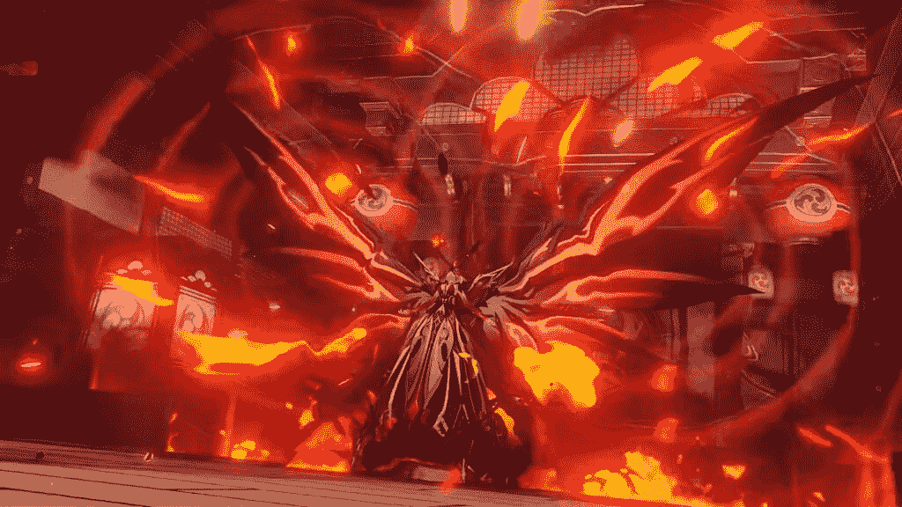

# Genshin Impact 2.1 更新扩展了闪电，增加了新的执政官角色，等等！

> 原文：<https://www.xda-developers.com/genshin-impact-2-1-update/>

到目前为止，Genshin Impact 玩家度过了一个多事的八月，因为 [v2.0 更新](https://www.xda-developers.com/genshin-impact-2-0-update-inazuma/)带来了一个全新的地区，闪电，供他们探索。Mihoyo 最近也发布了一个令人惊讶的公告，通知我们从新的 2.1 更新开始，[所有玩家都将免费获得一个五星角色](https://www.xda-developers.com/genshin-impact-horizon-zero-dawn-collab-free-5-star-character/)。现在，Genshin Impact 2.1 在这里，扩展了闪电地区，并带来了一些游戏中最令人期待的角色，特别是电子执政官雷电幕府，与 Venti 和中力相对应的雷霆类型；以及引入新的老板和技工。Android 上的[最佳游戏之一](https://www.xda-developers.com/best-android-games/)的新更新将于 2021 年 9 月 1 日到来。

## 来自 Genshin Impact 2.1 Livestream 的免费原始照片

在我们开始之前，以下是来自本次活动直播的免费普里摩日代码:

*   DSPVUN2BKH5M
*   CB7UU6KT2H59
*   NTPVU7JTJYPD
*   GENSHINGIFT(这可能是更老的遗留代码)

[在这里快速兑换](https://genshin.mihoyo.com/en/gift)通过您的浏览器。你也可以在游戏中兑换，但是浏览器兑换更快。请尽快行动，因为这些是有时间限制的代码，很快就会过期。

* * *

## Genshin Impact v2.1 中新的可玩角色

之前的 2.0 更新流已经戏弄了几个即将到来的角色，现在，他们中的一堆在这里！

### 雷电幕府

五星电子执政官通常使用长柄武器，但由于她的元素技能，他改用剑。她的技能也为整个团队补充能量，同时也为她的基本攻击注入电。还有一堆其他的爱好者也开始为这个角色出场。从它的声音来看，这可能是一个强大到足以为闪电地区加冕为神的角色，填补了蒙德斯塔特的 Venti 和李越的 Zhongli 的脚步。

### 我的尺寸

Sangonomiya 木村心美是一名 5 星级 Hydro Catalyst 用户，专注于为团队提供治疗，很像芭芭拉，但方式不同。木村心美的暴击率为负，意味着她不受益于暴击率或暴击伤害；但是她确实得到了更多的治疗。看看 Mihoyo 如何提高这个角色来吸引收入是很有趣的，因为除此之外，这里没有比其他像 Barbara(免费获得)这样的治疗师所能提供的更多的不同。

### 萨拉

库茹·萨拉是一名拥有电子视觉的四星持弓者。她有一个能量补充技工，允许她为队友补充能量。

### Aloy

### 

阿洛伊是 AR 20 以上的所有 Genshin Impact 玩家将获得的免费 5 星级角色，作为地平线:零黎明交叉事件的一部分。

这里唯一的问题是，索尼 PlayStation 5 和 PlayStation 4 上的玩家将在这个 2.1 补丁中免费获得角色和她的专用弓，而其他人将在 2.2 补丁中稍后获得角色，并且没有弓武器。

* * *

## Genshin Impact 2.1 中的新老板

在 Genshin Impact 2.1 中，我们得到了一些现有老板的基本变化，以及一个新的以 La Signora 形式出现的每周老板。

### 这位女士

### 

“夫人”是最新的每周“战斗领域”老板，这意味着老板的奖励将被限制在每周一次战斗。通常情况下，这场战斗将花费 60 树脂，但如果这是在你一周的前 3 场 boss 战斗中，将减半。夫人在第一阶段使用低温，然后在第二阶段切换到高温。

### 电俄刻阿尼得斯和水力本质

电俄刻阿尼得斯，以及水力本质，似乎是现有老板的变化。据推测，他们将在补丁中为新的五星角色提供提升材料。

* * *

## Genshin Impact 2.1 中的其他新游戏机制和变化

### 新武器

除了 5 星角色补充武器，还有一个新的 4 星武器是一条鱼(？？).不，这不是占位符图形。

### 每日登录事件

这个补丁引入了一个临时的每日登录事件，允许玩家在 10 天的登录时间内获得最多 10 个交织命运和其他奖励。一些消息暗示这将是给玩家的一周年纪念礼物，但英语直播和新闻稿并没有这样标记。

### 钓鱼；捕鱼

补丁 2.1 在游戏中引入了一个新的捕鱼机制。游戏中捕捉不同的鱼有各种难度，这些鱼可以兑换奖励。还有被称为观赏鱼的特殊鱼类，您可以收集它们，然后通过蓝宝石优雅装饰的新水池在您的 Serenitea 花盆中饲养。

### 事件

就像以前的补丁一样，这个月会有一系列的活动让玩家全神贯注于游戏内容。

### Serenitea Pot 中物品副本的负载减少

当相同物品的复制品被放置在 Serenitea 花盆的相同区域时，这些复制品将会减少负载。这应该允许玩家更好地放置布景，因为家具通常有重复的元素。

* * *

这听起来像是一个令人兴奋的游戏补丁，尤其是随着雷电将军的到来以及她成为游戏中更好角色的潜力。公告中你最喜欢的部分是什么？请在下面的评论中告诉我们！