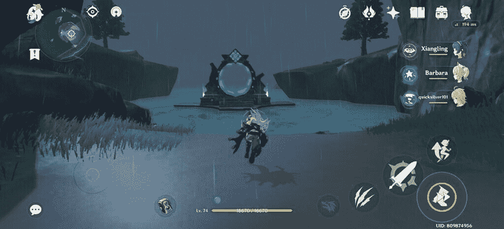

# Genshin Impact:帮助你掌握游戏的 15 个技巧和窍门

> 原文：<https://www.xda-developers.com/genshin-impact-advanced-tips-tricks/>

Genshin Impact 可能是最好的手机游戏之一，毫无疑问是一款非常棒的 RPG 游戏。你不需要相信我们的话——这个游戏是免费的，如果你花上几个小时，你会同意它显然超过了它的“免费”价格标签。如果你正在寻找开始，我们有一些[伟大的提示和技巧给 Genshin Impact 初学者](https://www.xda-developers.com/genshin-impact-tips-tricks-beginners/)。自从游戏发布以来，我们每天都花数小时玩游戏，现在我们为更高级和更有经验的玩家提供一些提示和技巧，帮助他们为游戏的结束做准备。我们假设阅读本指南的玩家是免费玩家，同时认识到在 Genshin Impact 中成为付费玩家并不会使游戏严重偏向于你。

## 连续冲刺不是最快的旅行方式

对于更高级的玩家来说，最容易忽略的一个提示是，连续冲刺并不是游戏中最快的移动方式。点击 Sprint 来触发快速爆发动画是第二快的，你应该更喜欢这样做而不是按住，因为它不仅整体上使用更少的耐力，而且整体上旅行更快。

 <picture></picture> 

Sprint till you get the Dash animation, and then tap the button again

在某些角色上，你甚至可以跳兔子步！冲刺和跳跃，快速连续地做，你会发现自己到达目的地的速度更快。你也可以无限期地这样做，因为耐力栏在它达到零时会出现故障，但你实际上并没有回到你的正常速度——所以你可以无限期地保持兔子跳(只要你不介意永远按跳跃按钮)。

兔子跳最好在电脑上执行，并且只限于某些角色，但是所有角色都可以在手机上完成。

## 平台很重要

Genshin Impact 在具有跨平台可玩性的 Windows、Android 和 iOS 上可用，在没有跨平台保存的 PlayStation 4 上也可用。这款游戏成功地保留了整个套件的所有游戏元素，这绝对令人印象深刻，这意味着无论你在哪个平台上玩游戏，你都可以以几乎相同的方式体验游戏。

然而，这并不完全正确。虽然是的，游戏在很大程度上是相同的，但在带有键盘和鼠标的桌面上玩游戏有自己的优势。当你用鼠标精确瞄准时，使用基于弓的角色更容易。在移动设备上，基于弓的角色是一个很大的缺陷，因为平移和瞄准不是一个理想的体验，特别是因为你要在不同的武器类型之间切换，并且必须不断刷新你的肌肉记忆。

在桌面上，当你有一个热键的时候，角色之间的交换会容易得多。事实上，桌面版本甚至有一个专用按钮(左 Alt +交换键)，你可以设置交换到一个角色，并立即执行他们的元素爆发。这使得推动者(角色将在本指南中进一步讨论)更容易执行并与团队的其他成员协同工作。[编辑:如前所述，你可以在一个按钮中交换和执行一个元素爆发，方法是直接点击有 Ult 可用的角色旁边发光的元素爆发按钮。只需直接点击它，您就可以切换并执行突发。]

相反，当你有移动的便利时，干掉一大群敌人就容易多了。在桌面上玩游戏意味着你可以在何时何地玩游戏受到很大的限制。在手机上，这种限制是不存在的——所以如果你在杂货店排队的时候只有几分钟可以打发，拿出你的手机，完成你每天的任务或者收集你错过的任何材料。游戏的平衡曲线在游戏的后期非常陡峭，所以这种便利很方便。

幸运的是，有了跨平台保存和同步，只要你有足够强大的硬件，你也可以享受桌面和移动的结合体验。不过，如果你是在游戏机上玩游戏，那就太糟糕了。

## 重复角色拉给你星座和大被动！

除了一些预先确定的免费分发物(主要角色又名“旅行者”，安珀，凯亚，丽莎和香菱)，角色必须通过嘎查系统/战利品箱机制解锁。如果你抽到了一个角色，你就永远解锁了，但是这个角色仍然在可能的奖励池中。这是因为所有的角色总共可以画/拉七次有意义的时间！第一次抽牌会解锁角色，随后的每次抽牌都会解锁一个星座，以某种方式对角色进行增益。所以，如果你没有如愿以偿地得到一个新角色，也没有得到一些重复的角色，也不要灰心丧气——这其实是好事。

有些角色从第一次出场就很体面。一些角色在达到一定的星座等级后变得可行，比如宁光，她在星座 1 的基础攻击上获得一个 AoE 效果。

一些角色在某些星座等级上获得了巨大的能量峰值，以至于你绝对应该期待那些解锁。例如，芭芭拉在星座 6 得到一个自动即时恢复加完全治疗，这是一个疯狂的套件，可以帮助你携带，可能消除了亚携带的需要。

因此，一旦你解开了每个角色的星座，重新评估他们是一个好主意。一个你之前可能已经放弃的角色可能刚刚变得对你可行，在你的团队中开辟出一个比你可能拥有的更好的位置。在做出选择之前，请阅读描述并试用 buff。

当你达到一个角色的最大星座后会发生什么？角色仍然留在池中，所以你仍然可以画他们。当你真的抽中它们时，你会得到足够的钱来许下另一个愿望并再次抽中。

## 使用无敌框架(iFrames)闪避所有攻击，并且永远不会受到伤害！

一些玩家可能已经注意到，在 Genshin Impact 中冲刺可以让玩家闪避一些攻击。他们是对的。这种潇洒的动画激活了玩家通常所说的 iFrame(无敌帧/免疫帧/刀枪不入帧)。不管是不是故意的，这个动画中的 iFrame 是一个小窗口，在这个窗口中你的角色变得完全不可战胜，并且忽略任何伤害。

您需要在攻击来袭之前的正确时间激活 dash 动画。这很难描述，但你可以用较小的敌人来练习。潇洒的 iFrame 可以轻松掌握，一旦你找到了理想的时机，你就可以在 Genshin Impact 的每一场战斗中毫发无损。

游戏中也有其他的 iFrames。下一个最常被激活的 iFrame 来自于字符交换，但是在这方面不可战胜的可能性很小。一堆角色，通常在 5 星级，在他们的元素爆发和元素技能上也有非常宏大的动画，这些也包含 iFrame 窗口。所以激活 Ult 可能会让你的角色免于一半的生命值被抹去。

在与一些烦人的老板打交道时，把握好这些 iFrames 的时机至关重要。例如，如果你有一个近战角色，狼的统治者安德留斯是一个非常讨厌的战斗 boss，因为 boss 经常在它附近造成伤害。每隔几秒钟一次完美冲刺，你就可以真正打败这个 boss，而不需要你的队伍中有一个治疗师或者远程单位。

## 理解战斗角色:携带，次级携带/爆发，元素使能，支援/治疗

战斗是游戏的中心进展支柱之一，所以让一个完整的团队完全破解并增强以对所有四个角色造成最大伤害是有意义的，对吗？嗯，不，不是真的。

《源氏冲击》中的角色一点也不平等，他们也从来没有打算平等。一些角色被设计成坦克和防御型，而另一些角色则更脆弱，但却有更多的 DPS(每秒伤害)。一些角色拥有主动和被动能力，这些能力的团队治疗属性多于伤害属性，而其他角色擅长频繁触发元素反应。一些角色甚至能在团队中找到自己的位置，仅仅是因为他们带来的冒险支持。然后有不同的元素和不同的武器类型，使整个情况令人惊讶地复杂，但有趣的工作网络。

建立一个好的团队需要这些不同角色之间的协同作用，一个理想的团队将包括**携带、子携带/爆发、元素使能器和支持/治疗者**中的每一个。《源深冲击》中的大多数角色都可以很好地重叠在几个不同的角色上。但是有些角色，比如芭芭拉，非常适合一个角色，以至于你在其他角色上浪费了他们。

### 携带

“搬运”是在你的队伍中造成最大伤害的角色。这是一个拥有最大 DPS 输出的角色，要么通过强力普通攻击，要么通过攻击和元素技能以及爆发的组合。通常，在像《MOBA》这样的游戏类型中，carry 并不打算成为一个坦克单位或者有任何自我维持的治疗，但这些游戏通常会像它们的类型一样同时有多个角色在场上。在 Genshin Impact 中，你需要自己在角色之间交换(或者玩合作游戏，如果你不想的话)，所以一点持续伤害或坦克是想要的品质，特别是如果你的治疗者可能没有达到最高等级。

团队的行动将会在游戏中期吸引大部分的注意力，因为这个角色将会“执行”你的游戏，我们会在这方面做更多的扩展。由于如何在有限的时间内结束游戏并清理螺旋深渊，进位成为团队中最重要的角色。

### 子载波/突发

你队伍中的下一个角色将会是一个副进位或者突发。一个“副进位”是下一个最高 DPS 的庄家，也是一个二级伤害的庄家选项，而“爆发”是指在短时间内带来非常高伤害输出的角色。副运和突发角色可以重叠，或者可以互换，这取决于你的团队是如何组成的。

这个角色的想法是当它的装备(包括元素技能和元素爆发)可以使用时，把它换进来，分配伤害，然后把它换出去；或者当你的载具在战斗中死亡时，用它来完成任务。

### 元素使能器

这是一个角色，它的目的是触发它的元素技能和元素爆发，即使这个角色被切换出去，它也会对这个领域产生影响。这允许你的携带和携带利用领域的影响来触发元素反应，然后进一步增加你的团队的总伤害输出或帮助你啃穿盾牌和其他敌人的 buffs。

他们的 Anemo 头像中的主角是作为我团队中使能者的填充者，因为我不希望我的团队中有两个电子用户(所以 Lisa 和 Fischl 是不可选择的)，而且我真的不喜欢 Chongyun。令人欣慰的是，使能器并不总是需要最大化等级和天赋(虽然很明显，你会做得更好)，所以我希望以后能换一个更好的使能器。

 <picture></picture> 

Image credits: [Sunmilk](https://twitter.com/sunmolk/status/1310876320398749697)

### 支持/治疗者

这个角色中的角色以他们所展现的团队效用而闻名。这个工具可以从净化状态效果，治疗团队，提供盾牌，利用人群控制，应用 buffs 等等。这个工具对于游戏的后期是非常必要的，因为它可能是打败一个老板或者因为它而失去整个团队的区别。

我们建议玩家在游戏中期创建一个适合这些广泛角色的团队。当然，这些是一般的指导方针，你可以随意偏离它们。但这将为你提供一个很好的平衡，让你在享受游戏的同时完成它的折磨，而不会在任何阶段感到停滞不前或不知所措。如果你没有一个完美的角色来适应一个角色，你可以即兴发挥，一旦你通过 gacha(战利品箱)机制获得一些好的角色，你就可以最终填补这个角色，作为一个自由玩家或其他人。

## 首先专注于你的携带，并最大化它

Genshin Impact 中角色的平衡曲线在游戏的后期变得非常陡峭和粗糙。这使得在任何时候都很难有一个平衡的 4 角色队伍，特别是当你关注你的冒险等级和随之而来的世界等级(这决定了敌人如何升级以跟上你)时。由于 Genshin Impact 在整个游戏中对待战斗的方式，以及螺旋深渊作为最终游戏的处理方式，Carry 成为游戏进展中最重要的工具。

综上所述，将你的全部资源集中在每一步最大化你的负担上是有意义的。选择一个能做好 DPS，适合 carry 角色，并且你喜欢玩的角色，并且绝对全力以赴直到你的冒险等级允许。在我的冒险等级 40 的情况下，我把大部分资源集中在剃刀上作为我的主要 DPS 角色，最大化它并在这些等级解锁后尽可能地提升它。

你也要注意提升角色的天赋，因为这会让那些攻击，技能和爆发更加猛烈。这样就更容易通过外包来提升团队的其他成员。

如果这个命令被打破，你会发现自己被难以对付的怪物包围，并且没有可行的方法去饲养它们，甚至可能陷入一个无能为力的循环，这将使游戏难以享受和进行。你确实想最终提升你团队中的其他人，但是这比你的负担更重要。

如果你的世界等级提升到了最大值，并且需要一个特定的冒险等级才能再次提升你的等级，那么在提升变得可行之前，种植提升所需的一切也是一个好主意。单词级的碰撞让怪物变得困难，只要为你的载体的下一个能量峰值做好一切准备就会让你的游戏体验更容易。因此，当升天成为可能时，你可以轻松地进入下一个上限。

## 提升你的天赋、武器和神器

上面的建议同样适用于天赋、武器和神器。为你的 DPS 角色选择正确的武器和神器组合，并尽你所能提升、精炼和最大化它们。你不一定需要有五星武器和神器，然后再考虑升级它们。边走边做，这样更容易走得更远。

至于天赋，在游戏中期最大化它们很容易，但是你必须在游戏后期选择你的优先级，所以选择对你有意义的升级路径，而不是一次最大化它们。对于你用来自动攻击的角色，优先考虑基本攻击天赋是有意义的。而对于像使能者这样的角色，你可能想先关注他们的元素技能，然后是元素爆发，也许完全忽略对他们的基本攻击天赋的投资。稍后，事情会变得棘手，所以选择你的战斗。

## 你实际上需要两个团队去螺旋深渊

螺旋深渊被认为是 Genshin Impact 目前的最终结局。虽然 1 - 8 层的难度越来越大，但后面的 9 - 12 层就更难了。这三层有分歧，需要 2x 4 个角色的团队来清除不同的怪物，一次一个团队。

你不能在这些团队中重复角色，这意味着你的两个团队都需要发挥出最佳性能，以便有机会清除这些楼层。这意味着你确实需要两个角色，并且让两个团队内部协同工作。

我这是什么意思？这意味着你不需要在你认为第二好的角色上推迟你的投资，而你会一直努力得到一个你最喜欢的角色。投资第二选择是没问题的，只要你有足够的资金来帮助团队的其他成员。所以在我的例子中，我把贝内特作为治疗者角色的第二选择，尽管我的重点是芭芭拉作为主要治疗者。类似地，如果我为我的主要团队获得更好的协同选项，香菱可以换成第二团队的主要 DPS。投资第二选择是没问题的(尽管这不应该是你的优先选择——只是一个副产品),反正你以后会需要它们的。

## 选择正确的神器

这是很多玩家自己想出来的，但也值得一提，因为它非常重要。神器可以有不同的属性，这是随机决定的。你已经知道有很多不同的神器，导致不同的被动奖励。现在你也知道了团队应该由不同角色的不同角色组成。在这种情况下，选择合适的工件来将合适的角色放在合适的位置就变得非常重要。

例如，剃刀这样的角色被设计成专注于物理攻击的 DPS 单位。所以剃刀的理想神器将集中于给予他更多的攻击伤害作为基础或攻击百分比，或者帮助他增加暴击伤害或暴击率。一个增强防御的神器不会在预期的角色中为剃刀做那么多，但可能仍然有其他原因让你想要保留该神器(例如它的其他属性，它与整个套装的协同作用，或者只是因为它更平，可以提供更好的奖金)。像芭芭拉这样的角色，她的治疗会减少她的最大生命值，需要一些神器来增加她的最大生命值，因为这反过来会影响你团队中其他人的治疗量和速度——在这种情况下，增加她攻击属性的神器没有任何帮助。像奇奇这样的治疗师使用攻击属性来衡量团队治疗，所以现在攻击属性有所不同了。

阅读角色描述和天赋描述，看看你的角色是如何塑造的，找出你需要优先考虑的属性，然后从可用的资源中选择合适的物品，然后将物品升级到更好。如果你没有合适的具有期望特征的神器，即兴发挥直到你能找到合适的骰。在上面的截图中，工件集并不是最适合 Barbara 的，但是它与我的库存中可用的工件池中的 HP 和 HP 百分比相匹配。

## 4 件套工件并不总是最好的被动

大多数神器套装在两件套装中提供一个额外的被动效果，然后在 4 件套装中提供另一个额外的被动效果(而一些精选神器只提供 1 件额外效果)。从表面上看，从一个很棒的组合中装备所有的物品，让你从 4 件组合中获得额外的奖励，这听起来是个好主意。但实际上你可能不想这样做，因为大多数 4 件式被动语态很乏味。

相反，在游戏中期，玩家可以更好地混合和匹配那些首先关注他们选择的属性，然后接受任何奖励的物品。这可以让你在你想要的属性方向上增加角色的数量，而不是堆积无用的属性来获得 4 件的奖励。接下来，你可能想混合搭配 2 件套的奖励，像勇敢的心和旅居者的决心这样的几件套在 2 件套上提供很好的 DPS 统计，但是在 4 件套的奖励上可能会减少。带着想要的属性组合降落神器是一个纯粹的运气游戏，所以你要知道你不需要一个神骰来实现你的目标。

## 使用外部地图使资源收集更容易

这个提示是边缘欺骗，取决于你如何对待外部的指导和帮助。但是 Genshin Impact 的世界实在是太大了，资源数不清，到处都是。仅仅依靠游戏中的地图变得非常困难，即使你小心翼翼地使用所有 99 个可用的标记。请记住，这种大小的地图只有两个可用的区域:蒙德斯塔特和李越，在可能的七个区域中，每个元素对应一个区域，所以这在将来会变得更加难以跟踪。

谢天谢地，有像 [MapGenie.io](https://mapgenie.io/genshin-impact/maps/teyvat) 和 [GI 世界地图](https://genshin-impact-map.appsample.com/#/)这样的外部地图可以让你的工作稍微轻松一点。这些在线网站充当交互式地图，允许您切换并查看某个资源，而且只能查看该资源。

如果你只是缺少了一些风眼菌或地气菌，或者你需要知道所有的地点来快速培养 Jueyun Chilis 或 Philanemo 蘑菇以提升角色，或者知道怪物部落在哪里可以培养出粘液和 Hilichurls，这就非常有用了。为了平衡起见，我们建议你只有在紧要关头才使用这些外部地图——给自己一些时间去探索和寻找资源，因为这是游戏的主要魅力之一。

## 合作游戏的优势和局限性

Genshin Impact 是一款主要供单人玩的游戏。该游戏还有一个合作模式，在冒险等级 16 级解锁，其他玩家可以加入你的游戏，或者你也可以加入他们的游戏。合作模式有它的好处，但也有它的局限性，所以要了解这两者。

一个团队最多可以有 4 名玩家，玩家可以控制的角色数量与地图上玩家的数量成反比。如果地图上有两个玩家，每个玩家可以控制两个角色。

与 MMORPGs 不同，Genshin Impact 有一个玩家被明确指定为主机。其他玩家加入的是主机版本的世界，而不是一个普通的世界。这意味着你的行为会影响主机世界，而不会影响你的世界，正因为如此，你实际上只能通过合作做一些事情。

合作模式是击败周围有更多人的暴徒和老板的好方法。这让你可以频繁地触发更多的元素反应(在移动桌面上有更简单的快捷键，使得元素反应更容易)，尽管你无法控制何时触发什么，因为玩家可以控制自己的角色。如果队伍中的其他人水平不均衡(这是很常见的情况)，或者如果你没有推荐的地下城元素(其他人可能有)，这对于在更高等级的困难地下城中闪电战非常有用。你可以帮助完成日常的任务，领域/地下城，帮助世界的老板，收集你在你的世界中完全积累的资源。

说到限制，你不能加入世界等级比你高的玩家世界，你只能加入相同或更低的玩家世界。这意味着你不太可能在一个更高级别的玩家的世界中简单地获得传奇战利品。您也只能在您所在地区的服务器上查看和加入玩家。合作模式中的主要战役也是暂停的，所以如果有人被困在某个地方，你就无法帮助他们完成主要故事情节(尽管我们认为主要故事情节并没有那么难)。如果你作为客人加入，你也不能收集 Oculi，因为你存在于一个不属于你的世界。域也受到原树脂的限制(Genshin Impact 的耐力系统版本)，所以你能与域互动的程度受到你还剩多少原树脂的限制。

## 对横幅愿望的怜悯

横幅愿望是接触新角色的主要方式之一。Genshin Impact 使用了一个 gacha 系统，这意味着你只有一次机会获得一个新角色。这是一个战利品箱机制，玩家从大量可能的结果中获取结果，包括许多填充内容，比如更容易找到的武器等等。

这个游戏确实为自由玩家提供了很多机会来积累这些愿望(通过直接的‘命运交织’和‘相识命运’奖励，通过原始积累，以及通过无主星尘和无主星光的交换)。如果你是一个不介意为这些愿望花费现实世界现金的玩家，你可以这样做。

最终发生的是，无论哪种方式，你都会有很多愿望，而每个愿望获得五星角色或五星武器的机会非常小。当你有很多愿望时，你得到这些梦寐以求的物品的几率会增加，但这仍然是一个概率，而不是保证你会得到这些传奇人物或武器。

实际上，你确实得到了某种保证。Genshin Impact 融合了非正式地称为“怜悯”的东西。如果你的前 89 个愿望没有给你一个五星角色或武器，游戏会同情你的坏运气，保证在第 90 个愿望时给你一个五星角色或武器。这第 90 个愿望可以是一个新的五星角色或通过横幅介绍的武器，也可以是横幅提到的奖励池中的五星。一旦你得到一个 5 星，这个计数重置为零。

如果你的目标是通过那个横幅来介绍那个闪亮的新 5*字符，并且在你得到它之前不会停下来，那该怎么办？如果你还没有收到，那么你的下一个第 90 个愿望(即本例中你的第 180 个愿望)一定会是横幅中介绍的五星标志。这个游戏非常同情你的坏运气，并要求你不要浪费更多的愿望(或真实游戏的钱，如果你花了它来实现愿望)。

这个游戏也很方便地显示了你的愿望历史，所以你不需要一直记住它。如果你知道你正在接近你的第 180 个愿望，你也许可以停下来，把它用在一个看起来更合你口味的角色身上。仅仅知道这种机制的存在就能帮助你做出更明智的决定。

## 五星级并不总是比四星级好

请记住，Genshin Impact 表面上应用了 5 星和 4 星评级。所以五星的角色/武器并不会因为是五星而自动变得伟大。也有很棒的 4 星角色和武器，有些可以说比任何 5 星角色和武器都要好，因为他们的机械、被动或协同。

如果你没有很多五星级的角色，没有理由感到沮丧。我的主要团队没有五星角色或武器，而且我到目前为止还没有花任何现实世界的钱就达到了 41 级。因此，如果你是一个只有 4 星的免费玩家，你会没事的，相信我。

## 每日任务对于增加你的冒险等级是无价的，但是要小心

冒险等级是你的总体档案级别，是决定你在哪个世界级别玩的标准。世界等级反过来决定了开放世界中怪物和战利品的等级和难度。正如人们所希望的那样，一旦你开始轻松通过各个阶段，你会希望难度和回报都有所提高。冒险等级也会对你的角色等级、天赋和武器设置上限，所以你会在某些点上受到限制，直到或者除非你达到更高的冒险等级。

在游戏的早期获得冒险等级是相当简单的。但是后来，等级曲线变得陡峭(这是贯穿 Genshin Impact 的重复主题)，你在冒险等级中的进度变慢了。谢天谢地，最快获得冒险等级的方法是每日任务，顾名思义，每天都在刷新。绝大多数的日常任务也非常简单，每个任务都可以在 30 秒到 2 分钟内完成。每成功完成一次，你还可以获得 225 点冒险等级经验和 10 点初始奖励，如果你完成了当天的所有四个任务并获得奖励，你还可以获得 500 点 AR 经验和 20 点初始奖励。这些数字听起来可能很小，但它们累加起来。比如，要达到冒险等级 40，你需要在 Adeventure 等级 39 之后获得 10550 AR 经验，而你从这些日常任务本身就获得了很酷的 1400 AR 经验。玩一周，最低也就 9800 AR 经验已经在银行了。

不过话虽如此，冒险等级决定了世界等级。一些世界级别的升级被锁定在冒险等级提升任务之后，允许玩家延迟升级，直到他们确信他们的载具可以对付更高级别的怪物。但是一些世界级别的碰撞会立即发生(即世界级别 1、3 和 5)。所以如果你带着低等级的装备到达 40 级冒险等级，你可能很难对付高等级的怪物。[如果你发现自己被困在这上面，把你的全部注意力集中在你的行李上，并最大限度地利用它。]所以，留意你每天完成了多少任务，你的团队在你目前的情况下表现得有多有效。如果难度很高，跳过几天的日常任务，直到你的负担能赶上。

## 享受比赛

这是给所有有经验玩家最低调的建议。在游戏的后期，人们很容易被这种折磨压垮。 [Genshin Impact](https://play.google.com/store/apps/details?id=com.miHoYo.GenshinImpact) 还通过游戏奇妙地缩放复杂性，所以你在游戏开始时的体验可能与接近结束时的体验不一样。一开始是一个令人愉快的游戏可能会变成一项工作，试图最小化你的统计数据，并通过不同的角色组合，团队协作，文物，武器等进行导航。

你不需要最小化最大值，直到游戏结束。在那之前，我强烈建议你专注于你真正喜欢扮演的角色。找到让游戏对你来说很棒的地方，磨砺会感觉不那么像磨砺，更像一次旅行。