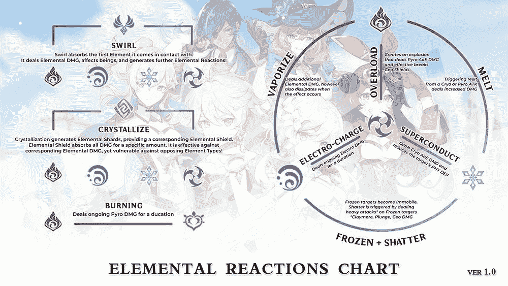

# 10+初学者技巧和窍门，帮助你掌握 Genshin 影响！

> 原文：<https://www.xda-developers.com/genshin-impact-tips-tricks-beginners/>

自 2020 年末推出以来，Genshin Impact 一直是最受欢迎的游戏之一。RPG 实现了 gacha 机制，这是货币化的战利品箱的另一个名称，尽管你不一定需要花钱来享受这个游戏，甚至不一定需要擅长这个游戏。广阔的开放世界制作精良，围绕着一个动漫幻想世界，你可以在拥有个人基本技能的角色之间切换。这款游戏由 MiHoYo 开发，由于其相似的图形和视觉效果，经常被比作*塞尔达:野性的呼吸*。Genshin Impact 可以在 iOS 和 Android 上使用，但也可以在 PC、PlayStation 4 和任天堂 Switch 上享受。

这款游戏已经引起了游戏玩家的关注，尤其是在移动设备上，因为它在推出的头两个月就获得了约 3.93 亿美元的收入，其中仅第一个月就有 2.45 亿美元的收入。由 [*Sensor Tower*](https://venturebeat.com/2020/12/01/sensor-tower-genshin-impact-brings-in-nearly-400-million-in-2-months-on-mobile/) 发布的一份报告将 Genshin Impact 列为创收第二大手机游戏，击败了 PUBG Mobile 和 Pokémon GO 等游戏。据估计，自推出以来，这款游戏每天的收入超过 600 万美元。这些数字不包括中国和其他地区第三方应用商店的收入，因此这方面的收入肯定会更多。游戏才刚刚开始，还有更多的内容在酝酿中。

Genshin Impact 是手机上最大的 RPG 之一，老实说，当你开始玩的时候，试图吸收一切可能会有点令人不知所措。为了让事情变得更容易，我们收集了一些重要的提示和技巧来帮助你进步，特别是如果你刚刚开始或计划最终投入到游戏中。

## 探索，然后探索更多

Genshin Impact 是一个相当大的游戏，它肯定需要时间来探索其广阔世界的每一寸。当你外出探险时，你要与各种类型的野兽战斗，打开宝箱，揭开秘密。确保你拿起所有你遇到的东西——鲜花、食物、矿石、箱子等等。有些花需要你对它们使用元素魔法才能采摘。一定要抓住它们，因为它们对未来的任务很重要。如果你看到一个箱子或任何收藏品，在你前进之前得到它通常是一个好主意。

您需要提高您的冒险等级，以解锁新功能并获得奖励。这可以通过获得冒险经验来实现，当你完成任务时，冒险经验会提升你的等级。因此，确保除了探索，你回到执政官，故事，任务和世界任务已经分配给你。

确保你使用地图，因为它是一个很好的工具。您可以在地图上放置自定义标记，这样您就知道在哪里可以找到某些物品和材料，或者万一您留下一个箱子没有收集。放下标记很有用，因为它可能会帮助您在将来需要时找到项目。当你和你的朋友一起玩合作游戏时，这也很有帮助，因为他们可以更容易地快速前往市场收集他们需要的物品。

## 注意你的耐力

除了战斗，每个角色都使用耐力做很多事情，比如短跑、躲避、攀爬、游泳、滑翔等。耐力表可以被看作是一个黄色条 UI 元素，当你的角色耗尽或充电时，它会在不使用时自动隐藏。你有越多的耐力，你就有越长的时间去做所有这些事情，而不需要等待并填满耐力表。因为它是一种重要的资源，所以花些时间来增加它。这可以通过收集 Oculus(风眼和地宫)来完成，然后在这些用完的地方拜访和崇拜七神的雕像。Oculus 是一个冒险项目，可以在地图的北部区域找到。通过提供风眼术和地宫术给他们各自的七尊雕像，你也可以得到各种奖励，比如初始装备或者冒险等级经验。如果你想在收集风眼菌和地气菌方面节省一些时间，你可以点击[这个链接](https://genshin-impact-map.appsample.com/#/)来查看一个包含精确位置的交互式地图。

## 拉嘎查(愿)

Genshin Impact 实现了“Gacha”系统，通过一个名为 Wish 的游戏内系统解锁新角色。除了获得新角色，你还可以获得稀有武器。这可以通过使用“交织的命运”和“熟悉的命运”来实现，最好一次打开十个，因为它保证了你获得四星级的机会。要得到这两种命运中的任何一种，你需要提升你的冒险等级或者花费一些时间。你从哪里得到原始照片？嗯，这种特殊的货币可以通过在游戏中完成简单的事情来获得，比如完成任务、打开箱子、击败敌人等等。最后，你可以花一些真金白银去购买创世水晶，它可以用来交换原始水晶。

虽然花真钱是获得好角色和武器的最直接的方式，但在整个游戏中，将有大量的机会赚取 Primogems、交织的命运和相识的命运。因此，如果你不打算在游戏上花真钱，你仍然可以在很大程度上享受游戏。研磨也不是很剧烈。

## 排名上升

冒险等级(AR)是你的帐户进度等级，可以通过收集冒险经验来提高。这可以通过执政官任务、故事任务和世界任务来完成。请注意，冒险等级和角色经验或等级是不一样的，因为它们都影响游戏的不同机制。每完成一个任务，增加一个冒险等级，也能获得一些奖励。确保每次升级后都回到冒险者的位置。通过这样做，你可以获得资源奖励，如在 5 级和 10 级认识命运，等等。某些任务只有在你达到一定等级后才可用。此外，你可以通过每天的任务来获得冒险经验。这些在 12 级解锁，有四个不同的任务，提供你经验和一些资源。如果你完成了这四项，你还会得到额外的奖励。

## 把这些元素混合起来

你的主角可以拥有风(风)或地(地)的力量，这取决于你选择哪一种(一旦你进入李越地区，你可以在两者之间切换)。随着游戏的进展，你会遇到拥有各种元素力量的角色。琥珀拥有火的力量(Pyro)，卡娅拥有霜的力量(Cryo)，丽莎可以召唤闪电(Electro)。有更多的角色出现在你的面前，在你的花名册上拥有不同元素力量的不同角色似乎是一个不错的选择。通过这样做，你可以更好地理解每个角色以及他们之间的切换攻击。

 <picture></picture> 

Image credits: [Sunmilk](https://twitter.com/sunmolk/status/1310876320398749697)

在战斗中切换角色可以帮助你更好地掌握你的攻击和元素组合。组合不同的元素角色会产生不同的反应，这通常会使一场无法取胜的战斗对你有利。例如，风与火、水、霜或闪电的结合增加了攻击和伤害的传播，这使得它非常适合人群控制。具有相似元素的特征也可以产生一些优势。例如，两个风元素增加耐力，而两个火元素增加 25%的攻击伤害。所以你的探险队可以有两个风的角色，即使他们都很大程度上没有被使用，只是为了方便你四处探险。

查看拜蒙菜单(左上角) >队伍设置>元素共振中的元素共振图。

## 开始说话！

如果你是一个 RPG 迷，那么你应该知道大多数 NPC(非玩家角色)在游戏中没有任何好的理由，除了一些无用的对话。然而，源兴的影响并不完全相同。有些角色有你可以接受的秘密任务，有些甚至会卖给你稀有物品。建议你和路上遇到的每个人交谈，尤其是当你在野外漫游的时候。这看起来确实像是一项任务和耗时的活动，但它可以为你的角色带来一些你可能会错过的奖励。

## 赚取并装备相关神器

你可以通过在游戏中做任何事情来获得神器，比如打开箱子，完成任务，在你的冒险者手册中获得特殊经历，赢得战斗，等等。这些是特殊的附件或物品，你可以附加到你的角色身上来提供特殊的治疗加成、伤害输出、HP 和致命一击。每个角色最多可以装备五件神器。一旦你把一个特殊的神器放在一个空的角色位置，你可以在右边看到 2 件套和 4 件套属性加成的变化。理想情况下，你应该尝试并确保你为每个角色配备的神器激活这些额外的属性优势(尽管一些游戏后期的神器作为两件式和一件式组合做得更好)。请注意，工件是可以增强的，这意味着您可以分解较弱的工件来获得增强材料，或者只是使用相同的较弱工件作为增强材料。当你在游戏中得到更好的物品时，稍后，你也可以分解你升级的物品来再次获得你投资的一个好的部分。不同级别的工件可以升级到什么程度有不同的上限。但是对于早期的游戏，你不需要太在意最大化任何神器。

## 武装你的武器！

武器系统有点类似于神器，有增强或改进的选项。如果你有重复的武器，那么你可以用它们来改进同样的武器并增加它的加成。精炼一件武器不会增加它的基础伤害，但会增加它提供的额外属性或增益。为了增加你武器的基础伤害，你需要用金属资源制成的强化矿石来强化它们。

如果你缺少武器升级，蒙斯塔特的铁匠瓦格纳可以为你制造强化矿石。只要提供你通过压碎岩石开采的铁块。最好使用双手武器的角色，或者使用地理元素角色的能力更快地打碎岩石。

请记住，一些更好的武器(但不是全部！)可通过 Gacha 机制接收。所以对于你的早期游戏，如果你没有杀手武器也不要担心-你最终会得到一个，相信我们。

## 学习一些食谱

Genshin Impact 允许你烹饪食物(然后在以后食用)，这有助于提高你的角色的某些属性。要成为游戏中的主厨，你需要确保你选择了制作美味佳肴所需的各种食材。当你增加你的冒险等级时，你可以解锁新的食谱，你也可以通过和你在冒险中遇到的人交谈来学习一些。你应该努力达到你解锁的每一个食谱的最高熟练度。掌握它们，你应该能够快速解锁自动烹饪一些菜肴的能力。

确保你也记下了烹饪某道菜的角色，这样你就可以分配一个能给角色加分的角色。除了常规菜肴，确保你学会了这三样菜——巴巴托斯炖菜、莲子鸡蛋汤和中原杂碎——因为它们有助于在凉爽的 15 分钟内减少爬山和冲刺的耐力消耗，使探索变得更容易。

## 星座

每个角色都有一个星座，如果你碰巧通过一个愿望得到了相同的角色，那么你可以在这个星座上解锁并获得被动能力。这很棒，推荐给那些不打算用实际的钱来最大化他们角色的玩家(但是如果你喜欢这个游戏，你还是应该考虑付钱)。在这些星座上获得的被动技能，就像一个技能树，可能并不总是很好，但其中一些可以改变游戏规则。例如，如果你已经为芭芭拉最大化了星座，那么它会自动复活队中一个倒下的角色以及全部的 HP，如果你问任何一个后期玩家，这是相当疯狂的。

## 合作模式可以让你摆脱困境

如果你在某个关卡或怪物上卡住了，你可以转到游戏中的合作模式(一旦达到冒险等级 16 就解锁)。在合作模式下，你可以邀请其他玩家加入你的地图，或者在他们的世界中拜访他们。你会发现合作模式在对付某些老板时非常有帮助，有一个更高级别的玩家帮助你可以让你在 30 秒内杀死一些讨厌的老板！但正如互联网上的一般规则一样，对合作伙伴中的每个人都好，人们也会对你好。

* * *

在 Genshin Impact 中有很多值得探索的地方，所以不要犹豫尝试新事物。专注于享受游戏，你会发现无论如何你都会处于一个体面的竞争位置，即使是作为一个免费玩家。

开发者 miHoYo 最近也为 iOS、Android、PC 和 PS4 上的用户发布了新的更新。这次更新带来了两个新角色——反照率和甘雨，新的龙脊雪域，新的故事情节，以及大量的平衡改动。Genshin Impact 1.2 可供下载，如果你感兴趣，可以通过[这里](https://www.xda-developers.com/genshin-impact-1-2-update-changelog/)访问完整的 changelog。