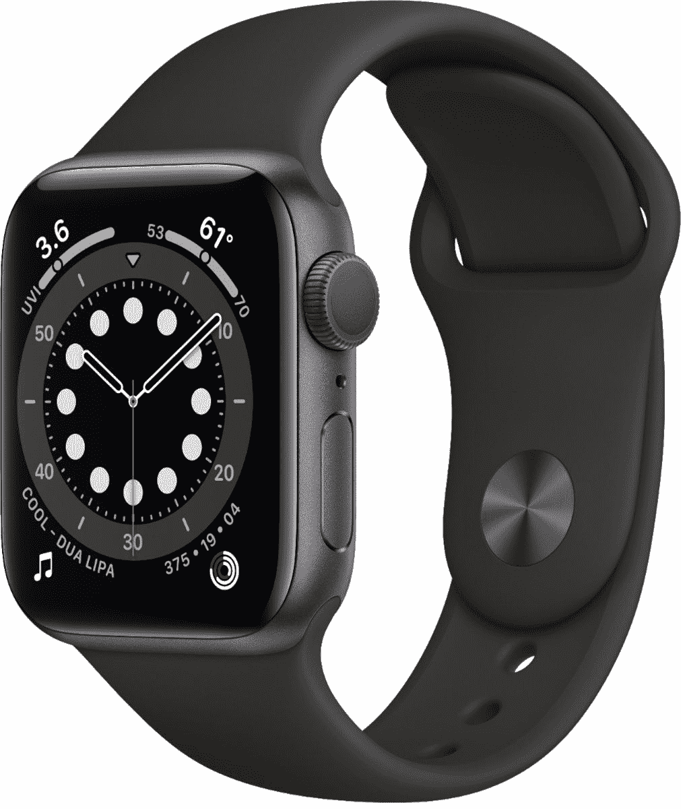

# 立即以 70 美元的价格购买 40 毫米 Apple Watch Series 6

> 原文：<https://www.xda-developers.com/get-a-40mm-apple-watch-series-6-for-70-off-today/>

# 立即以 70 美元的价格购买 40 毫米 Apple Watch Series 6

百思买现在已经将所有 40 毫米 Apple Watch Series 6 型号的价格降至 329 美元，比最初的建议零售价低 70 美元。

Apple Watch 是目前最好的可穿戴设备之一，但它只能与 iPhone 配对。Series 6 是最新一代的硬件，具有持续显示和血氧监测支持，红色(“产品红”)在 5 月降至 70 美元。现在你可以以同样的 329 美元的价格获得非 LTE 系列 6 的所有三种颜色。

在售的型号是较小的 40 毫米版本，没有专用的蜂窝调制解调器——你需要保持紧密的蓝牙连接才能接收来自 iPhone 的通知。然而，它仍然有一个专用的 GPS 传感器，所以你可以在没有手机的情况下进行户外跑步，并且仍然有位置/路径数据。除非你有强烈的愿望将手机大部分时间留在家里(或者有大量可消耗的收入)，否则没有必要购买价格更高的支持 LTE 的苹果手表。

 <picture></picture> 

Apple Watch Series 6

##### Apple Watch 系列 6

百思买有 40 毫米 Apple Watch Series 6 的所有三种颜色在售。在选定的地点还提供商店提货服务。

Apple Watch Series 6 提供了智能手表的所有常见功能，如身体活动跟踪、手机通知镜像以及运行基本应用程序的能力。最新一代的硬件增加了一个永远在线的显示屏(你好，2014 年的 Android Wear！)、血氧监测、更快的性能以及心律测试。根据最近的传言，似乎 7 系列的阵容并不太遥远[，但 6 系列的手表仍然值得购买。](https://www.xda-developers.com/apple-watch-series-7-flat-edge-design/)