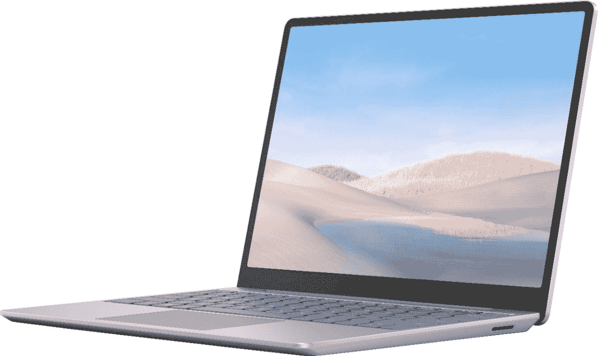

# 立即以高达 150 美元的价格购买一台微软 Surface 笔记本电脑

> 原文：<https://www.xda-developers.com/get-a-microsoft-surface-laptop-go-for-up-to-150-off-today/>

Surface Laptop Go 是微软的中端笔记本电脑系列，旨在成为出色的生产力机器，具有良好的性能和不会破产的价格。本月早些时候，配备酷睿 i5 CPU 和 256GB 存储空间的型号[降至 699.99 美元](https://www.xda-developers.com/get-the-surface-laptop-go-with-a-core-i5-and-256gb-storage-for-200-off/)，比原价节省了 200 美元。百思买现在对 Surface Laptop Go 的几个版本进行了打折，比通常价格低 101-150 美元。

在售的型号由[英特尔酷睿 i5-1035G1 处理器](https://ark.intel.com/content/www/us/en/ark/products/196603/intel-core-i5-1035g1-processor-6m-cache-up-to-3-60-ghz.html)驱动，该处理器有 4 个内核，8 个线程，时钟速度提高到 3.6GHz。你还可以获得 1536×1024 的 12.4 英寸液晶显示屏，8GB 内存，USB Type-A 和 Type-C 端口，耳机插孔和 Windows Hello 支持(用于通过网络摄像头登录)。所有 128GB 存储的型号售价为 598 美元(比建议零售价低 101.5 美元)，而 256GB 的型号为 749.99 美元(比建议零售价低 150 美元)。

 <picture></picture> 

Microsoft Surface Laptop Go

##### 微软 Surface Laptop Go

拥有 128GB 和 256GB 内部存储空间的 Surface Laptop Go 型号在百思买销售，共有三种颜色。

256GB Surface 笔记本电脑 Go 的销售价格与本月早些时候 700 美元的销售价格不太匹配，但折扣仅适用于砂岩色，而百思买有所有三种颜色的库存(冰蓝色、砂岩色、铂金色)。如果您想要的特定型号在附近的百思买店有售，您也可以选择在店内提货。

然而，微软 Surface Laptop Go 也有一些缺点。首先，8GB RAM 是[焊接到主板](https://www.youtube.com/watch?v=jzRb_3U2vs0)上的，所以不能升级(不过 SSD 可以更换)。这款笔记本电脑还配备了 Windows 10 S 模式，只能运行从微软商店安装的软件。谢天谢地，你可以通过系统设置关闭 S 模式，不需要额外的费用。