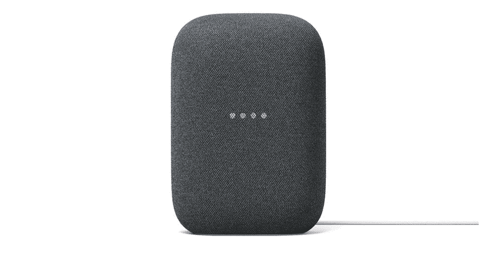

# 今天花 80 美元买一个 Nest Audio 智能音箱(优惠 20 美元)

> 原文：<https://www.xda-developers.com/get-a-nest-audio-smart-speaker-for-80-today-20-off/>

# 今天花 80 美元买一个 Nest Audio 智能音箱(优惠 20 美元)

谷歌的最佳音频质量智能扬声器以低于通常价格 20 美元的价格出售，有各种颜色。

谷歌最好的独立智能音箱是 Nest Audio。它没有触摸屏，不像 Nest Hub 和其他智能显示器，但它提供了出色的音质和将两个单元配对在一起获得立体声的能力。这款扬声器通常售价约为 90-100 美元，但目前在多家零售店的售价为 79.99 美元。

Nest Audio 是一款谷歌助手智能扬声器，因此它可以播放音乐，为您提供天气预报，播放新闻报道，控制智能家居设备，设置闹钟等等——所有这些都只需简单的语音命令。它有一个 0.7 英寸的高音扬声器和一个 3 英寸的低音扬声器，所以从播客到音乐的任何内容听起来都很棒，三个远场麦克风可以接收来自任何方向的语音命令。像所有其他助理扬声器一样，你可以从手机或平板电脑上的兼容应用程序向扬声器“投射”内容，并且它可以设置为蓝牙扬声器。

 <picture></picture> 

Google Nest Audio

##### 谷歌巢音频

这是谷歌最好的音频质量智能扬声器。所有颜色都在多家零售商处出售。

此次拍卖目前在百思买和 B&H 摄影与视频网站上直播。每种可用的颜色都打折，包括粉笔、木炭、鼠尾草(绿色)、沙子(粉色)和天空(蓝色)。如果你已经拥有一个 Nest Audio，或者你打算购买两个，你可以将两个配对在一起获得立体声效果。如果你持观望态度，我们还会对 Nest Audio 进行全面审查。