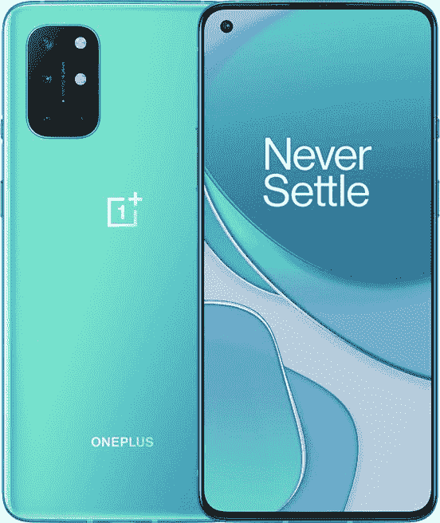

# 购买一加 8T 仅需 569 美元，包括外壳或屏幕保护套

> 原文：<https://www.xda-developers.com/get-a-oneplus-8t-for-just-569-case-or-screen-protector-included/>

# 购买一加 8T 仅需 569 美元，包括外壳或屏幕保护套

一加将 12GB 内存/256GB 存储的一加 8T 打折至仅 569 美元，你可以选择免费的外壳或屏幕保护装置。

一加 8T 是去年最好的安卓手机之一，拥有 120 赫兹的大屏幕，骁龙 865 芯片组，快速充电和四个后置摄像头。它已经上市销售了几次，自从 8T 被一加 9 系列取代后，销售更加频繁，但现在你只需花 569 美元就可以买到更贵的 12GB 内存型号。这比原价低了 180 美元，而且一加还附赠了一个免费配件。

在售型号有骁龙 865 芯片组，6.5 英寸 120 赫兹 AMOLED 屏幕，铝和玻璃建筑，128GB 内部存储和 12GB 内存。技术上有*四个后置摄像头，但只有 48MP 主镜头和 16MP 超宽镜头有用 5MP 微距是低分辨率，2MP 单色传感器帮助其他镜头。查看我们的[对一加 8T](https://www.xda-developers.com/oneplus-8t-review/) 的全面评论，了解我们在电话中的想法(TL；DR:很好)。*

 <picture></picture> 

OnePlus 8T

##### 一加 8T

一加 8T 的高端配置在一加的在线商店降至 569.00 美元。你也可以选择一个免费的配件。

一加 8T 最初以 8GB RAM 和 12GB RAM 型号销售(分别具有 128GB 和 256GB 存储)，但只有 12GB RAM 版本仍然可用。一加有“月球银”和“海蓝宝石绿”两种颜色的库存，你可以从三种免费配件中选择一种:“Karbon”保险杠套、砂岩保险杠套或钢化玻璃屏幕保护套。要更改附件，您必须在所选项目上单击“删除”，然后在您想要的项目上单击“添加”。