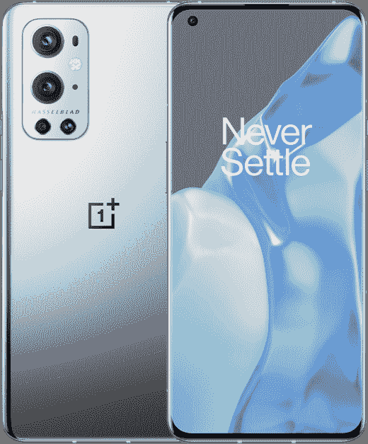

# 花 969 美元(优惠 100 美元)买一台一加 9 Pro，或者花 649 美元(优惠 80 美元)买一台一加 9

> 原文：<https://www.xda-developers.com/get-a-oneplus-9-pro-for-969-100-off-or-a-oneplus-9-for-649-100-off/>

过去几周，一加一直在销售其整个系列的手机。本月早些时候，该公司将一加 9 和 9 Pro 分别打折 30 美元和 40 美元。这算不上什么折扣，除非你已经打算购买这两款手机，但现在这两款手机的销量都好得多。

一加 9 系列使用骁龙 888 芯片组，8-12GB 内存和 128-256GB 存储空间。这些手机在上次销售中只便宜 30-40 美元，但现在你可以以 80 美元的价格买到一加 9，以 100 美元的价格买到一加 9 Pro。这两部手机分别降至 649 美元和 969 美元。有趣的是，一加 9 Pro 与入门级的 OP9 Pro 价格相同，OP9 Pro 最近在加拿大和美国被取消。

 <picture></picture> 

OnePlus 9

##### 一加 9

当你在收银台使用代码 **BESTOP9** 时，一加 9 现在售价 649 美元(优惠 80 美元)。

 <picture></picture> 

OnePlus 9 Pro

##### 一加 9 专业版

当你在收银台使用代码 **BESTOP9PRO** 时，价格更高的一加 9 Pro 打折至 969 美元(优惠 100 美元)。

一加没有像之前的折扣一样，免费赠送一年的意外损坏保护计划。但是，您仍然可以在结帐过程中添加它们，享受正常价格的 20%折扣。一加 9 的计划将花费您 55.20 美元，而一加 9 专业保护花费 71.20 美元。