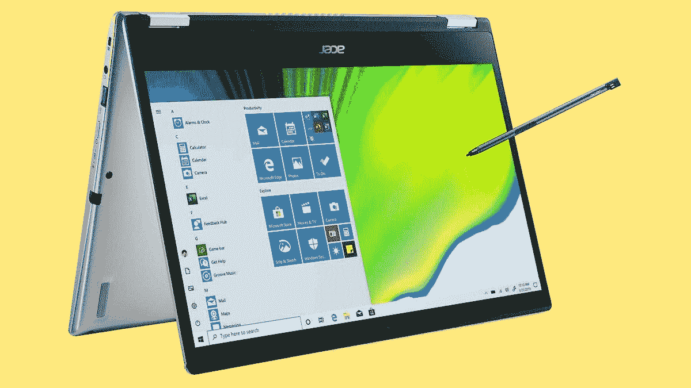
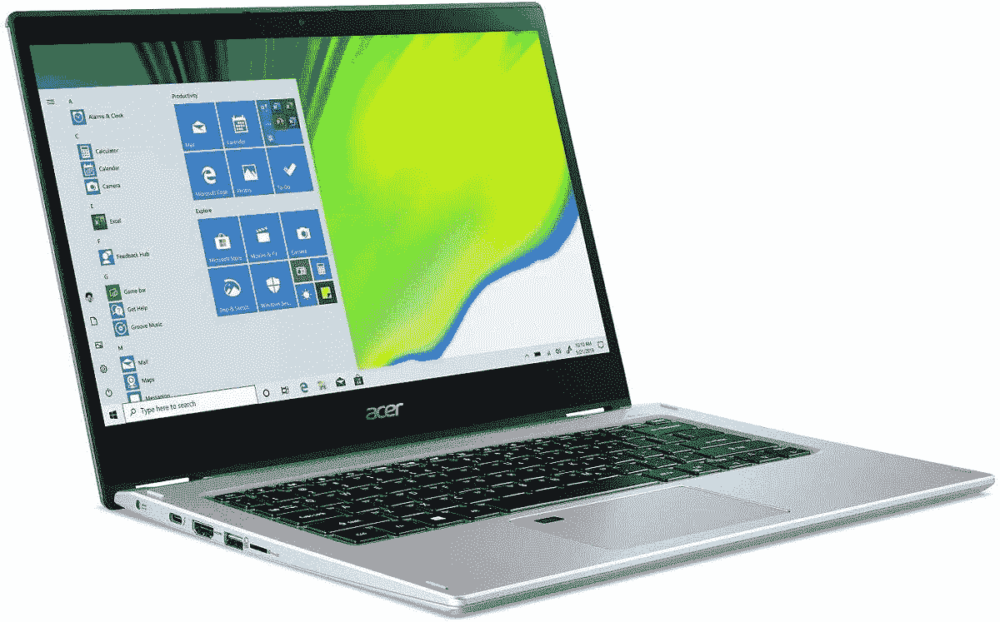

# 只需 480 美元，就能获得一台配备酷睿 i5 和触摸屏的宏碁 Spin 笔记本电脑

> 原文：<https://www.xda-developers.com/get-acer-spin-laptop-core-i5-touch-screen-deal/>

# 只需 480 美元，就能获得一台配备酷睿 i5 和触摸屏的宏碁 Spin 笔记本电脑

这款经过认证的翻新 Acer Spin 笔记本电脑价格为 480 美元，配有酷睿 i5 CPU、8GB RAM、SSD 存储和触摸屏。

 <picture></picture> 

Processed By eBay with ImageMagick, z1.1.0\. ||B2

由于在家办公的人数突然增加，笔记本电脑的需求仍然很高，但这并不意味着没有几个很好的交易。宏碁现在将其 Acer Spin 3 笔记本电脑的翻新版打折至仅 479.99 美元，比正常(非翻新)价格节省了 235 美元。对于你得到的硬件来说，这是一个非常好的价格。

产品清单上写着这台笔记本电脑是经过认证的翻新产品。宏碁表示:“从外观上看，这些产品通常与新产品没有什么区别，但有些产品可能会有轻度使用的迹象。在功能上，这些单元相当于新的。经过认证的翻新设备将装在一个新的棕色盒子中运输。”

如果你能接受翻新的条件，这款二合一笔记本电脑售价 480 美元，绝对是便宜的。它有一个[英特尔酷睿 i5-1035G1](https://ark.intel.com/content/www/us/en/ark/products/196603/intel-core-i5-1035g1-processor-6m-cache-up-to-3-60-ghz.html) 处理器，一个 4 核/8 线程芯片，TDP 为 15W。屏幕是一个 14 英寸的 1920x1080 IPS 面板，支持触摸，盒子里有一支手写笔，用于更精确的输入。还有 8GB 内存，256GB 固态硬盘存储，预装 Windows 10 Home。

 <picture></picture> 

Acer Spin 3 2-in-1 Laptop

这款 14 英寸笔记本电脑包的硬件非常棒，价格不到 500 美元。这是经过认证的翻新产品，正通过该公司的易贝官方商店出售。

Acer Spin 3 拥有您需要的所有端口和连接，包括 Wi-Fi 6 (802.11 a/b/g/n/ac/ax)、一个 microSD 卡插槽、蓝牙 5.0、HDMI、两个 USB Type-A 端口和一个支持雷电 3 的 USB Type-C 连接器。更多的 Type-C 端口会更好，而且仍然有一个专有的充电连接器，但硬件的其余部分在价格上是稳定的。