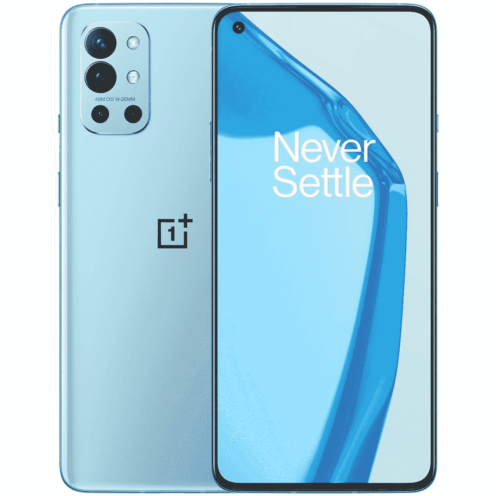

# 在任何 Android 手机上获取一加 9 的新动态壁纸

> 原文：<https://www.xda-developers.com/get-oneplus-9-live-wallpapers-any-phone/>

一加最新的旗舰产品阵容包括一些当今市场上最好的安卓智能手机。[一加 9 系列](https://www.xda-developers.com/oneplus-9/)包含三款设备——一加 9、一加 9 Pro 和一加 9R——在不同价位提供旗舰体验。在这三款手机中，一加 9 和一加 9 Pro 是真正的旗舰手机，拥有顶级的硬件，而一加 9R 是一款价格实惠的旗舰手机，内置高通的骁龙 870 芯片。

正如每一款新的一加手机发布一样，新的智能手机都有静态和动态壁纸可供选择。虽然我们已经在发布前分享了一些壁纸，但我们现在可以访问更新的一加壁纸资源 APK，你可以安装在任何安卓手机上获得最新的壁纸。

XDA 资深会员 [TechGenius](https://forum.xda-developers.com/m/techgenius.6067363/) 成功提取了一加壁纸 APK 和一加壁纸 APK(通过 Reddit 用户[RolfBenz](https://www.reddit.com/r/oneplus/comments/mc0uip/new_official_oneplus_9_pro_live_wallpapers/))你可以安装在任何安卓手机上获得新的一加 9 live 壁纸。一旦你的手机上安装了 APKs，你应该可以在壁纸库里找到一加 9 壁纸。如果你没有，你必须从 Play Store 安装谷歌[壁纸应用](https://play.google.com/store/apps/details?id=com.google.android.apps.wallpaper&hl=en_IN&gl=US)来应用新的动态壁纸。

**[一加九大论坛](https://forum.xda-developers.com/f/oneplus-9.12151/)| |[一加九大论坛](https://forum.xda-developers.com/f/oneplus-9-pro.12153/)|**

根据帖子上的评论，这些 apk 可以在旧的一加设备和非一加手机上运行。然而，我在我的 [Galaxy Note 20 Ultra](https://www.xda-developers.com/samsung-galaxy-note-20/) 上试用时遇到了一些问题。新壁纸没有出现在我的设备上的股票壁纸选择器中，当我试图使用谷歌的壁纸应用程序应用壁纸时，一加壁纸应用程序崩溃了好几次。但米莎尔能够在他的 Pixel 4 上使用动态壁纸，没有任何问题，所以 apk 仍然值得一试。

如果您感兴趣，可以从下面的链接下载 apk。如果你能在你的设备上使用一加 9 的实时壁纸，一定要留下评论。

**下载:** [一加 9 壁纸资源 APK](https://www.apkmirror.com/apk/oneplus-ltd/opwallpaperresources/opwallpaperresources-2-0-1-201222175339-3a9a8e3-release/oneplus-wallpaper-resources-2-0-1-201222175339-3a9a8e3-android-apk-download/)**| |**|[一加壁纸 APK](https://www.apkmirror.com/apk/oneplus-ltd/oneplus-wallpaper/oneplus-wallpaper-1-0-2-210223182435-493b060-release/oneplus-wallpaper-1-0-2-210223182435-493b060-android-apk-download/)

 <picture></picture> 

OnePlus 9

##### 一加 9

香草一加 9 是为那些谁想要旗舰性能，但不想支付最高美元。它提供了 6.5 英寸 120Hz AMOLED 显示屏，由哈苏调整的三摄像头设置，以及骁龙 888 SoC。

 <picture></picture> 

OnePlus 9 Pro

##### 一加 9 专业版

凭借 6.7 英寸的大尺寸四高清有机发光二极管显示屏和智能 120Hz 刷新率，一加 9 Pro 可能拥有市场上最好的显示屏。与 Hasselblad 合作调整的相机可拍摄出出色的静态照片，并捕捉精彩的 4K 视频。

 <picture></picture> 

OnePlus 9R

##### 一加 9R

一加 9R 是一加 8T 的翻版，带有高通的骁龙 870 芯片和重新设计的摄像头岛。这是一加 9 系列中最实惠的手机，它有可能成为最受欢迎的手机。

* * *

*特色图片:像素 4 上的一加 9 动态壁纸*