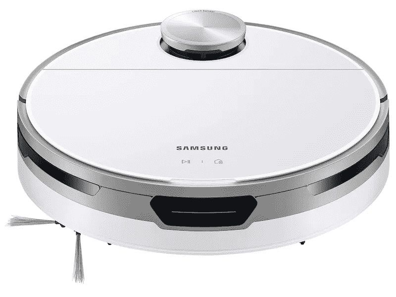

# 以最低的价格获得三星令人印象深刻的 Jet Bot 机器人吸尘器

> 原文：<https://www.xda-developers.com/get-samsung-jet-bot-vacuum-lowest-price/>

近年来，机器人吸尘器的受欢迎程度飙升。就在不久前，智能机器人吸尘器还不可靠，不可持续，而且非常昂贵。但是随着时间的推移，稳定的改进使得这种看起来未来的技术比以往任何时候都更容易使用。如果你一直想为你的房子买一个，你会很高兴地知道三星令人印象深刻的 Jet Bot 机器人真空吸尘器目前价格最低。

Jet Bot 机器人吸尘器是三星智能吸尘器系列中的入门级型号。它在 CES 2021 上亮相，并于 6 月在美国上市销售。它的零售价通常为 599 美元，但作为正在进行的发现三星活动的一部分，你可以只花 499 美元买到它，节省 100 美元。您可以点击下面的链接获得交易。

 <picture></picture> 

Samsung Jet Bot Robot Vaccum ($215 off)

##### 三星 Jet Bot+

三星令人印象深刻的 Jet Bot 机器人真空降至最低价格。趁供应不足，赶快买吧！

那么 Jet Bot 机器人真空到底有什么特别之处呢？首先，它配备了一个激光雷达传感器，可以为吸尘器创建周围区域的精确地图，从而更有效地清洁你的家。它可以在硬地板和地毯上工作，并可以通过识别表面类型和灰尘量来自动调整吸力。它还具有高效自清洁刷，障碍物传感器，可重复使用的过滤器，0.4 升可清洗的垃圾箱，以及可调的抽吸速度。

这款真空吸尘器一次充电可提供长达 90 分钟的运行时间，并且兼容谷歌助手、亚马逊 Alexa 和三星 Bixby。通过三星的 SmartThings 应用程序，你还可以跟踪吸尘器的状态，在你的家庭地图上查看它的移动，并指示它暂停或停止。

虽然三星提供了更先进的型号，如 Jet Bot AI Plus，但 Jet Bot 机器人 vacuum 因其巨大的价值、多功能性和令人印象深刻的功能集而成为更具吸引力的选择。