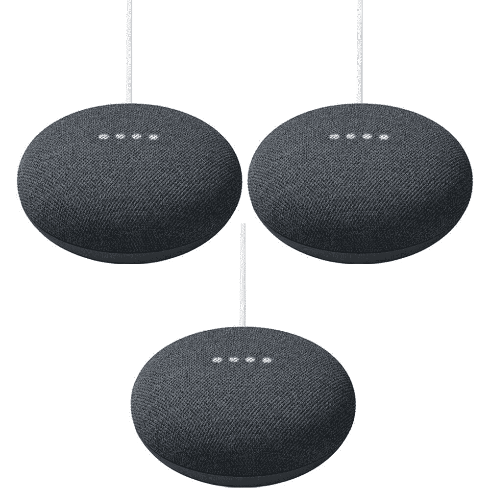

# 只需 65 美元就能获得三个谷歌巢迷你智能音箱

> 原文：<https://www.xda-developers.com/get-three-google-nest-mini-smart-speakers-for-just-65/>

# 只需 65 美元就能获得三个谷歌巢迷你智能音箱

最新的 Nest 迷你扬声器在易贝上以 64.99 美元的价格出售。粉笔和木炭色都有。

随着第二代 Nest Mini 的到来，谷歌终于在 2019 年底取代了最初的 Nest Mini 智能音箱(最初称为谷歌 Home Mini)。更新的型号看起来几乎一样，但它包更好的声音，墙壁安装支持，和不同的制造材料。它通常售价 30-35 美元(尽管建议零售价是 50 美元)，但现在你可以花 64.99 美元一包买三个。

Nest Mini 是一款带有谷歌助手的智能扬声器，因此您可以使用语音命令来播放音乐、提问、播放新闻报道、设置提醒和闹钟、管理日历事件等。它还可以用作 Chromecast 目标，因此您可以从本地 Wi-Fi 网络上支持的应用程序向扬声器“投射”音频。对于其他一切，Nest Mini 可以作为蓝牙扬声器配对。

 <picture></picture> 

Google Nest Mini (3-Pack)

##### 谷歌巢迷你(第二代)

Buydig 通过其易贝商店出售 3 包 Nest 迷你音箱，售价 64.40 美元。

新的 Nest Mini 与旧的 Google Home Mini 相比并没有太大的升级，但如果你需要更多房间的智能扬声器，或者如果你正在将一个以 Alexa 为主的家庭迁移到 Google Assistant，这是一个更便宜的方式来一次获得多个 Nest Mini。