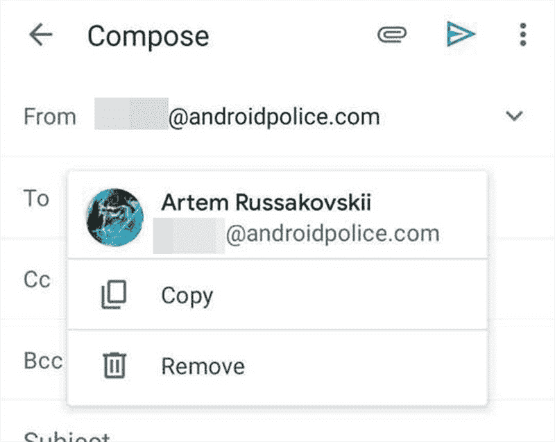
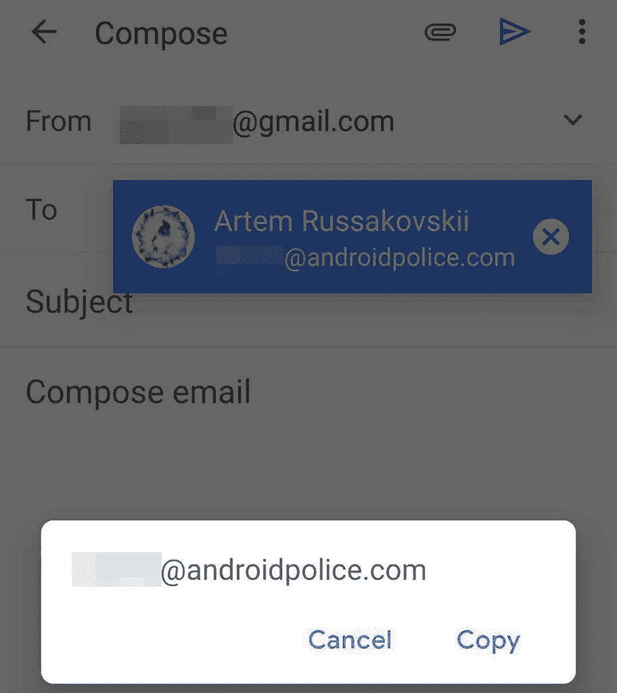

# Gmail for Android 有了新的按钮，可以帮助你轻松地复制和粘贴电子邮件地址

> 原文：<https://www.xda-developers.com/gmail-android-copy-paste-email-addresses/>

Gmail for Android 有了新的按钮，可以帮助你方便地复制和粘贴电子邮件地址。新的按钮取代了旧的手势，旧的手势要求你长按电子邮件地址来显示复制提示。

新按钮是由*的安卓警察*首先发现的[，他分享了以下突出这一变化的截图。正如你在所附图片中看到的，在撰写新邮件时，长按“收件人”、“抄送”或“密件抄送”字段中的电子邮件地址会打开一个新窗口。该窗口包括与电子邮件地址相关联的名称、电子邮件地址本身以及两个按钮-复制和删除。](https://www.androidpolice.com/2021/03/10/gmail-for-android-makes-it-easier-to-copy-and-paste-email-addresses/)

 <picture></picture> 

New copy and remove buttons

正如您所料，复制按钮将电子邮件地址复制到剪贴板，然后您可以将其粘贴到任何其他字段。另一方面，删除按钮从当前字段中删除选定的电子邮件地址。值得注意的是，删除按钮不会从其他字段中删除选定的电子邮件地址。因此，如果您在“收件人”和“密件抄送”字段中都有一个电子邮件地址，并且您使用“新建”按钮删除了“收件人”字段中的一个电子邮件地址，另一个不会被删除。

 <picture></picture> 

Old copy button

Android Police 进一步指出，目前新按钮似乎并不适用于所有 Gmail 用户。这表明该功能可能会随着服务器端的更新而推出。也有可能新按钮是 A-B 测试的一部分，这可能是为什么它们只对一些用户显示。我的 [Galaxy Note 20](https://www.xda-developers.com/samsung-galaxy-note-20/) 安装了 2021 . 02 . 05 . 07 版本的 Gmail 应用程序，可以使用这些新按钮。然而，我的 [Mi 10T Pro](https://www.xda-developers.com/xiaomi-mi-10t-pro-great-lcd-better-than-good-amoled-display/) 安装了相同版本的应用程序，却没有这些按钮。

在过去的几个月里，谷歌在 Gmail 中引入了一些急需的改变，比如不需要先下载就可以编辑 Office 附件的功能。我们还发现了一些即将推出的功能，如过滤信息的[搜索芯片](https://www.xda-developers.com/google-prepares-bring-gmail-search-chips-feature-mobile/)，这将为高级用户提供更多的实用功能。