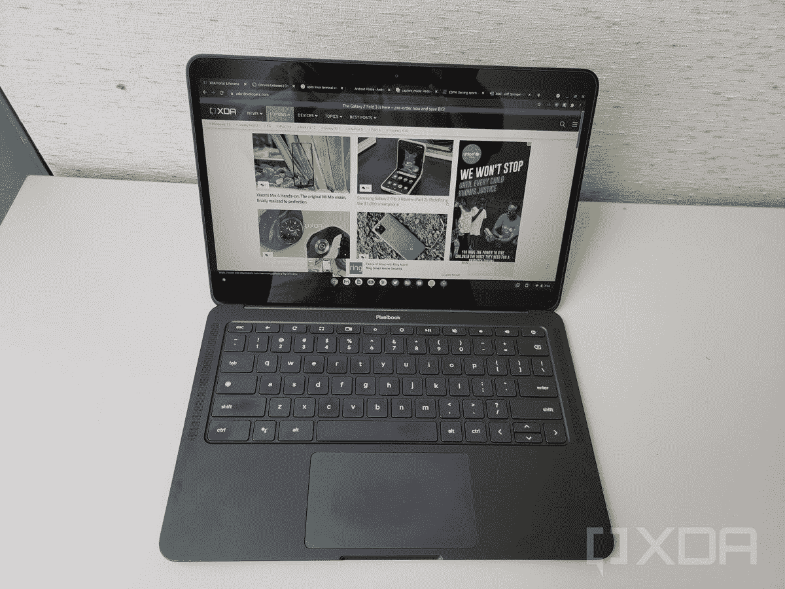

# 报告称，谷歌取消下一代 Pixelbook 机型，退出笔记本电脑市场

> 原文：<https://www.xda-developers.com/google-cancels-pixelbook-hardware/>

你或许根本不应该指望谷歌会发布一款新的 Pixelbook 品牌笔记本电脑。来自 *The Verge* 的一份新报告称，该公司已决定取消 2019 年 Pixelbook Go 的后续活动，并将制作该产品的团队转移到谷歌内部运营的其他部门。此举显然是一项削减成本的措施，在 2021 年的一份类似报告提到谷歌没有计划在 2022 年推出另一部 Pixelbook 之后[。](https://www.xda-developers.com/pixelbook-2022/)

### 复杂的故事

这将是谷歌复杂的第一方 Chromebook 硬件计划的最新进展。这一切都要追溯到 2013 年最初的 Chromebook Pixel。然后是 2017 年的 Pixelbook，也有自己的问题。最初的 Pixelbook 的价格更接近当时的 Windows 2-in-1，并且从未在日常消费者中销售良好。在随后到来的后续中，2017 年的 Pixel Slate 也遭受了损失。这一次，它模仿了微软 Surface Pro，但由于缺乏完整的平板电脑模式，因此遇到了软件问题。谷歌随后放弃了生产 ChromeOS 平板电脑的计划，完全支持笔记本电脑。

然后是 2019 年的 Pixelbook Go，这是一款传统的笔记本电脑，似乎终于为谷歌制造的 Chromebook 硬件奠定了基础。通过这一点，谷歌展示了它如何最终对 ChromeOS 进行了重大改变，以使该操作系统与 Windows 和 macOS 保持同步，并为其提供了完美的硬件。

 <picture></picture> 

Pixelbook Go

然而，三年过去了，谷歌对后续行动一直保持沉默。该公司甚至在给 The Verge 的 I/O 会议上表示，他们计划在未来保留 Pixelbooks，但也承认了一些变化和可以“持续很长时间”的新型 Chromebook 硬件但是，是什么推动了这些变化呢？大概就是钱和代工吧。

### 致力于构建硬件，还是依靠合作伙伴？

回到那是如何 *The Verge 的*消息来源表明，下一代 Pixelbook 可能在 2023 年首次亮相，因为它“正在开发中”谷歌显然想推出这款产品，但由于桑德尔·皮帅在一份备忘录中提到的变化和重新部署资源，显然不会。

谷歌的沟通经理劳拉·布林就此事向该出版物正式提供了以下声明。

> “谷歌不分享未来的产品计划或人员信息；然而，我们致力于构建和支持创新的、对我们的用户有帮助的谷歌产品组合。至于我们的员工，当我们改变工作重点时，我们会努力让团队成员跨设备和服务进行转换。”

它没有确认任何事情，但如果它是真的，今天你仍然可以买到很多很棒的 Chromebook 硬件。谷歌不需要像原始设备制造商已经做的那样，像过去那样在这个领域进行创新。

### 你今天能买到什么

基于这种措辞，如果这是真的，谷歌现在可能会在 Chromebook 硬件方面更倾向于其合作伙伴(也称为原始设备制造商)。由于据说这是一项削减成本的措施，谷歌的重点似乎更多地放在 Pixel 品牌的手机、手表和 Android 平板电脑上。预计 10 月 6 日(T1)在纽约市举行的一次活动中将会详细介绍很多这种硬件。

谷歌的合作伙伴[已经发布了质量超过谷歌自己的 Chromebooks。例子包括配备有机发光二极管显示屏的联想 IdeaPad Duet 5 平板电脑，配备触觉触控板的惠普蜻蜓 Chromebook，甚至是像联想 5i-14 Chromebook 这样的 Steam 兼容机器。寻找谷歌质量 ChromeOS 硬件的谷歌粉丝可能只能满足于其中一些产品。](https://www.xda-developers.com/best-chromebooks/)

**来源:**