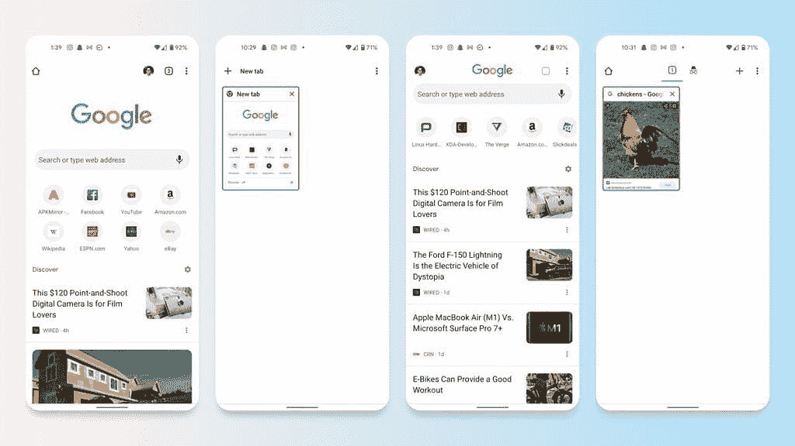

# 谷歌 Chrome 正在努力让用户点击新闻文章

> 原文：<https://www.xda-developers.com/google-chrome-discover-experiment-new-tab/>

谷歌 Chrome 很可能是世界上使用最多的浏览器，但谷歌就是谷歌，它经常喜欢向你推荐新功能。其中之一是发现提要。目前你可以在谷歌生态系统的很多地方找到它，主要是在谷歌应用程序上，但它也会在 Chrome 中出现，尤其是当你打开一个新标签时。实际上，它已经存在了很长时间，确切地说是从 Chrome 54 开始。所以你可以说这已经很平常了。但是谷歌希望用户真正使用这一功能，Chrome 90 的最新实验显示谷歌为谷歌的 Discover feed 的显示腾出了更多空间。

尤其是新标签页中的提要得到了改进。 [*Android Police* 一直在跟踪](https://www.androidpolice.com/2021/05/24/google-wants-to-sacrifice-chromes-usability-to-make-room-for-more-clickbait/)一个名为“Start Surface”的功能，这是一个对新标签页的计划改造，一个面向 Chrome 90 用户推出的该功能的新版本比以往任何时候都更加突出地显示了它的 Discover feed。新的布局将谷歌标志和搜索栏变得更小，并进一步移动到顶部。您最常访问的网站的快捷方式也从两行各 4 个图标变为一行可滚动的图标，但现在它可以容纳 12 个图标，而不是 8 个。

 <picture></picture> 

The old new tab page (left) versus the one currently being tested (right). Image credits: *Android Police*

当然，所有这些变化都是以让 Discover feed 变得更大、更引人注目为代价的，因为它现在占据了你手机显示屏的很大一块。在这个实验中有一些测试布局，但是大多数都遵循相同的基本思想:更小的东西，更大的发现提要。最近，谷歌为谷歌 Chrome 添加了其他新功能:Chrome Canary [目前正在测试](https://www.xda-developers.com/chrome-canary-android-experiment-follow-button/)一种类似谷歌阅读器的 RSS 订阅源，以更新你最喜欢的网站。

如果你想自己尝试这个实验，看看当这个功能对每个人都可用时你是否喜欢它(如果它确实对每个人都可用)，你可以更新到最新版本的 Chrome，并将其粘贴到你的地址栏，以获得特定的标志:

```
 <span >chrome://flags/#enable-start-surface</span> 
```

对此你怎么看？