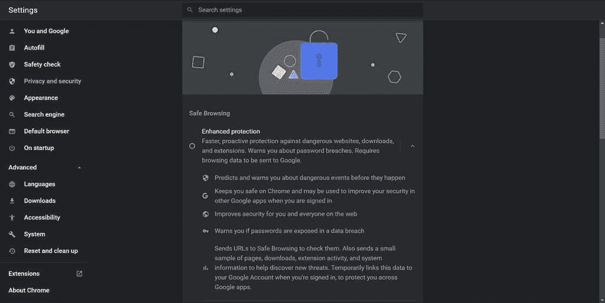

# 谷歌浏览器现在可以在安装不可信的扩展之前警告你

> 原文：<https://www.xda-developers.com/google-chrome-enhanced-safe-browsing-extension-warning/>

完全防止你的数据在网上泄露是很困难的，所以你能做的最好的事情就是采取措施来减轻损害，并尽可能避免暴露给攻击者。小心你访问的网站，你安装的应用程序，你使用的密码都是你可以采取的措施来保护你的数据，但知道什么可以安全使用并不是每个人都清楚的。这就是为什么谷歌 Chrome 提供了一个名为“增强安全浏览”的功能，该功能可以主动警告并保护用户免受危险网站或下载的影响。从今天开始，当用户试图安装不可信的浏览器扩展时，该功能也会发出警告。

随着去年 Chrome 83 的[发布，谷歌推出了“增强的安全浏览”,为用户提供更加主动和定制的保护，以抵御基于网络的威胁。随着去年底](https://www.xda-developers.com/google-chrome-83-privacy-controls-safety-check/)[谷歌 Chrome 86](https://www.xda-developers.com/google-chrome-ios-android-check-newly-saved-passwords-compromised/) 的发布，“增强的安全浏览”后来也来到了安卓系统。

当该功能启用时，谷歌安全浏览会根据其在线数据库检查您访问的网站和下载的文件，以确定它们是否危险。它还会警告你，如果你保存到谷歌 Chrome 的任何密码被暴露在数据泄露中，它还会自动禁用任何安装的被谷歌视为恶意的扩展。

 <picture></picture> 

"Enhanced safe browsing" toggle in desktop Chrome

[根据谷歌](https://security.googleblog.com/2021/06/new-protections-for-enhanced-safe.html)的数据，启用了“增强安全浏览”的用户被网络钓鱼成功的几率比其他用户低 35%。谷歌表示，2020 年 Chrome 禁用的恶意扩展数量增长了 81%。现在，为了让“增强的安全浏览”用户在安装 Chrome 网络商店的浏览器扩展时放心，谷歌 Chrome 将显示一个对话框，通知他们该扩展是否可信。谷歌表示，遵循 [Chrome 网络商店开发者计划政策](https://developer.chrome.com/docs/webstore/program_policies/)的开发者将通过“增强的安全浏览”信任他们的扩展，但新开发者的扩展可能需要几个月才能得到信任。目前，Chrome 网上商店 75%的扩展都是兼容的，但谷歌预计这个数字还会增长。

“增强安全浏览”的另一个新功能是将潜在危险文件发送到谷歌安全浏览进行分析的能力。如果谷歌安全浏览认为文件明显不安全，Chrome 目前将阻止下载这些文件，但对于那些它认为有潜在风险的文件，用户将收到警告，并可以选择上传文件进行更深入的分析。Chrome 的一级检查使用关于下载文件的元数据，而这种更深入的分析使用“实时的静态和动态分析分类器”。谷歌表示，“在短暂的等待之后”，Chrome 将显示一条警告，“如果安全浏览确定该文件不安全。”但是，如果用户信任该下载，他们仍然可以绕过警告。

这些对“增强安全浏览”的改变是上周开始向用户推出的 Chrome 91 更新的一部分。用户可以在 Chrome 设置中启用“增强安全浏览”，如下所示:

*   在 PC 上:设置>隐私和安全>安全
*   在 Android 上:设置>隐私和安全>安全浏览