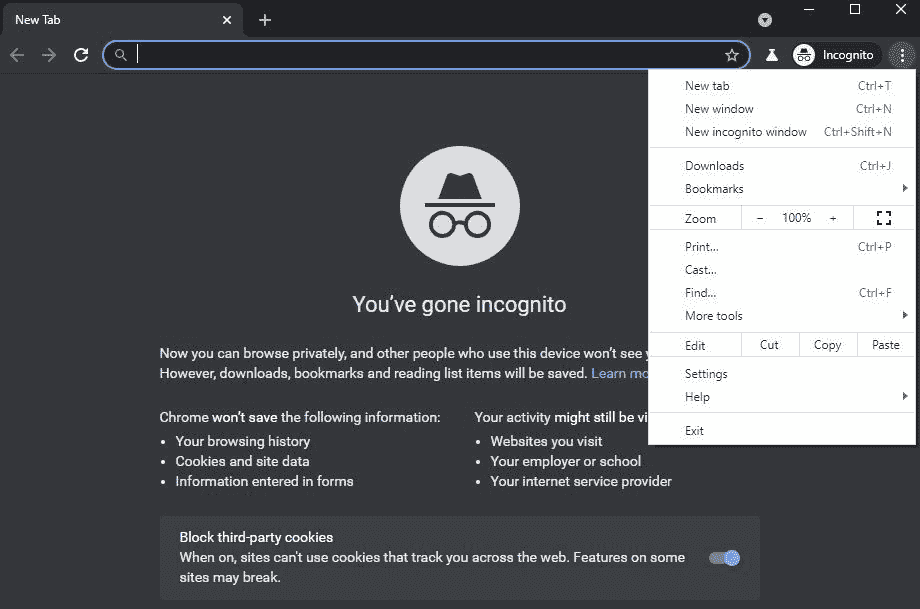
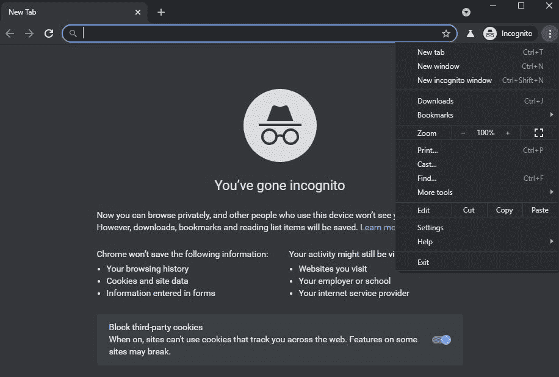

# 谷歌 Chrome 的隐姓埋名模式正在获得自己的原生黑暗主题

> 原文：<https://www.xda-developers.com/google-chrome-incognito-native-dark-theme/>

# 谷歌 Chrome 的隐姓埋名模式正在获得自己的原生黑暗主题

谷歌 Chrome 浏览器终于为隐姓埋名模式提供了一个原生的黑暗主题。以下是您现在可以启用它的方法。

谷歌[在 2019 年推出了 74 版安卓 Chrome 的原生黑暗模式支持](https://www.xda-developers.com/google-chrome-android-dark-mode/)。但在当前状态下，如果系统范围的黑暗主题被关闭，黑暗模式不适用于隐姓埋名模式下的应用程序菜单、上下文菜单和其他一些 UI 元素。这使得 Chrome 上的黑暗模式体验可能有点不和谐。谢天谢地，谷歌终于解决了这个问题。

 <picture></picture> 

Light themed menu in Incognito mode with new flag and system-wide dark theme turned off

Chrome 91 目前在金丝雀频道，包括一个新的标志，实现了隐姓埋名模式的原生黑暗主题(通过 [*TechDows*](https://techdows.com/2021/04/how-to-enable-native-dark-mode-for-incognito-interface-in-chrome.html) )。你可以通过导航到 *chrome://flags* 并搜索“微服模式”来找到这个标志这将带来新的**“允许小部件从其父小部件继承本机主题”**标志。

点击旁边的下拉菜单，选择“启用”选项。然后，单击底部的重新启动按钮，重新启动浏览器以使更改生效。

现在，打开隐身模式，点击右上角的三点菜单按钮。它现在将有一个黑暗的主题，即使你关闭了全系统的黑暗主题。

 <picture></picture> 

New native dark theme for Chrome's incognito mode

如前所述，Chrome 隐姓埋名模式的新黑暗模式标志目前仅在金丝雀频道可用。一旦该标志默认为稳定通道的所有用户启用，我们将更新本文。尽管这无论如何都不会是一个显著的变化，但很高兴看到谷歌精简了 Chrome 的原生黑暗模式，为用户提供了更好的整体体验。

如果你还没有收到更新，你可以点击[这个链接](https://www.google.com/chrome/)下载最新的谷歌 Chrome 版本。