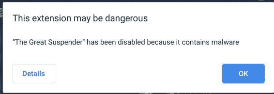

# 谷歌刚刚把 Chrome 上的“大外挂”作为恶意软件一脚踢开

> 原文：<https://www.xda-developers.com/google-chrome-the-great-suspender-malware/>

人们喜欢开玩笑说谷歌 Chrome 占用了大量内存，但这肯定是有一定道理的，尤其是如果你是一个 tab 囤积者。目前，我打开了大约 40 个标签，安装了 20 个扩展，Windows 任务管理器报告 Chrome 使用了将近 3GB 的内存。我的电脑有足够的内存，所以这对我来说不是问题，但对于那些安装了 8GB 或更少内存的 Chrome 用户来说，你可能会为其他程序耗尽内存。幸运的是，这个问题有几个解决方案。你可以关闭一些标签页，但这意味着你将无法轻松地从你离开的地方继续下去。或者，您可以使用类似 Great Suspender 的扩展来挂起标签，释放一些内存。如果你是喜欢这个伟大的吊杆扩展的人之一，那么我们有一个坏消息:它可能是恶意软件。

对一些人来说，这不是新闻。自 2020 年 11 月以来，扩展[的密切关注者已经警告](https://github.com/greatsuspender/thegreatsuspender/issues/1263)它可能正在运行恶意代码。该扩展的旧维护者在 2020 年 6 月将其出售给一个未知方[，用户指控该未知方在该扩展的 7.1.8 版本中悄悄放入了一些跟踪器。尽管 7.1.9 版本移除了追踪器，但许多用户对该扩展的怀疑是可以理解的。今年一月初，](https://github.com/greatsuspender/thegreatsuspender/issues/1175#issue-642243362)[多家媒体](https://www.theregister.com/2021/01/07/great_suspender_malware/)报道了这条新闻，包括我自己在内的许多人[决定放弃这条新闻。然而，今天早些时候，谷歌完全拔掉了流行的 Chrome 扩展插件的插头，强行从人们的 Chrome 安装中移除了巨大的吊杆，并在 Chrome 网络商店上移除了](https://twitter.com/MishaalRahman/status/1347262792643072000)[扩展插件的列表](https://chrome.google.com/webstore/detail/the-great-suspender/klbibkeccnjlkjkiokjodocebajanakg?hl=en)。

 <picture></picture> 

Chrome's removal message for The Great Suspender. Credits: Redditor /u/justingolden21

Reddit 和 Twitter 上的许多用户报告说，他们的电脑上的大吊杆被移除了。[Reddit 的/r/Chrome subredit 上的两条](https://www.reddit.com/r/chrome/comments/lch3k5/warning_please_immediately_uninstall_the_great/) [帖子](https://www.reddit.com/r/chrome/comments/lclhin/the_great_suspender_malware/)充满了人们抱怨这一突然决定的评论，因为移除导致他们所有暂停的标签被关闭。幸运的是，正如 Redditor /u/ [avatar_ENG](https://www.reddit.com/user/avatar_ENG) 所指出的，有一种方法可以恢复你的暂停标签。只需打开你的搜索历史，搜索“klbibkeccnjlkjkkiokjodocebajanakg”。如果这不起作用，你可以尝试这里列出的其他选项[。](https://github.com/greatsuspender/thegreatsuspender/issues/526)

如果你正在寻找一个伟大的吊杆的替代品，社区成员 TheMageKing——他在 11 月揭露了恶意的改变——推荐 [Tabs Outliner](https://chrome.google.com/webstore/detail/tabs-outliner/eggkanocgddhmamlbiijnphhppkpkmkl) 、[自动标签丢弃](https://chrome.google.com/webstore/detail/auto-tab-discard/jhnleheckmknfcgijgkadoemagpecfol?hl=en)或[会话伙伴](https://chrome.google.com/webstore/detail/session-buddy/edacconmaakjimmfgnblocblbcdcpbko?hl=en)。如果你喜欢使用这个伟大的吊杆，你也可以从 [GitHub repo](https://github.com/greatsuspender/thegreatsuspender/) 手动编译该扩展的最新安全版本(7.1.6)，并通过启用 Chrome 的开发者模式并选择“加载未打包的扩展”来侧加载它。7.1.6 的预编译版本可以在 Chrome 网上商店以“[The wonderful 吊杆](https://chrome.google.com/webstore/detail/the-marvellous-suspender/noogafoofpebimajpfpamcfhoaifemoa/related)”的名称获得，但我们不能保证它的安全性。