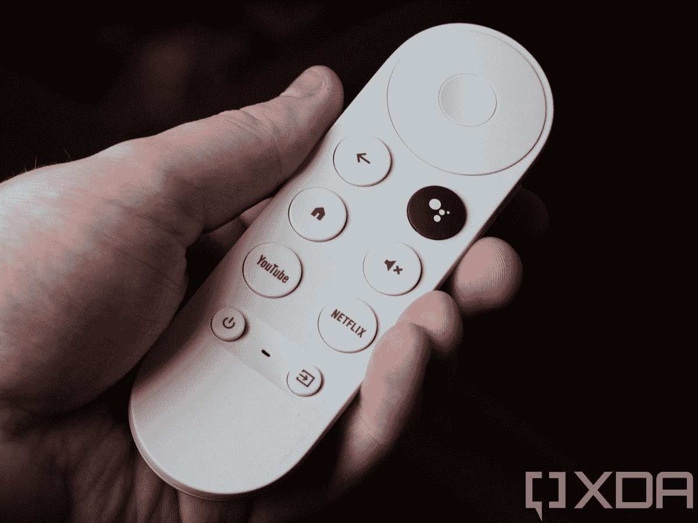

# 谷歌 Chromecast 和谷歌电视:电视直播的门户

> 原文：<https://www.xda-developers.com/google-chromecast-with-google-tv-streaming/>

在 9 月 30 日之前，一台支持 4K 的 Chromecast 至少要花 69 美元，而且你不得不将手机用作遥控器，在启动器中跳转到你需要的应用程序，以观看你想要的节目。在谷歌 Chromecast 和谷歌电视发布的那一天，我订购了它，这样我就可以测试它了。在我详细介绍设置过程和使用设备之前，我想提一下，如果你已经有了一个支持 4K 的 Android 电视机顶盒和一个支持谷歌助手的遥控器，就没有令人信服的理由去转换，更不用说考虑到这款 Chromecast 在发布时的限制了(我将在后面解释)。但是如果你想第一次升级一台旧的“哑”电视，谷歌的新加密狗值得你考虑。

 <picture></picture> 

The Google Chromecast with Google TV comes with a dedicated remote!

## 使用 Google TV 设置 Google Chromecast

设置过程非常简单，虽然有点耗时。你需要把装有谷歌主页应用的手机放在手边，以尽可能地简化设置。设置过程如下(括号中为设备):

1.  按住(电视)来配对遥控器
2.  通过扫描二维码将 Google Home 应用连接到 Chromecast(手机上的 Home 应用)
3.  连接到 WiFi(手机上的家庭应用程序)
4.  使用 Google 帐户登录(手机上的家庭应用程序)
5.  选择谷歌服务(手机上的家庭应用)
6.  设置谷歌助手(手机上的家庭应用程序)
7.  选择您的应用(手机上的家庭应用)
8.  选择环境模式照片来源(手机上的家庭应用程序)
9.  在遥控器(电视)上设置音量和电源按钮
10.  登录你的第三方服务(电视和电话都可以——一些例子:网飞似乎是最乏味的，迪士尼+可以用谷歌智能锁自动登录，如果你已经在手机上启用了它，CBS All Access 可以在你打开手机上的应用程序时自动登录，亚马逊 Prime Video 和 ESPN 需要在浏览器的激活页面上输入代码)
11.  (可选)使用遥控器转到电视上的设置，返回到设置遥控器上的输入切换器按钮

## 通过谷歌电视使用谷歌 Chromecast

由于专用遥控器和谷歌电视的屏幕用户界面，谷歌的新 Chromecast 终于能够与 Roku 和亚马逊的流媒体棒巨头竞争，同时凭借其传统的手机镜像功能击败他们。为了澄清任何可能的混淆，谷歌电视是对 Play Movies and TV 应用程序的重新命名，并在 Android 电视平台上增加了一个大屏幕 UI。凭借 8GB 的本地存储和 2GB 的 RAM，它与入门级的 NVIDIA Shield TV 不相上下(尽管后者提供 MicroSD 存储扩展)。

说到规格，处理器是 1.9GHz 四核 [Amlogic S905X3](https://androidpctv.com/comparative-amlogic-s905x3/) ，它通过 HDMI 2.0 连接以高达 4K 的分辨率和 HDR 传输内容。电源通过 USB-C 端口进入设备，它通过以太网电源适配器[支持以太网连接，该适配器单独出售](https://store.google.com/us/product/chromecast_ethernet_adapter_gen_2)。奇怪的是，谷歌 Stadia 在发布时没有支持，但根据 Stadia Twitter 账户，预计将在 2021 年初推出。

Google TV UI 对 Android TV 界面进行了改进，主要是通过整合您的 Google Play 库和您可能拥有的各种支持订阅的内容，如 Disney+、网飞、Hulu、Sling TV、亚马逊 Prime Video 等。您看到的界面取决于您是否使用设置 Chromecast 时使用的同一 Google 帐户订阅了 YouTube TV。如果你这样做，你会看到以下标签:搜索，为你，生活，电影，节目，应用程序和图书馆。否则，您将看到除“实时”选项卡之外的所有内容。下面是一个截图库，描述了你将在每个选项卡上看到的内容。

虽然新的谷歌 Chromecast 和谷歌电视相比以前的 chrome cast 绝对是一个进步，但与领先的 4K 支持的 Android 电视机顶盒相比，它显然是一个进步。最大的限制是除了 YouTube 电视之外，它不支持任何直播电视服务。在这篇评论中，我使用不同的谷歌账户多次完成了设置过程，这样我就可以使用一个账户来订阅 YouTube 电视的免费试用版，以说明日常使用中的差异。例如，如上所述，只有当您用来设置设备的 Google 帐户订阅了 YouTube TV 时，Google TV UI 才会有一个 Live 选项卡。如果您有多个 Google 帐户，并且使用了不同的帐户来设置 Chromecast，则必须在“设置”中添加带有 YouTube TV 订阅的第二个 Google 帐户，然后转到应用程序部分的 YouTube TV 应用程序来观看直播电视。令人欣慰的是，谷歌有望在未来增加对其他直播电视服务提供商的支持。

在我两周的使用过程中，我对遥控器有一些小意见，但除此之外，它是一款时尚而有竞争力的产品。我遇到的第一个问题是:当按住谷歌助手按钮并说“播放钢铁侠”时，它将我带到了几年前从谷歌 Play Movies 购买的电影，这部电影非常棒，除了谷歌 Play Movies 的标题最大值为 1080 便士，而不是我的迪士尼+订阅中包含的 4K 版本。这表明，当存在多个选项时，结果大多是准确的，但并不总是最好的。另外两个小问题:我希望遥控器像 Roku 遥控器一样有一个专用的播放/暂停按钮和一个专用的跳回 10 秒按钮。将所有功能整合到圆形 D-pad 中是一个不错的时尚空间节省器，但 Roku 遥控器除了 D-pad 的之外，还有那些专用按钮*。*

## 结论

在我看来，谷歌在发布这款带有谷歌电视的新 Chromecast 时，针对的是 Roku Stick 和亚马逊 Fire TV stick。如果他们的目标是 Android 电视机顶盒，他们会在发布时支持 Stadia，并支持更多的直播电视服务提供商。如果是这样的话，我会说谷歌把它打得落花流水(这比我最近对小熊队说的更多，但那是另一个故事了)。尽管谷歌电视有缺陷，偶尔会有延迟，但它做了 Roku 和亚马逊没有做的事情:整合来自多个服务的内容，以便电视节目和电影占据中心舞台，而不是应用程序。此外，Chromecast 继续提供过去七年来众所周知的无与伦比的手机镜像。49 美元的价格为 4K 内容提供支持，比 Chromecast Ultra 低 20 美元，使谷歌 Chromecast 和谷歌电视与其他 4K 流媒体工具保持竞争力。

### 带谷歌电视的谷歌 Chromecast

谷歌已经将 Chromecast 升级为一个成熟的基于 Android 的操作系统，名为谷歌电视。他们还为它配备了遥控器，使 49 美元的加密狗成为你的直播电视流媒体一站式商店。

**Affiliate Links**

Best Buy

[View at Bestbuy](https://shop-links.co/link/?exclusive=1&publisher_slug=xda&article_name=The+Google+Chromecast+with+Google+TV+is+your+Gateway+to+Live+TV+Streaming&article_url=https%3A%2F%2Fwww.xda-developers.com%2Fgoogle-chromecast-with-google-tv-streaming%2F&u1=UUxdaUeUpU30254&url=https%3A%2F%2Fwww.bestbuy.com%2Fsite%2Fchromecast-with-google-tv-4k-sky%2F6425982.p%3FskuId%3D6425982)

*照片由[亚当·康威](https://www.xda-developers.com/author/adamconway/)拍摄*