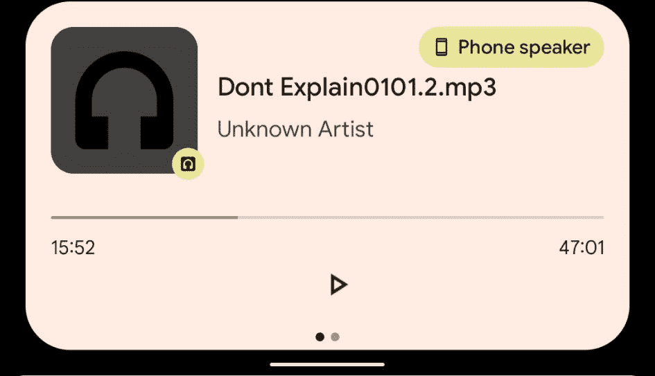

# Android 上的 Google Drive 增加了音频播放速度和通知控制

> 原文：<https://www.xda-developers.com/google-drive-android-adds-audio-playback-speed-notification-controls/>

# Android 上的 Google Drive 增加了音频播放速度和通知控制

Google Drive 的 Android 应用程序增加了对控制音频播放速度的支持，以及通知音频播放控件。

Google Drive 已经成为谷歌服务生态系统的重要组成部分。每个谷歌账户都有 15 GB 的免费存储空间，可以在云上存放你想要的任何东西，这个限额也适用于谷歌照片等其他谷歌服务。 [Drive](https://www.xda-developers.com/tag/google-drive/) 在与朋友和家人分享你的文件方面也做得很好，但在*听*音频文件的情况下，你只能听到存储在平台上的基本控制，而不必将它们下载到你的手机上。

现在，Google Drive 得到了更好的音频控制，功能更加强大(通过 *[Android Police](https://www.androidpolice.com/2021/07/15/google-drive-adds-audio-playback-speed-and-notification-controls-for-android/)* )。也许最大的升级是添加了通知控件。大多数其他具有音频播放功能的应用程序都在通知面板中提供播放控制，包括音乐播放器，但 Google Drive 没有这项功能。在最新的更新中，你可以使用按钮来播放和暂停你正在收听的内容。如果你需要在继续听东西的同时切换到另一个应用程序，这很有用。你还可以通过这一更新获得音频播放速度控制，允许你放慢或加快从应用程序中听到的任何内容。

 <picture></picture> 

Google Drive's new notification audio controls. Image credit: *Android Police*

没有人真正使用 Google Drive 作为他们的主要音频播放应用程序，这次更新不会改变这一点。但是在一些特定的使用案例中，拥有这些控件是非常有用的。如果你正在听你的同学在 Google Drive 上录制并与你分享的讲座，能够有通知控制或加快/减慢你正在听的内容是一个很大的改进。

尽管这看起来像是服务器端的更新(尽管 Google Play 中的补丁说明提到了这两个新功能)，但你现在就可以从谷歌 Play 商店获得最新版本的 Google Drive Android 应用程序。如果这些功能还没有显示出来，可能要过一段时间这些功能才会展现给你。