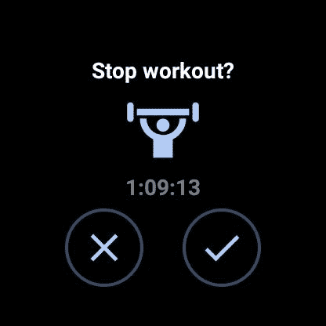

# Google Fit for Wear 操作系统现在可以检测您的锻炼何时结束

> 原文：<https://www.xda-developers.com/google-fit-wear-os-automatically-detect-workout-finished/>

# Google Fit on Wear OS 开始自动检测锻炼何时结束

Google Fit for Wear OS 现在能够检测到您何时完成了锻炼活动，并且不再记录所有内容。

Google Fit for Wear OS 获得了一项新功能，解决了许多用户面临的一个常见问题:忘记结束锻炼。以前，如果你开始记录锻炼，但没有手动结束，Google Fit 会继续记录一切，就好像你仍在进行锻炼一样，因此会弄乱你的活动数据。但是现在，它变得越来越聪明了。

正如 Reddit 用户 ayyndrew 发现的那样，Google Fit for Wear OS 现在能够检测到你何时完成了锻炼活动。如果你忘记结束锻炼，它将不再记录你的活动，这是在推出这项功能之前的情况。相反，它会在你的智能手表上显示一个提示，告诉你停止锻炼。据 Redditor *Zwiada* 称，它甚至发送触觉反馈来提醒用户结束会话。

 <picture></picture> 

Credits: /u/ayyndrew

目前还不清楚这项新功能是谷歌 Fit 新更新的一部分，还是服务器端的一个切换。但是从 Reddit 帖子的用户反应来看，它似乎被广泛使用了。这是一个受欢迎的生活质量的增加，肯定会改善 Wear OS 用户的用户体验。

去年 11 月，谷歌 Fit for Wear OS 进行了一次大换脸，带来了改进的用户界面和一些急需的功能。新更新中的一些主要变化包括使开始锻炼更容易的新磁贴、直接从智能手表设置锻炼目标的能力、跑步时的速度提醒、防止意外触摸输入的触摸锁定按钮、用于引导呼吸会话的新呼吸磁贴等等。

与此同时，新的更新还删除了一个有用的功能:高级力量训练跟踪，允许用户自动跟踪单个代表以及各组之间的休息时间。