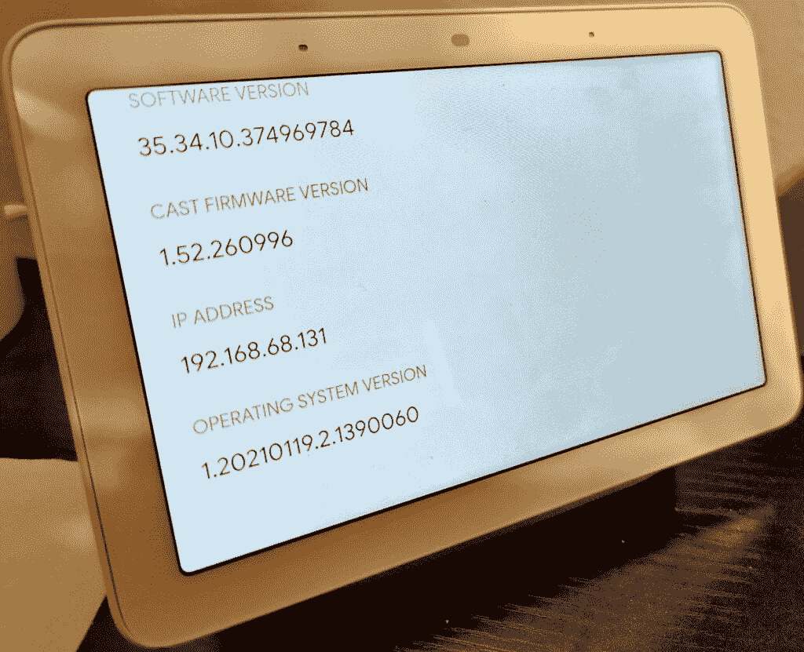

# 谷歌的 Fuchsia 操作系统在 Nest Hub 上进行了期待已久的首次亮相

> 原文：<https://www.xda-developers.com/google-fuchsia-os-debut-nest-hub/>

**更新 1 (08/18/2021 @ 1:49 PM ET):** 第一代 Nest Hub 用户本周将迎来一次重大更新，因为谷歌已经证实它正在广泛推出 Fuchsia OS。[点击这里了解更多信息。](#update1)文章发表于 2021 年 5 月 25 日，下面保留。

谷歌令人困惑的 Fuchsia 操作系统终于在现实世界的设备上复活了——不是像许多人希望和假设的那样在手机上，而是在智能家居产品上。谷歌推出了第一代 Nest Hub 的新更新，用 Fuchsia OS 取代了现有的操作系统。

Nest Hub 是一款谷歌助手驱动的智能扬声器，配有 7 英寸的大显示屏。它于 2018 年推出，运行基于 Linux 的操作系统 Cast OS。现在，谷歌正计划用 Fuchsia 操作系统取代这款操作系统(via [*9to5Google*](https://9to5google.com/2021/05/25/google-releases-fuchsia-os-nest-hub/) )。听起来很令人兴奋，新的基于 Fuchsia 操作系统的更新不会带来任何重大的 UI 变化。事实上，Nest Hub 的所有面向用户的设计元素以及整体功能和特性都将保持不变。

基于 Fuchsia 的更新将在未来几个月内推广到第一代 Nest Hub 设备。从 Cast 操作系统过渡到 Fuchsia 操作系统将是一个缓慢的过程。它将首先冲击运行预览程序的 Nest Hub 设备，随后是更广泛的可用性。

目前，Fuchsia 将只向 2018 Nest Hub 单位进军。谷歌尚未澄清是否以及何时计划将其最新操作系统引入其他基于 Cast OS 的设备，包括第二代 Nest Hub。考虑到 [Fuchsia 自 2016 年](https://www.xda-developers.com/googles-fuchsia-is-a-smartphone-os-with-a-new-ui-but-no-linux-kernel/)以来一直在开发中，很高兴看到它实际上在现实世界的设备上运行。与基于 Linux 的 Android 和 Chrome 操作系统不同，Fuchsia 操作系统是从零开始构建的，并使用了一个名为锆石的新微内核。

从一开始，Fuchsia 就一直笼罩在神秘之中，吸引了来自技术社区各个角落的各种疯狂的理论和观点。围绕 Fuchsia 最常见的理论之一是谷歌最终会用 Fuchsia 取代 Android 操作系统。我们不知道未来会怎样，但从目前的情况来看，Fuchsia 不太可能在短期内取代像 Android 这样的成熟操作系统。操作系统不是你今天开始构建，明天就发布的东西。如果 Android 有今天，那是因为十多年的努力，无数开发者的贡献，以及数百万用户的反馈。建议 Fuchsia OS 作为 Android 的替代品是愚蠢的，尤其是在经过六年多的发展后的这个新生阶段。

* * *

## 更新 1:广泛推出

早在 5 月份，谷歌就开始向少数参加预览计划的第一代 Nest Hub 用户推出 Fuchsia 操作系统。现在，该公司已经向谷歌证实，操作系统更新正在向所有用户广泛推出，而不仅仅是那些参加预览版计划的用户。

Fuchsia 操作系统更新将推出固件版本 1.52.260996。要检查您的设备是否收到了此更新，您可以打开 Google Home 应用程序，点击您的设备，然后选择“设备信息”或者，你可以转到你的 Nest Hub，从底部向上滑动，点击设置，然后点击“关于设备”如果你看到一个“操作系统版本”字段，那么你的 Nest Hub 肯定在运行 Fuchsia 操作系统。

 <picture></picture> 

Fuchsia OS installed on a first-gen Nest Hub

你可能不会注意到你的 Nest Hub 正在运行一个新的操作系统，这正是谷歌想要的迁移感觉。有些人觉得升级后的 Nest Hub 反应更快，但这种改善并不明显。