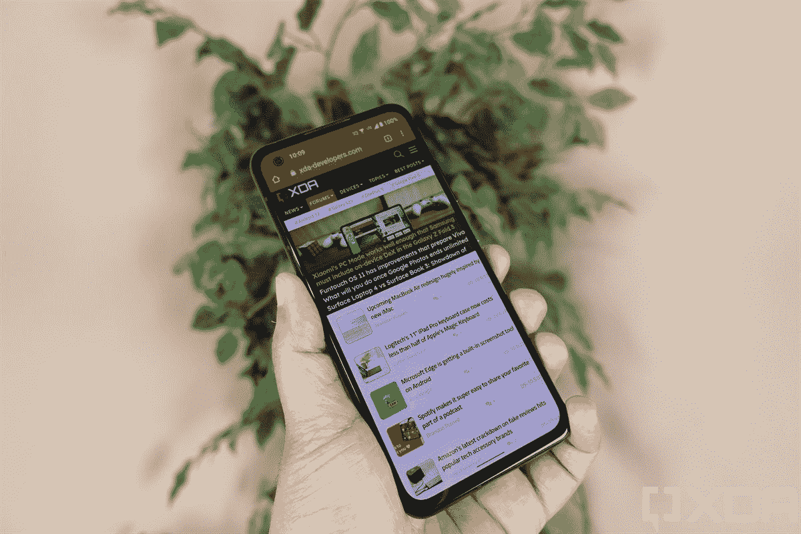
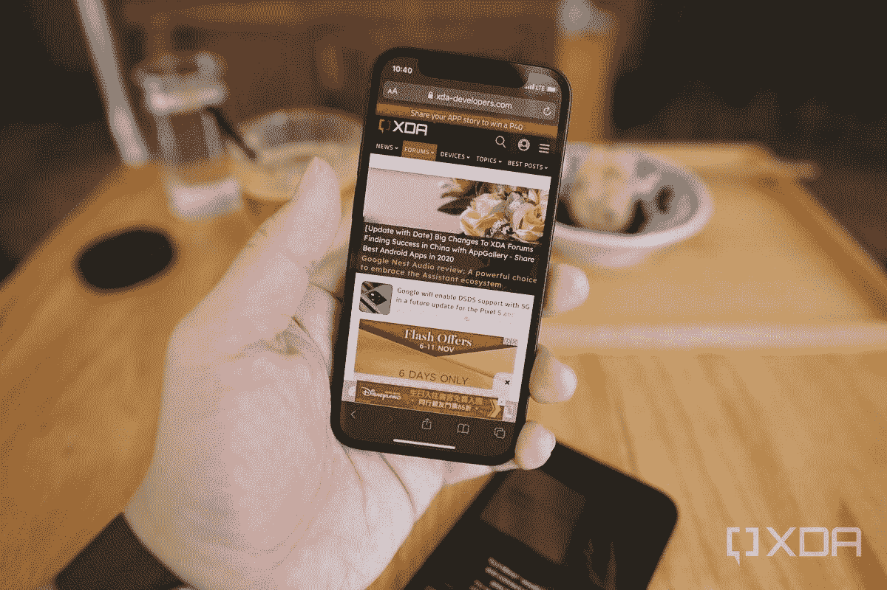

# 谷歌已经放弃了紧凑型安卓旗舰

> 原文：<https://www.xda-developers.com/google-gives-up-compact-flagships/>

本月早些时候，谷歌[展示了即将推出的 Pixel 6 系列](https://www.xda-developers.com/google-pixel-6-teaser/)，透露了最终的设计和一些技术信息。我们仍然不太了解新的相机设置，或者与三星合作开发的新的“张量”芯片组，但我们确实有新设计从各个角度拍摄的照片。Pixel 6 和 Pixel 6 Pro 看起来是自 2016 年第一批型号从(HTC 的)工厂生产线上下线以来，谷歌 Pixel 产品线最大的更新之一，但有一个细节可能并不明显:购买更小像素的选项消失了。

谷歌是唯一有兴趣销售小型手机的安卓智能手机制造商之一。

从 2016 年最初的 Pixel 手机(可以说在此之前还有 Nexus 5X 和 6P)到去年，谷歌一直出售两款旗舰手机:一款普通的 Pixel 和一款 Pixel XL。除了屏幕尺寸之外，总会有一些差异，比如非 XL 设备上的电池较小，但它们在很大程度上拥有相同的硬件。如果你想要一部 Pixel 手机，选择小一点的不会损失任何重要功能。

谷歌是唯一有兴趣销售小型手机的安卓智能手机制造商之一。在过去几年里，小型手机的定义一直在稳步变化，因为边对边屏幕使得在更小的框架中放置更大的显示器成为可能，但任何对角线小于 6 英寸的屏幕都是一个好的开始。根据这一定义，今年发布的唯一一款小型旗舰手机是 Zen fone 8 T1，它采用了骁龙 888 芯片组和 5.9 英寸 AMOLED 屏幕。即将推出的 6.1 英寸 [Xperia 5 III](https://www.xda-developers.com/sony-xperia-5-iii-september-shipping/) 将会很接近，6.2 英寸 [Galaxy S21](https://www.xda-developers.com/samsung-galaxy-s21/) 也是如此，但与目前市场上的其他手机相比，这些手机都很小。

 <picture></picture> 

The ZenFone 8 is the only sub-6" flagship smartphone released this year (so far).

多年来，谷歌一直在提供更小的 Pixel 手机，有时是针对旗舰机和低价机。Pixel 3 拥有 5.5 英寸的屏幕(尽管顶部和底部的大边框使其略显不紧凑)，Pixel 4 拥有 5.7 英寸的显示屏。谷歌去年用 Pixel 5 改变了这种模式，它只有一种尺寸:6 英寸。

今年，谷歌将回归生产两款旗舰 Pixel 手机，但它们都不小。该公司已确认常规的 Pixel 6 将有 6.4 英寸的屏幕，而 Pixel 6 Pro 将有 6.7 英寸的屏幕。购买不是砖块大小的像素的选项显然将随着新手机而消失，标志着谷歌多年来参与的传统的终结。谷歌仍有可能在未来生产更小尺寸的 Pixel“A”手机，但这将是内部硬件更差的廉价设备。

小型旗舰手机的数量每年都在减少，这当然不是什么秘密——小型旗舰手机卖得不好。苹果去年在这个想法上赌了一把，推出了 [iPhone 12 Mini](https://www.xda-developers.com/apple-iphone-12-mini-hands-on-preview/) ，这是该公司近年来最小的手机，不是廉价产品(如 SE 2020)，但[苹果据称由于销售不佳，提前结束了这款手机的生产](https://www.xda-developers.com/apple-iphone-12-mini-production-ceased/)。

 <picture></picture> 

You can still buy the iPhone 12 Mini, but Apple has allegedly stopped producing it.

只有当手机也变得更便宜时，对小尺寸智能手机的需求不足似乎才会改变。据报道，苹果在销售最新款 iPhone SE 方面没有任何问题，这款手机在美国的零售价为 399 美元，功能比旗舰 iPhone 少。小型手机不太可能很快消失，但小型昂贵的手机正濒临灭绝。

尽管较小的旗舰机似乎卖得不好，但总会有(很可能永远会有)像我这样的人不想一直带着笨重的智能手机。如果我想看电影或打出长消息，我有其他设备可以更好地完成这些任务。还记得你以前是如何用拇指够到大多数手机的整个屏幕的吗？美好时光。

我们希望谷歌决定在某个时候重返小型旗舰领域——也许是凭借 Pixel 6 Mini。以目前小旗舰灭绝的速度，潜在的 Pixel 6 Mini 或更小的 Pixel 7 不会有任何竞争。