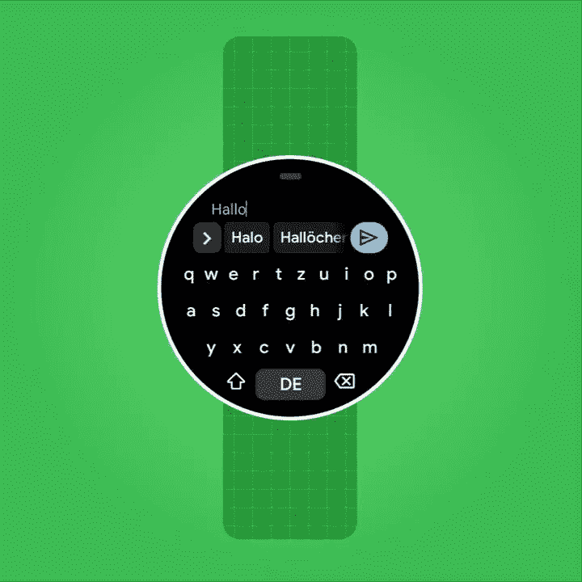

# 谷歌终于开始关注 Wear OS 了，但我们仍然需要新的硬件

> 原文：<https://www.xda-developers.com/google-giving-wear-os-attention-need-new-hardware/>

谷歌的智能手表 Wear OS 软件平台已经休眠了一段时间。Play Store 和谷歌制作的应用程序仍在运行，新手表也在稳步上市，但大多数应用程序开发者对这个平台不感兴趣。谷歌也忽视了将其更新的功能和服务带到 Wear OS 上，谷歌助手和其他组件长期存在的 bug 仍然普遍存在。

除了对设备销售不佳的猜测之外，谷歌为何放弃 Wear OS 一直没有明确的答案([苹果的销量继续超过其所有竞争对手](https://www.xda-developers.com/apple-garmin-huawei-smartwatch-market-2020/))。该公司对 Fitbit 的收购引发了人们的猜测，Wear OS 可能会被彻底改造或取代，使用最初由 Fitbit 开发的软件和技术。然而，尽管收购是在 2019 年 11 月[宣布的](https://www.xda-developers.com/google-officially-acquires-fitbit/)，各种监管障碍阻止了收购在今年 1 月之前[完成。如果谷歌计划对 Wear OS 进行彻底改革，该软件可能会停留在维护模式——但这并不是正在发生的事情。](https://www.xda-developers.com/google-completes-fitbit-buyout-after-months-of-scrutiny/)

Google 最近[公布了本月 Google I/O 开发者大会的日程](https://www.xda-developers.com/google-io-2021-schedule-events-talks/)，并且自 2018 (虽然 2020 年没有活动)以来[首次有多个活动专门针对 Wear OS。谷歌计划在](https://www.youtube.com/watch?v=VZVosFzD9NU)[举办一场“穿戴新功能”会议](https://events.google.com/io/session/6c4c64c7-bd33-405d-9725-ff0727d240cc?lng=en)，以及[一场关于](https://events.google.com/io/session/fbef3692-047b-4573-b345-7d40388ff568?lng=en)[建筑瓷砖](https://www.xda-developers.com/google-wear-os-tiles-feature/)的研讨会。这两场会议并不是谷歌认真对待穿戴的确凿证据，但也有其他令人鼓舞的消息。本月早些时候，[谷歌发布了用于 Wear OS 手表的 Gboard 键盘](https://www.xda-developers.com/gboard-wear-os-available/)——这是谷歌多年来首次在该平台上推出新的应用程序。

 <picture></picture> 

Gboard on Wear OS

很高兴看到谷歌再次对 Wear OS 感兴趣，但还有很长的路要走。谷歌助手[在大多数手表上都是一团乱麻](https://www.xda-developers.com/ok-google-hotword-broken-wear-os-fix-coming/)，第三方应用程序开发已经基本停止，谷歌自己的一些应用程序可能会受益于更新。自从 [Google Play 音乐停止](https://www.xda-developers.com/google-play-music-app-begins-inevitable-global-shutdown-of-service/)以来，还没有任何官方方法可以在 Wear OS 手表上离线存储音乐；YouTube 音乐仍然不见踪影，尽管苹果手表的一款应用于 2020 年 10 月发布[。](https://blog.youtube/news-and-events/youtube-music-now-available-apple-watch/)

更重要的是，Wear OS 需要新的硬件。Wear OS 手表使用的大多数芯片组的供应商高通一直在犹豫是否要开发新的可穿戴硬件。直到去年，Wear 3100 还是该公司最好的可穿戴设备芯片组，它是基于一个老化的 28 纳米架构构建的。高通终于在去年发布了更新的硬件， [Wear 4100 和 4100+](https://www.xda-developers.com/qualcomm-snapdragon-4100-announcement-wear-os-smartwatches/) ，它们提供了急需的性能和可用性改进。

仍然只有一款 Wear OS 手表采用了 Wear 4100 芯片组:Mobvoi TicWatch Pro 3。据报道，摩托罗拉正在为一款采用芯片组的智能手表[申请名称许可，但业内一家更大的公司 Fossil 尚未更新其任何一款手表以使用新硬件。更糟糕的是，高端的 Wear 4100+根本没有 Wear OS 手表。升级后的芯片承诺全彩色环境显示、增强的运动跟踪和其他功能，该平台可以从中受益。如果第三方制造商对销售 Wear 4100+手表不感兴趣，那么谷歌需要推出自己的手表。](https://www.xda-developers.com/new-moto-branded-smartwatches-are-coming-but-theyre-not-what-you-may-think/)

现在，Wear OS 似乎在说——至少在谷歌能够找到 Fitbit 的长期可穿戴战略之前——我们需要更多配备最新硬件的手表。多年来，该平台一直在处理器速度缓慢、内存不足 1GB 的低功率手表上挣扎，但 TicWatch Pro 3 证明了该操作系统在正确的硬件上可以运行良好。我们只是需要更多(更好)的手表。也许[三星的下一代智能手表](https://www.xda-developers.com/samsung-galaxy-watch-4-wear-os-blood-glucose/)可以成为该平台迫切需要的推动力。

*特色图片:Mobvoi TicWatch Pro 3*