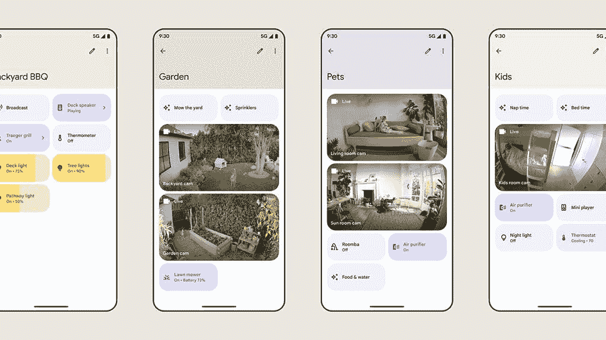

# Google Home 应用程序正在进行重大改进，为用户提供更加个性化的体验

> 原文：<https://www.xda-developers.com/google-home-app-revamp/>

除了新的 [Nest Wifi Pro 和第二代 Nest 门铃 Wired](https://www.xda-developers.com/google-second-gen-nest-doorbell-wired-nest-wifi-pro-launch/) 之外，谷歌今天还展示了经过改进的 Google Home 应用程序。全新设计的新 Google Home 应用旨在为用户提供一个更加可定制的界面来控制他们连接的智能家居设备。

虽然更新的 Google Home 应用程序目前还不能供用户使用，但该公司已经向我们深入概述了今年晚些时候推出的新应用程序。与当前的布局不同，更新后的 Google Home 应用程序有一个新的“收藏夹”标签作为主屏幕，让您可以创建连接的智能家居设备、操作和常用自动操作的个性化视图。您还可以在收藏夹选项卡中添加已连接摄像机的实时流，以便更快地访问。

“个人收藏”标签还可以让您访问底部的媒体控制。媒体控制将显示为“正在播放”栏，如果有多个连接的设备正在播放媒体，您可以在该栏上滑动来访问特定于设备的媒体控制。轻按该栏将打开一个整页布局，其中有附加的播放控件、专辑封面和进度条。

在收藏夹部分的顶部，Google Home 应用程序具有一个转盘，可以让您快速访问所有连接的设备，这些设备按相机、照明、气候和 Wifi 类别分组。摄像机快捷方式打开一个新布局，显示来自连接的安全摄像机的实时流，而照明快捷方式列出所有连接的灯，带有调节亮度的滑块、打开或关闭灯的按钮以及每个房间的灯开关。最后，Wifi 快捷方式将让您快速访问您的所有网络、点和设备，以及共享密码、测试网络、查看网络事件和运行速度测试的选项。

除了收藏夹选项卡，Google Home 应用程序还可以让您快速访问底部栏中的设备选项卡，该选项卡按房间列出了您的所有设备，一个专门的自动选项卡用于启动和编辑例程，一个活动选项卡将显示最近的活动通知。它还将包括应用程序设置页面的快捷方式。

除了这些变化，谷歌还计划明年在 Google Home 应用中添加对自定义空间的支持。此功能可让您将房间或房间内的设备分组，以便于访问。此外，它还可以让你在一个屏幕上分组所有与孩子或宠物相关的设备。

 <picture></picture> 

Custom Spaces

最后，谷歌明年还将推出一个脚本编辑器，帮助高级用户创建强大的家庭自动化。尽管该公司尚未分享关于脚本编辑器的所有细节，但它表示该编辑器将提供 100 多项新功能和自动化功能。脚本编辑器将通过即将推出的 Google Home for web experience 提供，这也将使用户可以选择在浏览器窗口中查看摄像头馈送。

适用于 iOS 和 Android 的新 Google Home 应用将在未来几周内通过公共预览计划向用户提供。如果你想在 stable 推出之前尝试一下，你可以通过点击[这个链接](https://support.google.com/googlenest/answer/12494697)注册公共预览计划。目前，谷歌还没有分享稳定版本的时间表。一旦我们有更多的细节，我们会让你知道。

*你对更新后的 Google Home 应用有什么想法？这些改变会让应用程序对你更有用吗，还是你更喜欢它目前的状态？请在下面的评论区告诉我们。*