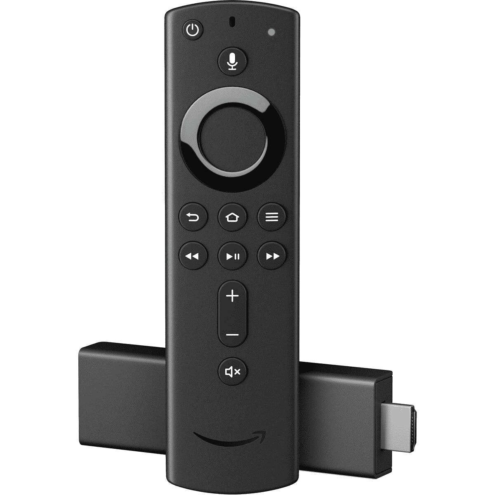
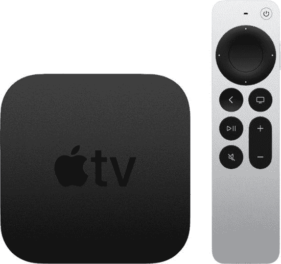
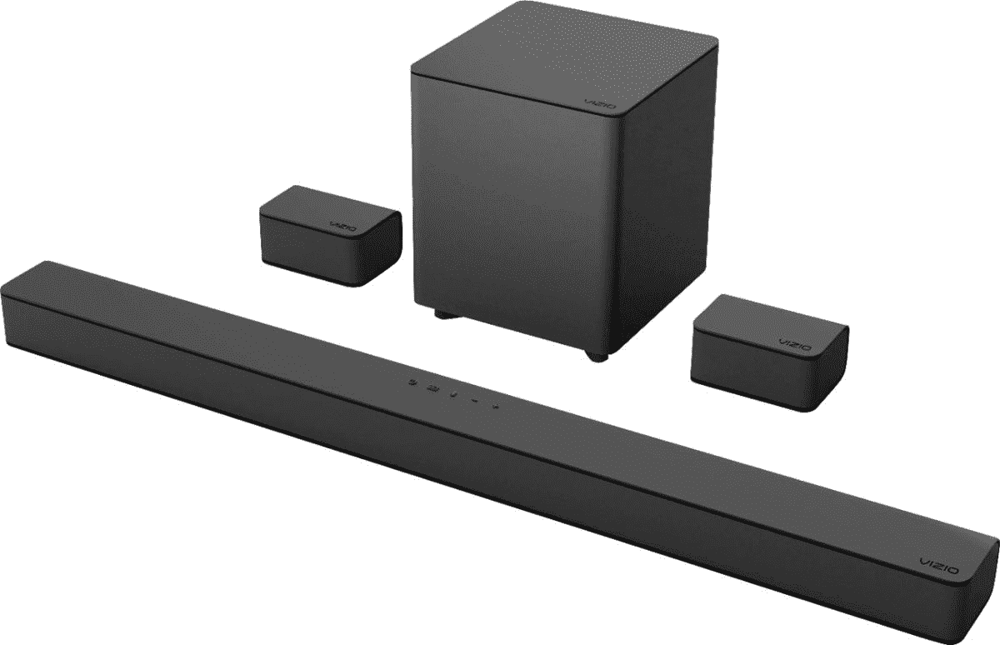

# 2022 年最后一分钟的黑色星期五智能电视、流媒体和家庭音频交易

> 原文：<https://www.xda-developers.com/google-home-max-black-friday-sale-best-buy/>

# 2022 年最后一分钟的黑色星期五智能电视、流媒体和家庭音频交易

使用 XDA 的 2022 年黑色星期五电视和家庭音频设备交易指南，升级您的客厅或个人娱乐设置。

2022 年黑色星期五正式到来，亚马逊、百思买等零售商刚刚推出了一系列新交易。许多这样的交易已经活跃了几个星期，但如果你只是在同一时间登录挑选一些节日礼物，你仍然有很多可以探索的。为了让您更容易找到最佳交易，我们将更新该中心，以汇集智能电视和家庭音频设备的最佳黑色星期五 2022 交易。拿起你的信用卡，准备好点击结账按钮。

在 2022 年黑色星期五销售期间，你会看到各种类别的大量交易，但我们在这里将主要关注电视、流媒体设备和音频外设。如果你有兴趣打开钱包获得更多交易，你可以查看我们的[黑色星期五 2022 电话交易综述](https://www.xda-developers.com/black-friday/)或[个人电脑和游戏综述](https://www.xda-developers.com/best-black-friday-pc-gaming-deals/)。

## 最佳电视交易

如果你热衷于娱乐，一台好的电视可以确保你享受正在观看的内容。这里有一些伟大的黑色星期五电视交易，你可以用来升级你的设置。

*   <picture></picture>

    S95B 三星有机发光二极管智能电视(2022)

    ##### 三星 S95B 66 英寸 4K OLED 电视

    三星 S95B 是我们挑选的您现在可以买到的最好的智能电视。它运行该公司的 Tizen 操作系统，并配有你预计 2022 年顶级电视的所有功能。你可以购买这款 55 英寸和 65 英寸显示屏的电视，它们都在黑色星期五打折。65 英寸的变体可以低至 1449.99 美元(以旧换新)，低于其通常的 2300 美元的价格。

*   ##### LG 55" Class C2 系列有机发光二极管 evo 4K UHD 智能电视

    LG Class C2 4K OLED 电视有很多令人喜欢的地方，包括令人印象深刻的图像质量、基于您正在消费的内容的音频、允许您快速浏览菜单的神奇遥控器等等。百思买目前对这款特定的电视提供 300 美元的折扣，这使得它只需 1300 美元就能买到。

*   ##### 三星 The Frame 55 英寸 QLED 4K 电视(2022)

    那些想买一台生活电视来增加家居美感的人应该考虑一下三星的 The Frame 电视。你可以使用它内置的艺术模式，让它在不使用的时候看起来像一件艺术品。框架电视从 32 英寸开始，一直到 85 英寸，所有这些都在黑色星期五打折。

## 流媒体设备的最佳优惠

如果您有一台不智能的旧电视，或者您只是想升级电视上的服务质量，我们建议您购买一台可以连接到电视的优质流媒体设备。以下是目前正在销售的一些最好的产品:

*   <picture></picture>

    亚马逊 Fire 电视棒

    ##### 亚马逊 Fire 电视棒 4K

    亚马逊的 Fire 电视棒仍然是市场上最好的流媒体设备之一。它提供了一套令人印象深刻的功能，并解锁了各种内容流。这是购买这种特殊流媒体设备的最佳时机。它目前从黑色星期五通常的 50 美元降到了 25 美元。

*   <picture></picture>

    谷歌 Chromecast 搭配谷歌电视

    ##### 谷歌 Chromecast 搭配谷歌电视

    谷歌 Chromecast 非常适合那些不想进入亚马逊的 Echo 和 Fire 电视设备世界的人。通常售价 50 美元的 4K 型号现在降到了 40 美元，所以你可以立即节省 10 美元。抓住它，当你可以的时候！

*   <picture></picture>

    苹果电视 4K 32GB(第二代)

    ##### 苹果电视 4K (2021)

    苹果流行的流媒体盒子在亚马逊的 64GB 存储空间已经打折到 99.99 美元，比原来的零售价便宜了 80 美元。对于电影、音乐甚至游戏来说，这是最好的流媒体设备之一。与市场上的其他蒸棒相比，这款稍大一些，但它也解锁了更多功能。

## 音响系统和音箱的最佳交易

如果您想改善您的娱乐设置，将音频体验提升到一个新的水平，这些优惠将帮助您开始:

*   ##### 【Google Nest Mini(第二代)

    Google Nest Mini 是一款入门级的辅助智能扬声器，功能强大。它没有谷歌 Nest Audio 的声音大，但你可以将它们两个配对在一起，获得更好的体验。在有限的时间内，你可以只花 35 美元买一双。

*   <picture></picture>

    Vizio 5.1 声道 V 系列 sound bar

    ##### Vizio V51-H6 5.1 声道 sound bar

    Vizio V51-H6 sound bar 只省了 50 美元，但考虑到原价并没有那么高，还是很划算的这是一个 5.1 声道的条形音箱，这意味着您可以在房间内放置更多扬声器。这会给你一个很好的环绕声体验。

*   ##### JBL 5.1 声道 soundbar 带无线低音炮

    JBL 5.1 声道 soundbar 带无线低音炮是一套强大的音响系统，总功率 300W。它配备了五个全频驱动器和两个 1-1/4 英寸的高音扬声器，以及一个 10 英寸的低音扬声器，以提供强大的低音。

* * *

这些是你现在能找到的最好的黑色星期五电视和音频交易。我们将继续更新这篇文章，以反映最好的交易，但你可能想去我们的网络星期一中心浏览整个网络周的最新优惠。