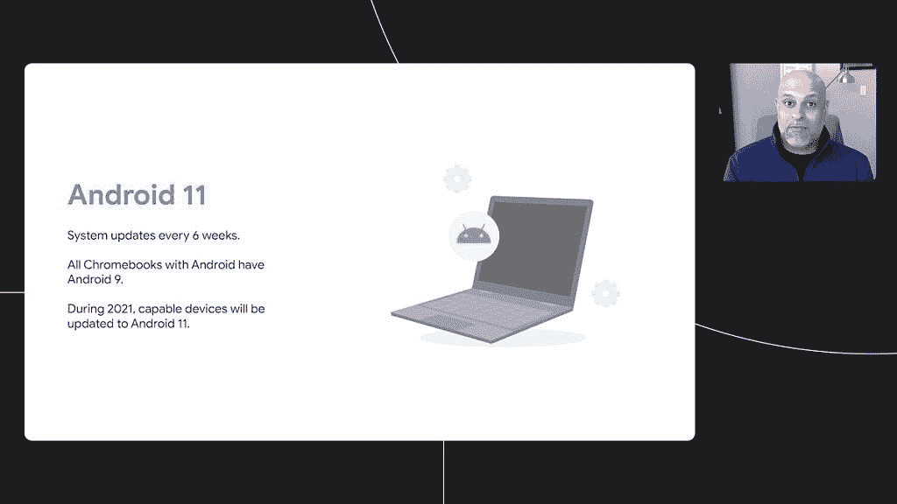

# 谷歌 I/O 2021 摘要:所有主要新闻和公告

> 原文：<https://www.xda-developers.com/google-io-2021-recap/>

谷歌 I/O 2021 于周二拉开帷幕，我们已经欣喜若狂，看到了此次活动中所有令人兴奋的东西。事实上，这里有太多东西需要解开，甚至不知道从哪里开始。从彻底的 Android 12 重新设计 Material You，到多年来最大的 Wear OS 更新，到开创性的语言模型，再到地图和谷歌照片的生活质量改善，几乎每个主要的谷歌产品和服务都在变得更好。

XDA 门户网站团队一直在努力报道这一重大事件的最新公告和突发新闻。但是对于普通人来说，要跟上繁忙的新闻周期可能会有些力不从心。我们听到了。为了节省你从一篇新闻跳到另一篇新闻的时间和精力，下面是我们从 Google I/O 2021 报道的每一个重大公告和发展的回顾。

## Android 12 Beta 1:新功能、GSI 等！

正如预期的那样，谷歌在周二的谷歌 I/O 上正式放弃了 Android 12 的第一个测试版。与往常一样，谷歌 Pixel 用户是第一批获得最新软件的用户，第一个测试版已经向注册了测试版计划的 Pixel 5、Pixel 4/4a 或 Pixel 3/3a 用户推出。来自合作伙伴 OEM 的几款旗舰手机也加入了 Android 12 测试版派对。到目前为止，以下原始设备制造商已经确认为他们基于骁龙 888 的旗舰产品发布 Android 12 测试版:

### Android 12 Beta 1 合格设备

没有像素或骁龙 888 旗舰？别担心。你仍然可以通过 Android 12 测试版 GSI 获得最新的软件。如果你有一部 Project Treble 兼容手机，塞犍陀已经发布了[这个优秀的指南](https://www.xda-developers.com/android-12-beta-gsi/)，引导你启动一部 Android 12 GSI。

### Android 12 测试版功能亮点

**[安卓 12 Beta 1 上手:安卓](https://www.xda-developers.com/android-12-beta-1-hands-on/)** 来了个彻底的重新设计

*   随着 Android 12 的发布，Android 古老的[小工具终于有了重大改变](https://www.xda-developers.com/google-android-12-widgets-overhaul/)。
*   Android 12 将把设备个性化提升一个档次，自动从你的壁纸中选择通知面板、锁屏、快速设置和其他用户界面部分。
*   隐私是 Android 12 的核心主题之一，谷歌正在[加倍努力](https://www.xda-developers.com/android-12-privacy-private-compute-core-privacy-dashboard/)推出隐私仪表盘、私人计算核心、[剪贴板访问提醒](https://www.xda-developers.com/android-12-copies-ios-14-with-new-clipboard-access-alerts/)等更多功能。与 Android 12 没有直接关系，但无论如何，一个受欢迎的新增功能是在谷歌应用程序中引入了一个按钮，用于删除过去 15 分钟的搜索历史。
*   你的 Android 手机已经可以让你控制许多智能家居设备，在 Android 12 中，它甚至可以让你解锁汽车。这项功能将在今年晚些时候出现在运行 Android 12 的 Pixel 和三星 Galaxy 手机上。
*   需要扫描附近蓝牙设备的应用程序不必请求位置许可。Android 12 是[将蓝牙扫描](https://www.xda-developers.com/android-12-location-scan-nearby-bluetooth-devices/)部分与位置权限解耦，变成专用的 BLUETOOTH_SCAN 和 BLUETOOTH_CONNECT 权限。
*   从 Android 12 开始，几家 OEM 厂商将开始默认使用 H.265 编解码器进行视频录制。这背后的原因是 H.265 提供了与 H.264 相同的视频质量，而使用了一半的比特率，从而显著减小了文件大小。H.265 得到了高端和中档 Android 手机的广泛支持，但唯一的问题是，它在几乎所有受支持的手机上都是默认禁用的。
*   Android 12 将有一个新的性能类 API，开发者可以使用[来识别设备的功能有多强大](https://www.xda-developers.com/android-12-performance-class/)，并相应地扩展其应用的功能和性能，以获得更优化的体验。

* * *

## Material You 是谷歌自 2014 年以来最大胆的重新设计

在多次 Android 12 泄露中展示后，谷歌在谷歌 I/O 2021 上正式展示了其新的设计语言 Material You。最新的重新设计正值当前的材料设计，自 Android 9 Pie 以来几乎没有改变，已经开始有点过时了。Material You 是大胆的，丰富多彩的，令人耳目一新的，主要侧重于通过其动态主题化功能为用户提供无尽的定制。你的材料将不仅限于 Android，还将涉及所有主要的谷歌产品，包括 Wear OS、Chrome OS、智能家居设备等等。

* * *

## Wear OS 得到了三星和 Fitbit 的帮助

**[多年来最大的 Wear OS 更新已经到来:下面是它的样子](https://www.xda-developers.com/new-wear-os-update-hands-on/)**

*   在忽视 Wear OS 平台这么多年后，谷歌终于[开始认真对待它的智能手表 OS](https://www.xda-developers.com/new-wear-os-update-hands-on/) 。
*   在谷歌 I/O 2021 上，谷歌宣布将与韩国电子巨头三星合作建立一个统一的平台，结合 Wear OS 和三星智能手表 OS ti Zen 的精华。
*   最重要的是，Fitbit 的一些最受欢迎的功能也将被应用到操作系统中。
*   是的，穿上 OS，你也会有一件新的外套。
*   Wear OS 的另一个漂亮的改进是能够直接从你的智能手机下载应用程序。目前，用户被迫从智能手表预装的 Play Store 应用程序中下载应用程序，我们都知道在小小的屏幕上浏览如此多的菜单会令人沮丧。
*   谷歌证实，Wear OS 将在今年晚些时候推出 YouTube 音乐应用，允许用户在智能手表上存储音乐，以便离线收听。今年晚些时候，Spotify 应用程序也将提供同样的功能[。](https://www.xda-developers.com/spotify-download-music-podcasts-wear-os/)

* * *

## 认识 LaMDA:你的新数字朋友

谷歌 I/O 2021 的一个迷人之处是 [LaMDA，这是一个基于谷歌名为 Transformer 的神经网络架构的对话语言模型](https://www.xda-developers.com/googles-language-model-friend-lamda/)。与其他语言模型不同，LaMDA 接受的是对话训练，可以就几乎任何话题进行流畅的对话。在主题演讲中，谷歌给出了 LaMDA 充当冥王星和纸飞机的演示，非常好。LaMDA 仍处于研发阶段，但它将有可能在未来用于驱动谷歌助手和其他谷歌产品。

* * *

## 星光计划:视频会议的未来

由于新冠肺炎疫情迫使数百万人呆在家里，视频通话比以往任何时候都更受欢迎。而视频会议应用如 Zoom、Google Meet、微软 Teams 等。允许我们与朋友和家人保持联系，我们中的许多人都希望在这些艰难的日子里，我们能够亲自见面。即使世界上许多地方正在放松限制，随着世界的联系比以往任何时候都更加紧密，仍然需要更好的远程会议工具。[认识一下星光计划](https://www.xda-developers.com/google-project-starline-video-chat/):谷歌的这个项目利用 3D 成像技术进行视频通话，感觉就像你真的在和某人面对面交谈。

* * *

## 谷歌地图:环保路线、更安全的路线和新的实时视图

*   生态友好路线和更安全路线是谷歌地图的两项新功能。
*   生态友好路线将有助于减少环境足迹，建议路线将导致较低的燃料消耗。
*   另一方面，更安全的路线将使用人工智能，通过考虑当前的道路，交通和天气条件，为您的目的地建议最安全的路线。
*   谷歌地图还将通过显示人行道、人行横道和步行岛的位置来提供更详细的街道概览，甚至会告诉你一个街区或一个特定地方有多繁忙。
*   地图会根据一天中的时间和你旅行的时间来定制结果。例如，在早上，地图会突出显示附近的咖啡店。
*   最后，提供基于增强现实的导航的实时视图也收到了一些新的更新。新的[实时视图将更容易访问](https://www.xda-developers.com/googles-improved-live-view-allows-people-to-explore-the-city-better-than-before-via-ar/)，更加动态，也可以用于导航室内建筑。

* * *

## Google 相册:更好地控制你的记忆

*   Google Photos 会让你把你的私人照片锁在一个只有你能访问的安全文件夹里。这首先出现在 Pixel 手机上，然后出现在其他 Android 设备上。
*   照片将获得一个机器学习技巧，让它创建一个包含三个或更多相似物体、形状或颜色的相册，并在记忆中突出显示它们。
*   新类型的记忆，如最佳月份记忆、旅行集锦、庆祝活动等。，很快会添加。
*   如果你不想重温某些记忆，照片会让你更容易隐藏某些人或时间段，这样他们就不会再次出现在你的记忆中。
*   电影照片将使用计算摄影技术[给你的静态照片带来生命](https://www.xda-developers.com/google-photos-use-ai-stills-to-life/)。它从你的相机胶卷中取出两张看起来相似的图像，并在人工智能的帮助下添加缺失的帧，以产生类似 GIF 的动画照片。

* * *

## 谷歌浏览器:密码提示

谷歌 Chrome 的内置密码管理器已经让我们的数字生活变得更加容易，它可以记住我们所有的密码，并在应用程序和网站中自动填写密码。今后，当 Chrome 检测到你保存的密码被泄露时，它会提醒你，甚至会[帮助你跨网站重置密码](https://www.xda-developers.com/google-chrome-automatically-fix-passwords/)。当你收到 Chrome 的密码泄露通知时，它会在旁边显示一个“更改密码”按钮。当你点击它时，Chrome 会带你去那个网站，并引导你更新密码。

* * *

## 谷歌助手:个性化快捷方式

展望未来，你在谷歌助手界面底部看到的建议快捷方式将更具上下文感知和个性化。谷歌正在添加一个新的[建议芯片功能](https://www.xda-developers.com/google-assistant-one-tap-shortcuts-third-party-apps/)，它将根据你的使用模式提供主动的快捷方式建议。应用程序开发人员将能够显示快捷方式，用户只需点击一下就可以直接进入应用程序中的特定页面。谷歌还取消了由 ShortcutManager APIs 设置的任意限制，只允许开发者创建 10 个快捷方式。现在，开发人员可以构建无限的快捷方式。此外，Android 12 上的谷歌助手将[自动从第三方应用](https://www.xda-developers.com/android-12-will-help-google-assistant-find-and-use-app-shortcuts/)中找到快捷方式，并在助手快捷方式库中展示它们。

* * *

## Chrome OS: Android 11，稳定的 Linux 应用支持，等等

在下一个稳定版本 Chrome 91 中，对 Linux 应用程序的原生支持终于来到了 Chromebooks ，该版本计划在 6 月的第一周推出。除了 Linux 应用程序支持，谷歌还证实，它将很快在受支持的 Chromebooks 上从 Android 9 更新到 Android 11。最后，Chrome OS 的电话中心将很快获得[从你的 Android 智能手机访问你最近拍摄的照片的能力](https://www.xda-developers.com/chromebooks-access-recently-uploaded-photos-from-android-device/)，这是其微软竞争对手 Your Phone 从第一天起就提供的功能。

## 

* * *

在 Google I/O 2021 上，Google 宣布他们正在与 Shopify 合作，让商家更容易在 Google 上展示他们的产品。对于消费者来说，谷歌在 Chrome 中引入了一个新功能，可以帮助你“在离开的地方继续购物”当你打开一个新标签时，Chrome 会显示你在不同购物网站上打开的购物车。在 Android 上，Google Lens in Photos 很快就会有一个“搜索截图”按钮，可以扫描照片中的鞋子、t 恤和其他物体，并显示相关产品。

* * *

## 机器学习将变得更快、更一致

机器学习已经为我们在 Android 上最喜欢的许多功能提供了动力，包括谷歌助手、谷歌镜头、智能回复，甚至 Snapchat 过滤器。但在 Android 上部署机器学习功能有几个障碍，谷歌希望改变这种情况。Google 正在为 Android 发布一个新的可更新的、完全集成的 ML 接口栈，它将为开发者提供一个标准化的平台，一套通用的工具和 API，在 Android 设备和版本之间提供更加一致的 ML 体验。作为该项目的一部分，谷歌还将通过谷歌 Play 商店在所有 Android 设备上推出 TensorFlow Lite，这样开发者就不必将其与自己的应用捆绑在一起，从而可以减少 APK 的大小。

* * *

## 来自 Google I/O 2021 的所有主要开发人员关注的公告

*   Jetpack Compose 1.0 将于 7 月升级到稳定频道，并将包括更多组件、对大屏幕的更好支持以及其他改进。
*   在金丝雀频道呆了几个月后，Android 工作室北极狐现在终于跳到了测试频道。测试版包括一些新的调试工具，如可访问性扫描器和内存分析器。
*   谷歌基于云的应用工具套件 Firebase 正在获得大量新功能，包括 Firebase 模拟器套件中的存储模拟器、应用分发工具中对 Android 应用捆绑包的支持、应用检查、性能监控中的实时数据处理、新的 Web SDKs 等等。
*   Flutter 2.2 是 Google 跨平台 app 开发语言的最新版本，它引入了[几个新的改进](https://www.xda-developers.com/flutter-2-2-google-io-2021/)。例如，默认情况下，null safely 现在是启用的。Flutter Ads SDK 也已经更新了自适应广告横幅和内置的 null 安全，并且有一些与性能相关的改进，以减少应用程序的大小，使动画更流畅。
*   谷歌的增强现实平台 ARCore 获得了两个新的 API。第一个是 [ARCore Raw Depth API](https://www.xda-developers.com/ar-core-raw-depth-api-recording-api-google-io-2021/) ，它将使开发人员能够捕捉周围物体的更详细的表示。同时，ARCore 录制和回放 API 允许开发人员捕捉带有 AR 元数据的视频镜头。
*   对于谷歌地图平台，谷歌发布了几款新工具，帮助网络开发者在其网络应用中提供更丰富的嵌入式地图体验。新的倾斜和旋转功能将为嵌入式地图带来 67.5 度倾斜和 360 度旋转的全新视角。与此同时，WebGL 叠加视图将允许开发人员在基本地图上渲染复杂的 2D 和 3D 对象。
*   在没有任何事先通知或解释的情况下，突然从谷歌 Play 商店移除应用程序是 Android 应用程序开发者最糟糕的噩梦。为了改善这方面的沟通和透明度，谷歌已经[详细说明了它将为 Google Play 控制台带来的一些变化](https://www.xda-developers.com/google-play-console-help-fix-apps-being-removed/)。在某些情况下，当谷歌检测到你的应用程序中存在任何潜在违规行为时，它将很快开始在谷歌 Play 商店的“政策和程序”部分显示警告，并提供修复这些违规行为的指导。
*   Google Play 计费库 v4.0 将为用户添加[新的支付应用和订阅的方式](https://www.xda-developers.com/google-play-new-ways-to-pay/)。这些新方式包括多数量购买、多行订阅和预付费计划。
*   谷歌还通过新的汽车应用程序库让开发者更容易为 Android Auto 和 Android Automotive 开发应用程序。

伙计们，收工了！Google I/O 2021 的哪个公告最让你激动？请在下面的评论中告诉我们。关于此次活动的视频回顾，请查看谷歌在 YouTube 上的 9 分钟总结，链接如下。