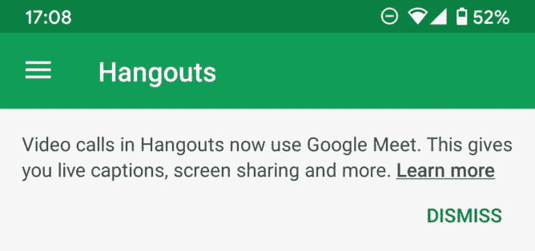

# Google Hangouts 扼杀群组视频通话——将用户推向 Google Meet

> 原文：<https://www.xda-developers.com/google-kills-hangouts-group-video-calling-pushes-google-meet/>

谷歌已经开始对即将推出的产品进行传统的“千刀万剐”,取消视频通话功能。messenger 应用程序曾被称为 Google Talk，不久将被 Google Chat 和 Google Meet 取代，现已更新至 36.0.340725045 版本，在其计划于 2021 年关闭之前首次失去功能。

 <picture></picture> 

Image credit: Android Police

Hangouts 用户现在会在联系人列表的顶部看到一条消息，称“Hangouts 中的视频通话现在使用 Google Meet。这为您提供了实时字幕、屏幕共享等功能。”接着是一个到谷歌支持页面的链接。如果您尝试在您的一个群组中开始视频通话，您将看到一个 Google Meet URL 粘贴到聊天中，供所有人在浏览器中加入。也许这不是最优雅的解决方案，但这里的游戏是试图让我们的行为远离去社交场所，至少对那些仍然去的快乐的少数人来说是这样。奇怪的是，你仍然可以通过 Google Hangouts 进行一对一的视频通话，就像以前一样，到目前为止，音频通话似乎完全不受影响。

根据 Android Police 的说法，你仍然可以回滚到早期版本的 Hangouts 并使用群组视频通话，但我们不完全确定你为什么想要这样做，除非你同时与许多人通话。Google Chat 的免费级别限制为 10 人，而 Google Hangouts 则是 25 人。无论是哪种情况，切换到其他东西可能更容易，因为谷歌 MO 表明，我们将在未来几个月看到更多的功能被弃用。

最终，谷歌似乎致力于将它的一大堆通信应用程序简化为聊天、会议和消息，坦白地说，这是一种解脱，因为在过去几年中，我们已经有了聊天、会议、消息、Hangouts、Allo、Duo、G+、Currents，可能还有一些我们已经设法屏蔽掉的应用程序。