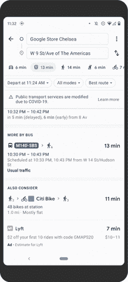
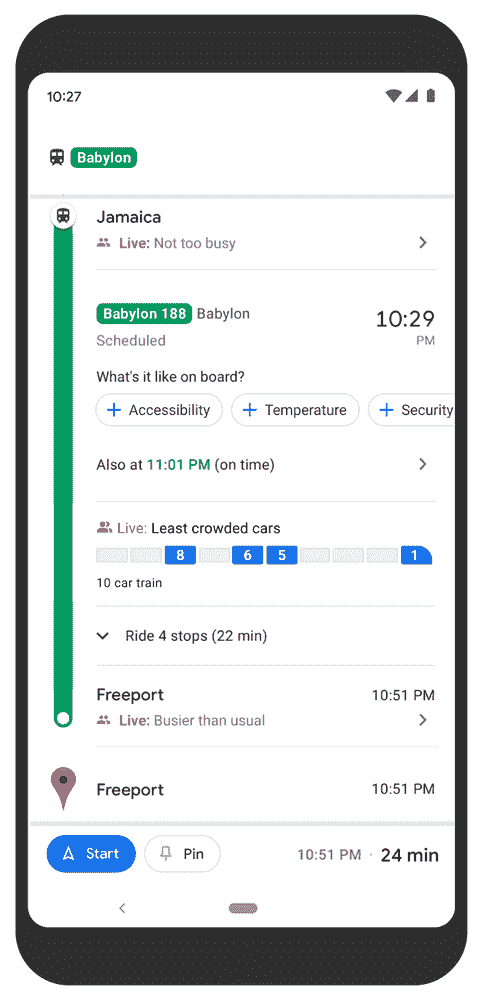
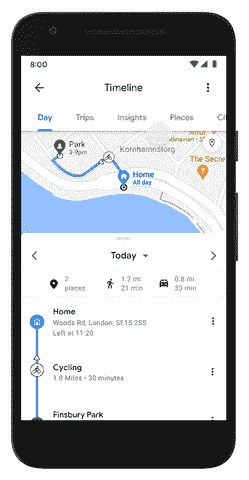

# 谷歌地图正在扩大其公共交通拥挤预测

> 原文：<https://www.xda-developers.com/google-maps-expand-mass-transit-crowdedness-predictions/>

谷歌地图[早在 2019 年 6 月就推出了公共交通拥挤预测](https://www.xda-developers.com/google-maps-crowded-trains/)。这项功能为通勤者提供了宝贵的信息，让他们在上车前了解公共汽车、火车或地铁有多拥挤，从而帮助他们相应地规划日常通勤。起初，这项功能在全球 200 个城市都可以使用，但谷歌现在正在将其扩展到*“100 个国家的 10，000 多家交通机构。”*

在一篇关于扩张的博客文章中，谷歌写道:

毫不奇怪，在疫情早期，公交乘客量大幅下降。虽然人们正在回归公共交通——与去年相比，美国地图上的交通路线增加了 50%——但安全仍是人们的首要考虑。这就是为什么我们将交通拥挤预测扩展到 100 个国家的 10，000 多家交通机构，这样你就可以知道你的线路是否可能有很多空位，达到最大容量，或者介于两者之间。有了这些信息，你就可以决定是上车还是等下一趟火车。因为不管是不是疫情，没人喜欢站在拥挤的地铁车厢里。”

该功能利用历史位置数据和地图用户的自我报告来生成这些预测。用于该功能的所有位置数据都是匿名的。

 <picture></picture> 

Transit crowdedness predictions

随着扩张，谷歌正在试验在纽约和悉尼看到实时拥挤信息的能力(通过 [*The Verge*](https://www.theverge.com/2021/7/21/22586512/google-maps-transit-crowdedness-expansion-timeline-insights-trips) )。该功能将为用户提供更详细的信息，如特定列车车厢的拥挤程度，而不是整个列车的拥挤程度。与常规的拥挤预测不同，谷歌使用公共交通机构提供的数据来生成这些粒度预测。在这两个城市测试该功能后，谷歌计划很快在更多城市推广。

 <picture></picture> 

Train level crowdedness predictions

此外，谷歌还在 Android 上的地图时间轴中添加了一些新功能。其中包括一个新的“Insights”标签，显示您在不同交通方式下花费的时间和旅行距离的趋势。它还显示了你去过的地方。

 <picture></picture> 

New Timeline Insights

谷歌地图现在也有一个“旅行”标签，列出所有去过的地方，并让用户选择导出列表，与他人分享。

 <picture></picture> 

New restaurant review prompts

最后，谷歌地图还将为美国的餐馆提供额外的评论选项，新的提示可以分享餐饮价格、外卖和外卖可用性等。谷歌计划很快为其他企业提供类似的提示。